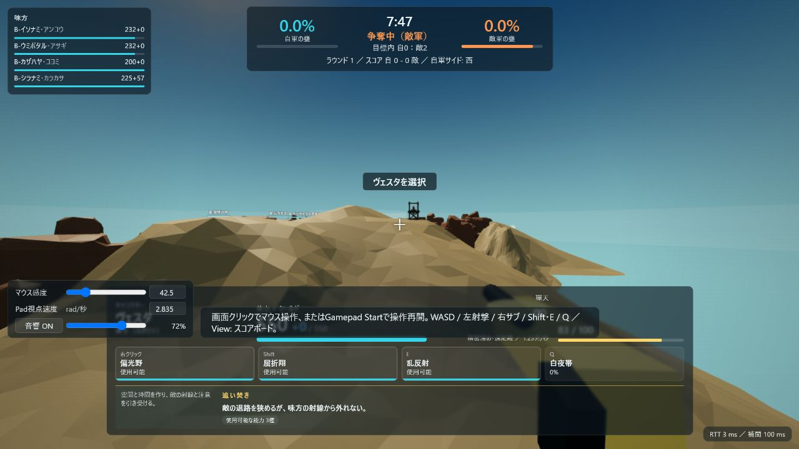
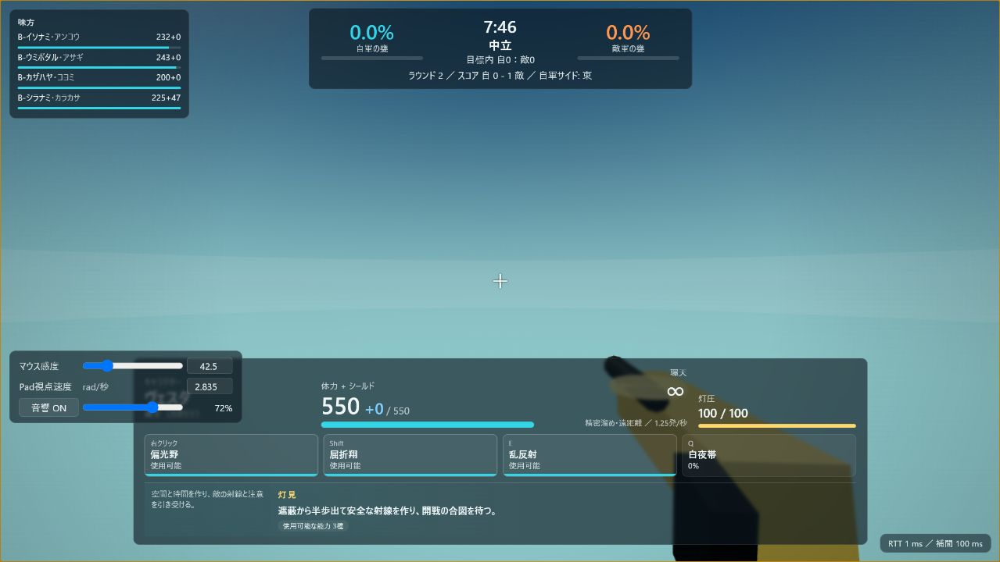
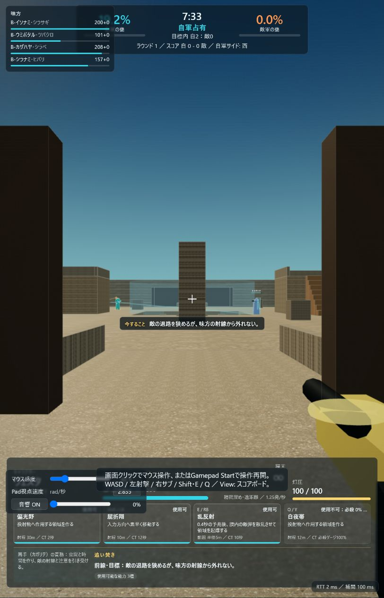
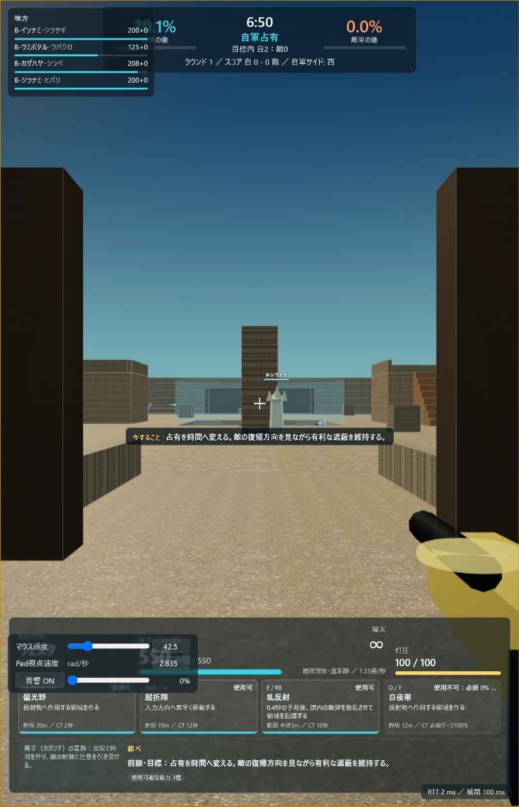

# 『篝合』rc.4 Visual Audit Evidence

- 検証日: 2026-07-20（Asia/Tokyo）
- 対象: `http://127.0.0.1:8787/`
- 最終ブラウザconsole: `[]`
- 判定: rc.4ローカル視覚受け入れ。公開環境E2Eではない

## Before

外部地形の表示とゲームプレイ面の意味が一致せず、spawn、route、coverの関係を読み取れなかった。

足元の競技用床と周辺構造が視認できず、空だけが画面の大部分を占めた。プレイヤーは接地、遮蔽、進行方向を予測できなかった。

## After

- 足元の床、左右のhard cover、中央ルート、前方の味方が同時に読める。
- 空だけになる状態と、外部GLBが作っていたfalse wallは見られない。
- 3.5m未満のworld-space nameplateを隠し、至近距離の巨大な味方名を除去した。
- 下部HUDに入力、名称、効果、射程、CT、使用可否、ロール責務、現在の行動が揃っている。

目標状態、味方体力、前線上の味方、遮蔽、ロール別の次行動が同時に更新された。ブラウザconsole errorは0件だった。

## 比較上の制約

途中でCodex内ブラウザ領域が1280×720相当の横長から813×1261相当の縦長へ変更された。そのため、before/afterはpixel-perfectなlayout差分ではなく、床、遮蔽、spawn exit、nameplateの構造差分として一つの比較入力で判定した。最終状態は現在の実viewportで個別に再検査した。

## 残る視覚ゲート

- 競技用blockoutを専用world artへ置換する。ただしcollisionはblueprint側で管理する。
- 専用キャラクター、rig、animation、LOD、weapon animationを制作する。
- 録音Foley、材質別impact、occlusion、最終mixを制作する。
- 横長1080p、主要GPU、ゲームパッド、reduced-motion、低性能端末で人間のプレイテストを行う。
