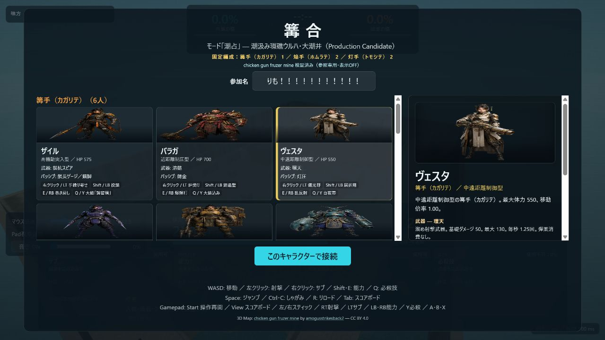
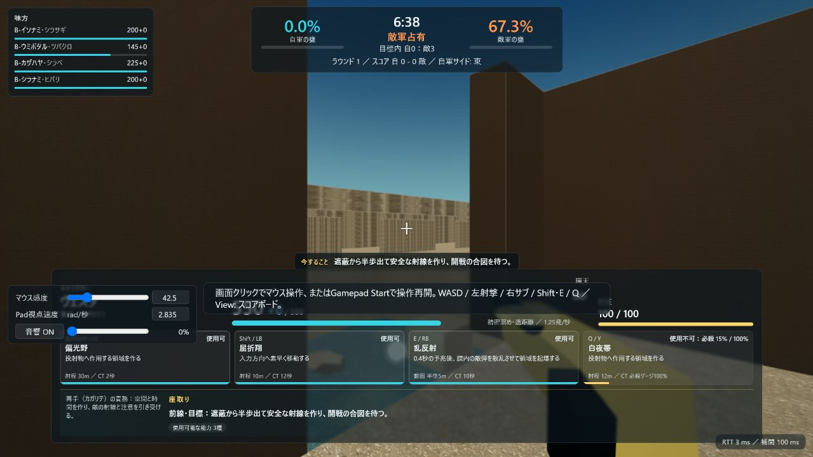
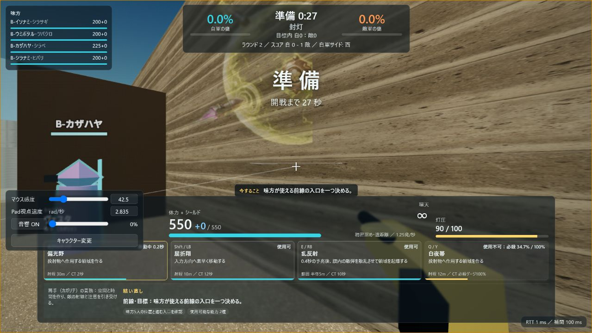

# 『篝合』rc.5 アセット実画面監査

- 実施日: 2026-07-21（JST）
- 対象: ローカル `http://127.0.0.1:8787/`
- サーバー: rc.5作業ツリーから新規起動。`/healthz` 200、`ready=true`、起動直後 `uptimeSec=7.9`
- SSOT: `contentSha256=e62cad2a166deb901b2ec9da5e4852a985720fe6f56d6daa0ae129048945f2f6`
- 判定: ImageGenビジュアルとUI統合はローカル受け入れ。ElevenLabs全90件、公開環境、AAAワールド品質の受け入れではない

## 証拠

### キャラクター選択

- DOM上の `.heroOptionArt` 18件が、18個の異なる内容ハッシュ付きWebP URLを参照。
- 選択中のヴェスタ詳細も同じSSOT URLを使用。
- カードにはロール、HP、武器、パッシブ、4アクションが表示される。
- 緑背景の残留、画像欠落、別ヒーローへのフォールバックは目視上なし。

### 戦闘HUD

- HP/シールド、武器、固有資源、3能力、必殺ゲージ、CT、射程、使用可否を同時に確認。
- 篝手の責務と、その時点の人数差・前線状況に基づく行動案を表示。
- 数値マウス感度とゲームパッド視点速度が画面内で編集可能。

### 透過能力アトラス

- 透過アトラス由来の発光演出が戦場内で描画される。
- グリーンバックや白/黒のグリッド境界は目視上残っていない。
- HUDの必殺ゲージは戦闘中に増加し、アクションごとの専用状態表示を維持。

## 機械確認

- ブラウザconsoleのwarning/error: 0件。
- `shared/data/hero_assets.js`: HTTP 200、676,057 bytes、上記SSOTハッシュを含む。
- 配信用WebP: 90/90、SSOT参照欠落0。
- 画像ハッシュ検証: 90/90合格。
- 2026-07-21再監査: `.heroOptionArt` 18/18と詳細画像は`data-asset-integrity=verified`、18個の固有SHA-256を確認。選択中ヴェスタの能力アトラスは`verified:vesta:4/4`。いずれも配信バイトをブラウザ内でSHA-256照合してから描画した。
- ElevenLabs MP3: 2/90のみ。UI/音響は存在する2件をSSOTから読み、それ以外は手続き音へ縮退する。

## 残存境界

- 現行ワールドには箱型シルエットと単純な大面積壁が残り、競技上の衝突整合はあっても、世界リリース向けの写実性・ランドマーク密度・素材変化には未到達。
- 音量は監査時にユーザー設定0%だったため、実耳による2件の音質評価は行っていない。
- 公開DNS/TLS/WSS、実回線、複数人による戦闘可読性、端末別GPU負荷は別ゲート。
