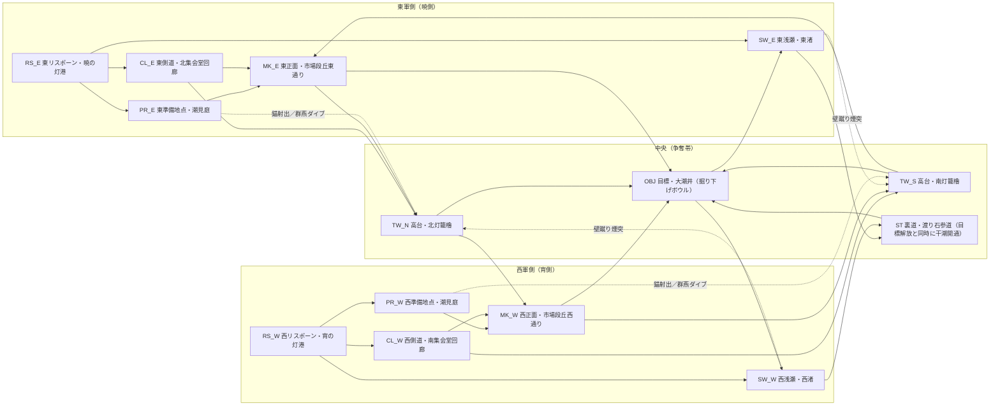

# 『篝合（かがりあい）』（仮称） Phase 1 ゲーム設計書

**プロジェクト**: 灯環世界ヴェルソラ — 5対5チーム制ヒーローFPS（完全オリジナルIP）
**版**: v0.1（Phase 1 / 設計フェーズ成果物。コード実装前）
**スコープ**: フルゲーム=18ヒーロー・4モード・8マップ想定 ／ プロトタイプ=6ヒーロー・1モード・1マップ

---

# 1. 前提として採用した仮定

1. エンジン非依存の設計を先行する。ルール・数値・ヒーロー仕様はすべてデータ駆動（テーブル化）で記述し、実装エンジンの選定に依存しない。
2. PC先行で開発する。KBM+パッド両対応とし、エイムアシストはパッド入力時のみ有効。UI・予兆表示は両入力で等価に読めることを受け入れ条件とする。
3. ネットワークはサーバー権威型。判定はサーバー側ラグ補償（巻き戻し）を前提とし、クライアント予測は移動と射撃演出に限定する。
4. 編成は5対5（前衛1・攻撃2・支援2）を正とするが、チームサイズ・ロール枠はデータ設計上6対6や枠変更に拡張可能な構造にしておく。
5. プロトタイプは1マップ・1モード・6キャラクター（前衛2・攻撃2・支援2）で基礎戦闘循環を検証する。本書のisPrototype=trueがその6体である。
6. 本書の数値ガイドライン（体力250基準、DPS100〜140、回復70〜110/秒、リスポーン10秒＋ウェーブ等）は初期チューニング値であり、プレイテストによる±30%程度の調整を許容する。ただし比率関係（撃破時間＞反応時間）は不変条件とする。
7. 全能力は共通の資源言語（体力/人数/位置/空間/時間/クールダウン/必殺技ゲージ/注意力/情報/復帰距離）でコストと報酬を記述し、レビュー時にこの帳簿で妥当性を判定する。
8. 視認性を最優先とする。チーム識別・能力種別の形状言語・音響予兆は全アセットの受け入れ条件であり、アートの都合で予兆を削ることは認めない。
9. 本書は正典（canon）である。名称・用語・勢力関係・ロール呼称の変更はリードデザイナーの承認を必要とし、各設計者は本書の用語をそのまま使用する。
10. 表現規制は全年齢寄りを想定する。流血表現は用いず、撃破は織身（おりみ）が光の糸に解ける表現で統一する。

# 2. 一文のゲーム紹介

> **灯を汲む競技戦争――撃破の数ではなく、天から降りる「灯着点」を薪べた者が都市の一年を勝ち取る、5対5の灯匠ヒーローFPS。**

# 3. 完全オリジナルの世界観

## 世界: 灯環世界ヴェルソラ

惑星ヴェルソラの空には、光の鉱物でできた巨大な環「灯環（とうかん）」がゆっくりと巡っている。灯環は季節ごとに欠片を落とし、それが大地に着床した場所「灯着点（とうちゃくてん）」からは、あらゆる技術の源となる灯素（とうそ）が湧き出す。かつて都市国家群は灯着点を巡って本物の戦争を続けたが、大破局の後に「篝火協約」が結ばれ、戦争は厳格に管理された5対5の競技戦「篝合（かがりあい）」に置き換えられた。戦うのは各都市が育てた灯匠（とうしょう）たち。彼らは実体を織機に預け、灯素の糸で編んだ戦闘用の体「織身（おりみ）」をまとって灯着点に立つ。篝合の勝敗が、都市の一年分の灯素配分――すなわち街の明かり、工房の炉、船の浮力のすべてを決める。

## 同じ人物同士が繰り返し戦える理由

灯匠は本体を各陣営の「アンカー織機」に預け、灯素の糸で編まれた織身で戦う。織身は撃破されると光の糸に解け、織機が約10秒で編み直す（リスポーンの世界内説明）。さらに篝火協約により、灯着点の採掘権は殺傷ではなく篝合の勝敗でのみ移転すると定められているため、灯環が欠片を落とすたび、同じ都市の同じ灯匠たちが季節ごとに何度でも同じ相手と戦うことになる。灯匠は都市の代表選手であり代理戦争の兵でもあり、市民は篝合を祭りとして観戦する。

## 銃器・機械・超常能力が共存する理由

この世界の銃器・絡繰機械・超常的な力は、すべて単一の資源「灯素」を異なる流派で加工したものである。港市圏は灯素を圧縮して撃ち出す灯銃を、工房連合は灯素を歯車と骨組みに編み込む絡繰を、潮列島は灯素を歌と結び目で操る織りの秘技を発達させた。つまり「魔法に見える能力」も「銃」も同じ技術樹の別の枝であり、灯匠ごとの流派の違いがそのままプレイスタイルの違いになる。

## 各地の目標を争う理由

灯素は灯着点から汲み上げるか、精製した灯核を運び切るかでしか都市の帳簿に計上されない。織身をいくら解いても（＝敵を何度撃破しても）灯素は一滴も手に入らないため、撃破は「相手が汲めない時間を作る」一時的な優位でしかなく、灯着点の占有と灯核の輸送だけが永続的な得点になる。篝火監理院が全戦闘を審判し、目標の進行量のみを公式記録とする。

## 勢力

- アルデーロ港市圏――交易灯船の都市同盟。灯素を商流と航路に変える現実主義の港湾国家で、精密な灯銃技術を誇る。
- セリカ高原工房連合――鋳造と絡繰の職人ギルド国家。灯素を機械骨格に編み込み、重厚な装備と設置機構を得意とする。
- ウルハ潮列島の灯汲み衆――潮と灯の祭祀文化を持つ列島民。織身技術の発祥地であり、身体と灯素を直接結ぶ流派を持つ。
- 篝火監理院――協約を執行する中立機関。篝合の審判、アンカー織機の管理、灯素配分の記帳を担い、いずれの都市にも属さない。

## アートディレクション

真昼の光を基準とした高彩度・高コントラストの明るい画面。素材言語は貝灰漆喰の白、真鍮、色ガラス、灯素の暖色発光。敵味方はチームカラーの縁光と形状で瞬時に判別でき、能力エフェクトは形状文法（円＝領域、線＝射線、明滅＝予兆、糸のほどけ＝撃破）で統一する。暗所や視界阻害は情報の演出であって画面を汚さない。

# 4. 5つの設計原則

## 原則1: 撃破は火花、目標は薪

撃破が生むのは人数差という燃え尽きる火花であり、勝敗に積み上がるのは目標進行という薪だけである。すべての能力・モード・UIは「得た優位を目標秒数へ変換する」動線を持たねばならず、キル自体が得点になる設計を禁止する。

## 原則2: 一人一糸

各灯匠の能力群は、ただ一つの中核メカニクス（糸）を補強するためだけに存在する。新能力の提案は「この糸をどう太くするか」を説明できなければ却下される。無関係な強能力の寄せ集めは正典違反。

## 原則3: 強い灯ほど濃い影

強力な効果には必ず影（対価）を対で設計する。短い持続・明確な予兆・長いクールダウン・短い射程・自己リスクのうち最低二つを持たない強行動は実装しない。長時間の操作剥奪は世界観上も協約違反として存在しない。

## 原則4: 読める戦場

全能力に視覚予兆と音響予兆を義務付け、形状文法（円＝領域、線＝射線、明滅＝予兆）を全ヒーローで共有する。「見えなかった」「聞こえなかった」で負ける体験を作らないことが、明るいアート方針の存在理由である。

## 原則5: 復帰距離も武器

リスポーンからの復帰導線はマップとモードの設計対象である。撃破の価値は復帰距離で決まるため、深追いの報酬とリスク、ウェーブ復帰の合流タイミング、目標位置と織機の距離をワンセットで調整する。

# 5. コアループ

一周期は30〜90秒。織機で織り直された5人がウェーブ復帰で合流し（復帰距離の支払い）、移動中に灯見――足音・標定・帳越しの影から敵編成と位置の情報を集める。目標地点に近づくと火掛かり（牽制射撃と短CD能力の小さな交換）が始まり、双方が体力・クールダウン・位置を少しずつ支払いながら座取りを進める。どちらかが有利な帳簿（人数・ゲージ・高所）を確信した瞬間に火蓋が切られ、集団戦で能力と必殺技が交換される。勝った側は生存者の残り時間を使って灯着点の占有や巡灯車の押し込みという「薪」に変換し、負けた側は復帰距離とウェーブのタイミングを計算して、崩れた帳簿を立て直すために結い直しへ戻る。この「情報→交換→戦闘→変換→再集合」の環が、必殺技ゲージ（45〜90秒周期）と噛み合って波を作る。

# 6. 一回の集団戦の流れ

①結い直し――アンカー織機が織身を編み直し、ウェーブ復帰で5人の糸が揃う。灯手が香や縫い目を仕込み直す準備の時間。②灯見――前進しながら情報を汲む。標定の残光、消灯帳の位置、敵織機からの復帰方向で、敵の帳簿（誰が落ちたか、ゲージは重いか）を読む。③火掛かり――焔手が反応時間の外から牽制を撃ち、敵の短CD防御を先に支払わせる。ここではまだ誰も深入りしない。④座取り――篝手が篝火を掲げて一歩前に出て空間を主張し、灯手は遮蔽の裏、焔手は射線の交差点へ。灯着点との距離が各自の椅子を決める。⑤火蓋――どちらかが帳簿の有利（CD差・人数差・高所）を確信し、篝手の突入か焔手の精密射で開戦。開戦の合図は必ず音と光で全員に読める。⑥帳簿交換――防御能力と妨害能力が対で切られる短い応酬。ここで無駄な糸（CD）を余分に支払った側が次の局面で裸になる。⑦初火花――最初の撃破。織身が糸に解ける音は戦場全体に響き、5対4の帳簿が確定する。⑧追い焚きか退き火――勝ち側は復帰距離を計算して深追いの利を測り、負け側は退き火（遮蔽と傘と波を使った撤退）で二人目の火花を渡さない。⑨薪べ――生き残った側が残り時間を灯着点の占有率や巡灯車の距離に変換する。ここで初めて火花が薪になり、記録係の監理院が進行を刻む。⑩結い戻し――双方が織機へ糸を戻し、ゲージと位置の新しい帳簿を持って次の周期へ。必殺技が重くなった側は、次の火蓋を自分から切る権利を得る。

# 7. 三ロールとサブロール

## 篝手（カガリテ）（前衛）

無視できない脅威で空間と時間を作る。篝火を掲げて敵の射線と注意力を自分に集め、味方が呼吸できる「明るい領域」を確保し、前線の位置そのものを資源として支配する。

**サブタイプ**: 高機動突入型 ／ 近距離制圧型 ／ 中遠距離制御型 ／ 妨害・変則型 ／ 変種：陣地・護送型（近距離制圧型の派生） ／ 変種：波状突撃型（高機動突入型の重量級派生）

## 焔手（ホムラテ）（攻撃）

作られた機会を撃破と圧力に変換する。篝手が作った空間と灯手が作ったテンポを受け取り、正確な射撃と機動で人数差という火花を起こす、チームの変換装置。

**サブタイプ**: 汎用中距離型 ／ 長距離精密型 ／ 高機動遊撃型 ／ 近距離戦闘型 ／ 範囲制圧型 ／ 特殊戦術型

## 灯手（トモシテ）（支援）

味方の増幅・敵の無効化・テンポ操作。回復は集中攻撃を消す魔法ではなく、正しい位置と遮蔽と連携に対する利子であり、灯手はクールダウンとゲージという時間経済の銀行家である。

**サブタイプ**: 高出力回復型 ／ 戦術ユーティリティ型 ／ 護衛・防御型 ／ 攻撃支援型 ／ 高機動支援型 ／ 変種：回復転換型（高出力回復型の派生）

# 8. 18キャラクターの概要表

| 名前 | ロール | サブタイプ | 得意距離 | 難度 | プロトタイプ |
|---|---|---|---|---|---|
| ザイル | 前衛 | 高機動突入型 | 近距離 | ★★ | ● |
| バラガ | 前衛 | 近距離制圧型 | 至近距離 | ★ |  |
| ヴェスタ | 前衛 | 中遠距離制御型 | 中〜遠距離 | ★★ | ● |
| ヌエドリ | 前衛 | 妨害・変則型 | 中距離 | ★★★ |  |
| セドラ | 前衛 | 変種：陣地・護送型（近距離制圧型の派生） | 中距離 | ★ |  |
| シオマネキ | 前衛 | 変種：波状突撃型（高機動突入型の重量級派生） | 近〜中距離 | ★★ |  |
| アサギ | 攻撃 | 汎用中距離型 | 中距離 | ★ | ● |
| シラサギ | 攻撃 | 長距離精密型 | 遠距離 | ★★★ |  |
| ツバクロ | 攻撃 | 高機動遊撃型 | 近〜中距離 | ★★★ | ● |
| ホクチ | 攻撃 | 近距離戦闘型 | 至近〜近距離 | ★★ |  |
| ボタン | 攻撃 | 範囲制圧型 | 中〜遠距離（曲射） | ★★ |  |
| アンコウ | 攻撃 | 特殊戦術型 | 中〜遠距離 | ★★★ |  |
| ツヅリ | 支援 | 高出力回復型 | 中距離 | ★★ | ● |
| コヨミ | 支援 | 戦術ユーティリティ型 | 中距離（設置物中心） | ★★★ | ● |
| カラカサ | 支援 | 護衛・防御型 | 近〜中距離 | ★★ |  |
| シラベ | 支援 | 攻撃支援型 | 中距離 | ★★ |  |
| ヒバリ | 支援 | 高機動支援型 | 近〜中距離（経路依存） | ★★★ |  |
| カズラ | 支援 | 変種：回復転換型（高出力回復型の派生） | 中距離 | ★ |  |

## 篝手（カガリテ）（前衛） 6体

### ザイル（高機動突入型・プロトタイプ）

- **中核メカニクス**: 投錨――巨大な錨型ランタン「錨灯」を放物線で投げ、鎖リールで自分を射出して突入する。着地点には短時間の減速の輪が敷かれ、敵の退路を一拍だけ奪う。全能力は「錨をどこに刺すか」の一点に集約される。
- **武器**: 飛翔弾（二段判定の鎖杭スピア。至近で刺突判定、中距離で投擲判定）
- **移動**: 非常に高い（錨射出による長距離ダイブ）。ただし移動能力は錨のCDに完全依存
- **固有資源**: 鎖長ゲージ――地上移動と壁接触で巻き取られ、錨の射程と引き寄せ速度を決める
- **必殺技**: 大錨『繋留環』――上空から大錨を落とし、半径8mの鎖柵の環を5秒間展開する。環は外からの飛翔体を遮り、敵は跨ぐ際に大きく減速する。環の内側に閉じた戦場を作る。
- **弱点**: 錨は大きく光り軌道が読める上、飛翔中は被弾判定が拡大する。突入後の帰還手段もCD依存のため、減速の輪を耐えられた場合は孤立して各個撃破される。体力575で前衛としては軽め。
- **シルエット**: 細身の登攀士。背中に体格より大きい錨型ランタン、腰に鎖リール。移動時に鎖が鳴る。

### バラガ（近距離制圧型）

- **中核メカニクス**: 鋳金――受けたダメージの一部を「鋳金」として炉に蓄え、任意の地点に凝固させて遮蔽（鋳造壁）を作る。敵の火力を吸うほど戦場に地形を増やせる、被弾を資源に変える前衛。
- **武器**: 近接（溶鎚。振りが遅く範囲が広い、命中時に余熱の小範囲ダメージ）
- **移動**: 低い（基本速度以下。短い踏み込み鎚撃のみ）
- **固有資源**: 鋳金――被ダメージ蓄積量。鋳造壁の耐久はこの量で決まる
- **必殺技**: 大鋳込み――蓄積した鋳金を全放出し、自分を中心に半円の城壁を一気に鋳造。同時に溶鎚が10秒間灼熱化し、振るたびに広い余熱ダメージを撒く。
- **弱点**: 射程が全ヒーロー中最短で、距離を保たれると鋳金すら溜められない。鋳造には1秒の注入予兆があり、壁は上を取られると無意味。機動が低く、退き火が最も苦手。体力700。
- **シルエット**: 炉を背負った鍛冶の巨人。胸に火窓、片腕が鋳型付きの籠手。歩くたび炉の低音が響く。

### ヴェスタ（中遠距離制御型・プロトタイプ）

- **中核メカニクス**: 偏光野――中空に灯素のレンズ場を投射し、その空間を通る敵の飛翔弾・爆発物を減速させ軌道を逸らす。射線を消すのではなく「弾の時間」を歪ませて味方の反応時間を買う、遠隔遮蔽の前衛。
- **武器**: チャージ（灯圧砲。溜めるほど弾速と口径が上がる中遠距離砲）
- **移動**: 低め（後退射撃時のみ速度低下なしという防御的な足）
- **固有資源**: 灯圧――砲のチャージと偏光野の展開時間が同じ灯圧タンクを共有する
- **必殺技**: 白夜帯――前方の広い帯状空間を6秒間「白夜」に変える。帯内の敵飛翔体と爆発は70%減速し、味方の弾速は30%上昇する。撃ち合いの時間そのものを味方に有利に歪める。
- **弱点**: 即着弾（ヒットスキャン）には偏光野がほぼ無力で、光学系の敵に射線で詰められると仕事がない。砲のチャージ中は移動が遅く、灯圧を砲に使うと野が張れない二律背反を常に迫られる。体力550。
- **シルエット**: 天測儀を思わせる多重リングの砲を構えた長身の観測士。展開した偏光野は虹色の薄膜として見える。

### ヌエドリ（妨害・変則型）

- **中核メカニクス**: 消灯帳――光を吸う布のカーテンを空間に張る。帳は視線も弾も通すが、帳越しの敵はHUD支援（輪郭・体力バー・照準補助・標定）を失い、ヌエドリ自身だけは帳の中で敵の灯を視認できる。情報と注意力を直接攻撃する前衛。
- **武器**: 即着弾（連装灯針。低単発・高レートの中距離針銃）
- **移動**: 中程度（帳をくぐる瞬間だけ短い滑り込みが可能）
- **固有資源**: 帳布――カーテンの展開面積。時間で織り戻る
- **必殺技**: 宵闇の緞帳――一帯を6秒間巨大な消灯領域で覆い、領域内では敵全員のHUD支援を奪いつつ、味方全員に敵のシルエットを共有する。情報の非対称を極大化する。
- **弱点**: 本体は前衛最軽量の525で、帳の効果はHUDのみ――エイムが良い敵には素通しで撃ち抜かれる。帳は端から回り込めばよく、展開時に大きな織り音が鳴るため設置位置が読まれる。
- **シルエット**: 夜鳥の羽衣をまとった影絵のような細身。背の骨組みから黒い帳を広げる姿は翼を開いた鵺。

### セドラ（変種：陣地・護送型（近距離制圧型の派生））

- **中核メカニクス**: 担ぐか、据えるか――一本の大灯柱を「担ぐ」と前面の可搬遮蔽（低速化）、「据える」と全周の背の高い柱遮蔽になる。呼び戻すと柱が地面を削りながら手元へ戻り、経路上の敵を押しのける。一枚の遮蔽の置き所がすべて。
- **武器**: 飛翔弾（杭打ち機。三点バーストの灯杭）
- **移動**: 低い（担ぎ中はさらに低速。柱の呼び戻しに掴まって短距離移動可）
- **固有資源**: 柱の耐久と状態（担ぎ／据え置き／帰還中）
- **必殺技**: 参道――灯柱を連ねた一直線20mの遮蔽回廊を15秒間展開する。護送目標や退き火のための「道」を地形ごと作る。
- **弱点**: 遮蔽は世界に一枚しかなく、呼び戻し中は完全に裸になる。据えた柱は高所からの曲射に無力で、柱を破壊されると再鋳造まで30秒の丸腰が続く。体力650。
- **シルエット**: 巡礼装束の大男が自分の背丈の倍ある灯柱を肩に担ぐ。据えた柱は鳥居のように光の紙垂を垂らす。

### シオマネキ（変種：波状突撃型（高機動突入型の重量級派生））

- **中核メカニクス**: うねり――移動し続けることで波高ゲージを蓄え、放つと前進する灯素の大波を起こす。波に乗った味方は加速と小シールドを得て、波を受けた敵は押し流される。単騎の突入ではなく「チームごと運ぶ」突撃前衛。
- **武器**: 爆発（水撃弾。山なりに投げる短導火の破裂弾）
- **移動**: 中程度だが、自分の波に乗ると高速（波乗り）
- **固有資源**: 波高――移動距離で蓄積、静止で減衰するゲージ
- **必殺技**: 大潮『満ち』――前方広範囲に大波を走らせ、敵を最大1.2秒押し流して陣形を崩し、味方は波に乗って一斉に前進できる。開戦の号砲となる全員輸送。
- **弱点**: 静止を強いられると波高が枯れて何もできない。波は直線的で発生の水音が大きく、横に一歩避けるだけで空振る。片腕の大鋏は右半身しか守らず、左からの射撃に脆い。体力600。
- **シルエット**: 片腕だけ極端に巨大な鋏をもつ甲殻の重装兵。移動すると足元に小さな波紋が常に立つ。

## 焔手（ホムラテ）（攻撃） 6体

### アサギ（汎用中距離型・プロトタイプ）

- **中核メカニクス**: 標定――同一の敵への連続命中で「灯標」が刻まれ、刻まれた敵の輪郭が数秒間チーム全員に共有される。自分の命中がそのままチームの情報資源になる、基準線となる中距離射手。
- **武器**: 即着弾（三点バーストの標定灯銃。中距離で最も素直な弾道）
- **移動**: 標準（スライディングのみ。逃げも詰めも並)
- **固有資源**: 標定スタック――命中の継続で蓄積し、外すと減衰する
- **必殺技**: 一斉標定『晒し灯』――視界内の敵全員に灯標を刻み8秒間共有し、その間自分のバーストは4点に強化される。集団戦の開戦情報を一手に供給する。
- **弱点**: 瞬間火力が低く、標定を完成させる前に詰められる近距離戦が最も苦手。リロードが長く、遮蔽で命中を切られ続けるとチームへの情報供給ごと止まる。体力250。
- **シルエット**: 測量士の外套と単眼の照準器。銃の背に標定の灯が命中数だけ点る。

### シラサギ（長距離精密型）

- **中核メカニクス**: 結露レンズ――覗き込み続けるほど倍率と威力が上がるが、レンズが曇って周辺視野が狭窄していく。威力と自衛情報を天秤にかける「覗きすぎのリスク」を撃つたび管理する狙撃手。
- **武器**: チャージ（結晶灯狙撃銃。覗き込み時間でチャージされる精密単発。フルチャージの胴撃ち最大威力は199で、体力200帯を含むどのヒーローも胴撃ち一撃では撃破できない。体力200帯への一撃撃破はヘッドショット命中時のみ成立する）（改訂: D8）
- **移動**: 低い（覗き込み中はほぼ静止。移動音も大きい）
- **固有資源**: 澄み――レンズの透明度。覗くと曇り、目を離すと回復する
- **必殺技**: 澄み渡り――12秒間レンズの曇りが消え、チャージ速度が倍化し、弾が1体を貫通する。威力上限は通常時と同一（フルチャージ胴撃ち最大199）で、一撃撃破がヘッドショット限定である条件も変わらない。狙撃手が「代償なし」で撃てる唯一の時間。（改訂: D8）
- **弱点**: 近距離自衛がほぼ無く、覗き込み中は側面と背後の視覚情報を失う。フルチャージ直前にレンズが強く光り、狙われている側に予兆が見える（この発光予兆は一撃撃破力の対価として恒久に維持する）。胴撃ちでは最軽量帯すら一撃で解けないため、撃破性能はヘッドショット精度に依存する。体力200の最軽量。（改訂: D8）
- **シルエット**: 白鷺の羽根飾りをつけた細身の射手。長銃の先端に大粒の結晶レンズが一つ。

### ツバクロ（高機動遊撃型・プロトタイプ）

- **中核メカニクス**: 勢い――壁蹴りと滑走を連鎖させると勢いゲージが溜まり、投擲刃の威力と連射が速度に比例して上がる。被弾すると勢いが漏れる。止まったら最弱、走り続ければ最強の壁面遊撃手。
- **武器**: 飛翔弾（回転灯刃。壁と床で一度跳弾する投擲刃）
- **移動**: 非常に高い（壁蹴りの連鎖、滑走。ただしすべて地形依存）
- **固有資源**: 勢い――連続機動で蓄積、静止と被弾で減衰するモメンタム
- **必殺技**: 群燕――8秒間、壁がなくても空中蹴りで方向転換でき、刃が二枚同時投擲になる。地形の制約から解き放たれた遊撃の時間。
- **弱点**: 遮蔽のない開けた場所では勢いを作れず火力が最低値に張り付く。機動経路が壁沿いに限られるため、壁際に領域や偏光野を置かれると走路ごと封じられる。体力200。
- **シルエット**: 燕の尾のような二又のマフラーをなびかせる小柄な韋駄天。壁を蹴るたび足裏の灯が瞬く。

### ホクチ（近距離戦闘型）

- **中核メカニクス**: 油と火花――灯油の塊を投げて敵を「油濡れ」にし、火打ち式散灯銃の火花で点火すると大ダメージが弾ける。二段の手順を踏んだ者だけが近距離最大の瞬間火力を得る、段取りのブローラー。
- **武器**: 散弾（火打ち式散灯銃。至近で最大、減衰が急）
- **移動**: 中程度（油溜まりの上では自分だけ滑走できる）
- **固有資源**: 油量――油塊の投擲回数を決めるタンク。時間で精製される
- **必殺技**: 大火祭――8秒間、自分の周囲に油霧を撒き続けながら自動点火する移動する炎場になる。近づいた敵を炙るが、自分の位置も最大級に喧伝される。
- **弱点**: 油→点火の二段を踏まないと火力が並以下で、単発の捲り性能が低い。油塊は遅い飛翔弾で避けやすく、油の匂いと着弾音が接近を予告してしまう。体力300の重量攻撃。
- **シルエット**: 油壷を腰に提げた火消し半纏の男。散灯銃の銃口に火打ち石の環が回る。

### ボタン（範囲制圧型）

- **中核メカニクス**: 打ち上げと開花――曲射弾を任意の高度で「開花」させ、傘状の灯火片を降らせる。遮蔽の向こうの空間を上から制圧する唯一の間接射撃手で、開花高度の設定がそのままエイムになる。
- **武器**: 爆発（曲射灯砲。山なり弾道の開花弾）
- **移動**: 低い（砲展開中は歩幅が縮む）
- **固有資源**: 筒温――連射で上がる砲身の熱。高温ほど開花半径が広がるが装填が遅くなる
- **必殺技**: 千輪咲き――指定領域に12連の開花弾幕を降らせ、約8秒間その空間を立ち入り困難にする。拠点の防衛と敵陣形の分断に使う面の必殺技。
- **弱点**: 直射がほぼできず、至近に詰められると自分の開花に巻き込まれるため撃てない。低い天井の屋内では開花が潰れて威力半減。打ち上げ音で着弾の2秒前から降下地点が読める。体力250。
- **シルエット**: 花火師の法被と背負い式の砲架。開花弾は牡丹の花のような同心円の光で咲く。

### アンコウ（特殊戦術型）

- **中核メカニクス**: 誘い灯――放った提灯魚雷は「敵がそれを注視している間だけ」強く追尾する。見なければ曲がらないが、見なければ本体の射線と接近を見失う。敵の注意力そのものを撃つ誘導使い。
- **武器**: 誘導（提灯魚雷。低速・撃墜可能な追尾灯）
- **移動**: 低め（水路と浅瀬でのみ速い滑行）
- **固有資源**: 誘因――敵が自分の灯を注視した累計時間で溜まるルアーゲージ。魚雷の同時起動数を決める
- **必殺技**: 深海の行列――6基の提灯灯機を隊列で進軍させる。注視した敵ほど強く追われるため、敵チームに「見るか、見ないか」の集団的ジレンマを強制する。
- **弱点**: 魚雷は遅く、撃ち落とされ、遮蔽で視線を切られると直進しかしない。本体の自衛火力が全攻撃役で最低のため、魚雷を無視して詰める判断そのものが最大の対抗策になる。体力250。
- **シルエット**: 深海魚の骨格を模した外套と、頭上に揺れる一つ目の釣り提灯。魚雷は小さな提灯の群れ。

## 灯手（トモシテ）（支援） 6体

### ツヅリ（高出力回復型・プロトタイプ）

- **中核メカニクス**: 繕い針――味方に針を撃ち込み「縫い目」を残す。縫い目は数秒かけて回復に変わり、同じ味方に重ね縫いすると開放時にまとまった回復が弾ける。当てる腕前が回復量になる遅延型メインヒーラー。
- **武器**: 飛翔弾（裁縫針型の灯針。敵に当てると小さな持続ダメージ「解れ」を残す）
- **移動**: 標準
- **固有資源**: 針数――縫い目のストック。リロードではなく糸繰りで回復する
- **必殺技**: 千針の帳――範囲内の味方全員の縫い目を即時開放して回復を弾けさせ、以後10秒間、自分の縫い目の変換速度が倍化する。
- **弱点**: 回復が遅延型のため、集中攻撃を受けている味方を「今すぐ」立て直す瞬間回復が構造的に苦手。回復がすべて射撃精度に依存し、乱戦で針を外すと支援量が急落する。体力225。
- **シルエット**: 大きな糸巻きを背負い、指先から光の糸を垂らす仕立て屋。縫い目は味方の体に金色の破線として見える。

### コヨミ（戦術ユーティリティ型・プロトタイプ）

- **中核メカニクス**: 刻み香――香を焚いてチームの時間経済を操作する。「早回しの香」の煙に立つ味方はクールダウン回復が加速し、「遅延の香」を浴びた敵は能力の構え（詠唱・展開）が長くなる。回復をほぼ持たないテンポの支配者。
- **武器**: 設置（薫煙香炉。置いた香炉が周囲の敵に持続ダメージと微減速の煙を燻す）
- **移動**: 標準（煙の中では自分の輪郭が薄れる）
- **固有資源**: 刻――時間経過と味方の能力使用で蓄積する、香を焚くための蓄積資源
- **必殺技**: 閏刻（うるうどき）――6秒間、味方全員のクールダウン回復が3倍になる。集団戦の直前に焚けば、チームの能力帳簿が一度だけ「余分な一日」を得る。
- **弱点**: 回復手段がほぼ無く、体力の帳簿を直接立て直せない。香は置き型で即効性がなく、機動の高い敵には煙ごと素通りされる。香炉は破壊可能で、燻る匂いの表現が位置を教える。体力200。
- **シルエット**: 暦売りの行商装束に、腰から下げた大小の香炉。煙は文字のような紋様を描いて漂う。

### カラカサ（護衛・防御型）

- **中核メカニクス**: 受け流しの傘――開閉式の大傘を開くと、正面・上方からの飛翔弾を消すのではなく横へ逸らす。逸れた弾は消滅せず戦場に残るため、逸らす角度の管理がそのまま護衛の技量になる。
- **武器**: 散弾（傘骨の先端から放つ短筒散灯。閉じ傘時のみ使用可）
- **移動**: 中程度（開いた傘で落下速度を殺す小さな滑空）
- **固有資源**: 張り――傘の受け流し耐久。逸らした弾のエネルギー量で消耗し、閉じると回復する
- **必殺技**: 千本傘――味方全員の頭上に小傘を4秒間差し掛け、各自に一人分の受け流し判定を与える。敵の必殺技の弾幕に対する「開戦を受け切る」防御の号令。
- **弱点**: 傘展開中は自分から一切攻撃できず、背面と側面が完全に無防備。ビームと近接には受け流しが効かず、逸らした弾が味方に流れる事故は本人の腕の問題として起こり得る。体力225。
- **シルエット**: 番傘職人の少女。背より大きな灯布の傘は開くと骨の一本一本が発光する。

### シラベ（攻撃支援型）

- **中核メカニクス**: 調弦――味方一人と光の弦で繋がり、その味方の命中のたびに「和音」が蓄積される。和音を開放すると、繋いだ味方の次の数発を強化し、被弾した敵に短い脆弱（被ダメ増）を付与する。誰と弦を張るかが采配のすべて。
- **武器**: ビーム（弦ビーム。敵に当てると減衰する細い持続ダメージ、味方に当てると調弦）
- **移動**: 標準（弦を張った味方の方向へ一度だけ滑り寄れる）
- **固有資源**: 和音――繋いだ味方の命中で蓄積するゲージ
- **必殺技**: 大合奏――6秒間、味方全員に与ダメージ+20%と弾速上昇を与え、蓄積した和音を全開放する。攻めの号令として最も分かりやすい増幅の必殺技。
- **弱点**: 価値が繋いだ相手一人の腕前と生存に強く依存し、その味方が落ちると支援量がほぼゼロになる。回復量は微小で、体力の立て直しはツヅリ級の回復役に遠く及ばない。体力225。
- **シルエット**: 弓奏楽器を横抱きにした楽士。張った弦は空中に一本の光の五線として見える。

### ヒバリ（高機動支援型）

- **中核メカニクス**: 渡り火――短い滑空と跳躍を繰り返す「渡り」の航跡に火の粉を撒き、その上の味方を回復する。移動距離が回復量に変換されるため、止まって守るのではなく、飛び回る経路設計で癒す渡り鳥。
- **武器**: 爆発（飛び火弾。小威力の破裂弾で、破裂の火の粉は味方に微回復）
- **移動**: 非常に高い（連続滑空と壁つたいの跳ね。支援中最速）
- **固有資源**: 渡り距離――移動の累計で溜まる火の粉。静止すると急速に冷える
- **必殺技**: 渡りの大火――長距離を一息に滑翔し、航跡に12秒間残る火の粉の帯を敷く。帯の上の味方は毎秒回復、敵は微ダメージ。戦場に「癒える道」を一本引く。
- **弱点**: 回復が経路依存のため、特定の一人を狙って集中的に立て直すことができない。静止を強いられる護衛場面が最も苦手で、体力200と小さな体は落下硬直を狙われると即座に解ける。
- **シルエット**: 雲雀の意匠の飛行外套をまとった配達員。飛んだあとに火の粉の点線が数秒残る。

### カズラ（変種：回復転換型（高出力回復型の派生））

- **中核メカニクス**: 宿り蔓――味方に蔓を繋ぎ、その味方が受けるダメージの一部を自分へ移し替えて肩代わりする。引き受けた「痛み」は棘の力に変換され、蓄えるほど自分の攻撃と開放時の回復が強くなる。身体を張る回復の変種。
- **武器**: ビーム（蔓ビーム。敵には引っ掻く持続ダメージ、味方には宿り蔓の接続）
- **移動**: 低め（蔓を繋いだ味方の近くでのみ速度上昇）
- **固有資源**: 痛み――肩代わりしたダメージの蓄積量。攻撃力と開放回復量に変換される
- **必殺技**: 代受苦の大蔓――8秒間、範囲内の味方の被ダメージの40%を自分が引き受け、終了時に蓄えた痛みを棘の衝撃波として周囲へ放つ。受けの必殺技でありながら反撃の狼煙になる。
- **弱点**: 肩代わりの構造上、敵の集中攻撃の的を自分に移すだけなので、遮蔽と味方の援護がないと真っ先に解ける。痛みを溜めすぎた状態で落ちると蓄積がすべて消え、リターンを丸ごと失う。体力250。
- **シルエット**: 蔓草が装束と一体化した庭師。肩代わり中は体表に赤い棘の紋様が浮かび上がる。

# 9. プロトタイプ6キャラクターの詳細

以下の6体でプロトタイプの基礎戦闘循環を検証する。数値はすべて初期チューニング値。

## ザイル（前衛（ゲーム内呼称: 篝手／カガリテ）／高機動突入型）

### コンセプト

- **出身・所属**: ウルハ潮列島の灯汲み衆出身。断崖に落ちた灯環の欠片を、錨と鎖一本で崖から崖へ渡って回収する「錨守（いかりもり）」の家系に生まれ、係留錨型の灯具『錨灯』を戦闘用の織りに転用する独自の流派を修めた。列島代表の灯匠として篝合に立ち、故郷の夜の漁り火と潮汲み船の浮力——一年分の灯素配分——を背負って戦う。
- **人格**: 明朗でせっかち、「先に錨を投げてから考える」と言い切る度胸の持ち主。ただし鎖の長さの計測だけは決して怠らない職人気質で、飛ぶ前に必ずリールを指で弾いて音を確かめる癖がある。撃破の数よりも「良い場所に刺せた錨」を自慢し、味方の支援には着地の鐘一打で礼を返す。
- **戦闘ファンタジー**: 行き先を先に戦場へ打ち込み、自分が矢になって飛ぶ快感。敵陣のど真ん中で錨の鐘を鳴らして着地し、敵の退路を鎖で一拍止め、味方が来るまでの時間を身体で稼ぐ——『錨をどこに刺すか』の一点にすべてを賭ける突入前衛の体験。
- **シルエット**: 細身の登攀士。背中に体格より大きい錨型ランタン、腰に鎖リール。移動時に鎖が鳴る。前衛5体の中で最も細く速い輪郭であり、背負った錨灯の暖色光と、飛翔時に出発点まで張られる鎖の直線が遠距離からの識別点になる。
- **色と形状のデザイン言語**: 形状文法に準拠——投錨の放物線と張った鎖の直線＝射線、減速の輪と繋留環＝円（領域）、錨灯の寿命切れ前の明滅＝予兆、撃破時は鎖ごと光の糸にほどける。素材は貝灰漆喰の白い織身、真鍮のリールと錨、潮列島の結び紐装飾、灯素の暖色発光。音響言語は『リール音の密度＝残り射程』で統一し、色に依存せず形と音だけで全情報が読めること。

### 基礎性能

- **体力**: 575（前衛としては軽量）。加えて投錨の射出着地時、鎖長ゲージの半分（最大50）が2秒で減衰する織身補強（一時シールド）に変換される。
- **移動性能**: 基本5.5m/s。投錨の射出中は14〜22m/s（鎖長ゲージ依存）、巻き戻しの帰還は20m/s。移動能力は錨系クールダウン（投錨11秒/巻き戻し18秒）に完全依存で、CD中は徒歩のみ。
- **推奨交戦距離**: 近距離。刺突3m／投擲有効18m／投錨射程12〜28m（ゲージ依存）。18m以遠への攻撃手段を持たない。
- **操作難度**: 2（5段階）。入力は少なく操作は素直で、難しさは操作技術ではなく『錨をどこに刺すか』という判断一点に集約されている。
- **習熟上限**: 非常に高い。壁沿いを組み込んだゲージの経路設計、錨の三用途（攻め/退き/高所）の配分、射出せず手繰り寄せでCD5秒回収に切るフェイク、巻き戻しを残すか使うかの資源管理、繋留環を『目標の最後の5秒』に合わせる判断で上限が伸び続ける。

### キット

**中核メカニクス** — 投錨――巨大な錨型ランタン「錨灯」を放物線で投げ、鎖リールで自分を射出して突入する。着地点には短時間の減速の輪が敷かれ、敵の退路を一拍だけ奪う。全能力は「錨をどこに刺すか」の一点に集約される。武器は錨と同じリールで巻き戻る鎖杭、サブ攻撃は刺した錨の回収運用、能力2は刺した鎖の逆再生、必殺技は最大の錨を空から刺す行為であり、キットのすべてが『一本の鎖の置き所』という同一の判断を太らせる（一人一糸）。

**通常攻撃** — 鎖杭スピア『飛翔弾』（メイン攻撃/左クリック）。対象が3m以内なら刺突判定となり、70ダメージ・毎秒1.2回の突きを繰り出す（ヘッドショットなし）。3mより遠い場合は鎖杭が投擲判定で射出され、弾速35m/s・有効射程18m・命中50ダメージ（ヘッドショット75の高リスク精密報酬）、発射後は鎖が自動で巻き戻るため発射間隔1.0秒・リロード不要。巻き戻し中は刺突も次弾も出せず、被弾すると巻き戻りが0.3秒延びる。対処: 18m以遠を保てばこの武器は完全に沈黙する。中距離では巻き戻りの一拍に撃ち返すか、カラカサの傘で投擲を逸らせばよい。

**副攻撃** — 『手繰り寄せ』（サブ攻撃/右クリック）。設置状態の錨灯が存在する時のみ発動でき、鎖を強く手繰って錨灯を地面を滑らせながら手元へ回収する。戻り経路は幅1.5mの直線で、経路上の敵に40ダメージと自分方向への2mの引き寄せ（操作は奪わない）を与え、射出せずに回収した場合は投錨のクールダウンが11秒から5秒へ短縮される——「飛ばずに刺して回収する」牽制運用の軸。手繰り中（最大0.9秒）は自分の移動速度が20%低下し、ジャンプ入力でいつでもキャンセルできるがCD短縮は失われる。対処: 回収の直線は錨灯から光の線で予告されるため横に一歩ずれれば空振りし、引かれても2mなので遮蔽へ体を戻せば継続打撃は受けない。

**能力1** — 『投錨』（能力1/Shift・中核メカニクス）。押している間、放物線の軌道予告が敵味方全員に発光表示される状態で照準し（予備動作0.35秒）、離すと錨灯を弾速28m/sで投げて地形に着床させる。射程と射出速度は鎖長ゲージに依存し（射程12〜28m・射出速度14〜22m/s）、設置から6秒以内の再入力で鎖リールにより自分を錨灯へ射出、着地時に周囲4mへ40ダメージと半径4m・30%減速・2.5秒持続の「減速の輪」を敷く。攻め・退き・高所取りのすべてに使えるが、CD11秒（錨消費時点から）の唯一の移動能力であるため、攻めに投げれば帰り道を同時に失う。飛翔中は被弾判定が30%拡大し、ジャンプ入力で鎖を切り慣性落下にキャンセルできる。設置された錨灯は耐久100で破壊可能、破壊されると射出は不発になりCDだけが残る。対処: 光る放物線を見たら着地点から散開し、錨灯本体を撃ち壊すか、飛翔中の拡大判定へ集中射撃を合わせる。

**能力2** — 『巻き戻し』（能力2/E）。投錨の射出で突入した直後、出発地点に「灯の楔」が5秒間残り、この間に入力すると鎖を逆再生して楔まで20m/sで帰還する（CD18秒）。帰還経路は突入時と完全に同じ一本の直線で、飛行中0.8〜1.4秒は攻撃不能かつ被弾判定30%拡大、離脱と同時に減速の輪は即座に消える。突入前や楔消滅後は使用不可。深く刺す保険に温存するか、使って往復の圧をかけるかという「錨をどこまで深く刺せるか」の資源判断そのものを担う。ジャンプ入力で途中キャンセルしてその場に落下できる。対処: 帰還線は突入の逆順で完全に予測できるため直線上に置き射撃を合わせるか、楔の5秒が切れるまで耐えて孤立させる。

**必殺技** — 大錨『繋留環』（必殺技/Q）。最大20m先を円指定して発動すると、1.2秒の予兆（天からの光柱と地面の円形影）ののち大錨が落着し、着弾点半径4mに60ダメージ、続いて半径8m・高さ3.5mの鎖柵の環を5秒間展開する。環は外から内への飛翔弾をすべて遮断し（上方は開放）、敵が柵を跨ぐ間は60%減速する——外の支援が届かない閉じた戦場を目標の上に作る、最大の投錨。充填コストは有効な行動で約75秒相当。コンボ相手: ホクチは環内で油濡れ→点火の二段を確実に通せ、ボタンは開放された上空から開花を差し込めて環内制圧が完成し、コヨミの遅延の香を重ねれば敵の防御能力の構えごと遅れる。対抗手段: 1.2秒の予兆中に円影から歩き出る、減速を承知で跨いで散開する、環内で本体（体力575・帰還はCD依存）を集中攻撃する、ツバクロの壁蹴りのような立体機動で柵を一息に越える。

**固有パッシブ** — 『鎖長ゲージ／錨脚』（固有リソース）。鎖長ゲージ（0〜100）は地上移動1mごとに+2、壁面に接触した移動では+4で蓄積し、被弾では減らないが投錨の使用で全消費される。ゲージは投錨の射程（12〜28m）と射出速度（14〜22m/s）を決定し、射出の着地時にはゲージの半分（最大50）が2秒で減衰する織身補強（一時シールド）に変換されて突入直後の一拍を支える。移動中は常にリールの鎖鳴りが響き、ゲージが満ちるほど音が密になるため、敵にも「どこまで飛べるか」がおおまかに聞こえる——静かに待ち伏せることと長く飛ぶことは両立しない。

### 運用

- **中核ゲームプレイループ**: ①遮蔽と壁沿いを走って鎖長ゲージを満たす→②敵支援または目標上の敵の「退路側」に錨灯を刺す→③射出突入し、減速の輪で退路を一拍奪って刺突で圧をかける→④作った人数差と空間を目標確保・護送の秒数へ変換し、巻き戻しで帰るか輪の中で味方の合流を待つ→⑤帰還後に再び壁沿いでゲージを巻き取る。成果は撃破数ではなく「輪で止めた敵の時間」と「触り続けた目標の秒数」。
- **初心者向けの使い方**: 最初は投錨を『逃げ』と『高所取り』に使い、CD11秒が返ってくる体内時計を作る。突入は敵支援が孤立した時だけに絞り、飛ぶ前に必ず巻き戻しが使えるかを確認する習慣をつける。ゲージ半分以下の投錨は射程も速度も落ちるので、開幕と復帰中は壁沿いを走って貯金してから前線に出ること。18m以遠では武器が届かない——間合いの内外をまず覚える。
- **上級者向けの技術**: 錨灯をあえて敵の足元ではなく退路側に刺し、射出せず手繰り寄せのCD5秒回収に切り替えるフェイクで敵の散開だけを強要する。飛翔中の鎖切りキャンセルで着地点をずらし、置き射撃を外させる。繋留環は撃破目的でなく『目標確保の最後の5秒』を買う使い方が最も期待値が高く、ホクチ・ボタンのCDと位置を確認してから落とす。楔の5秒を常に数え、帰還線に敵の射線が通っている時は帰らず環や遮蔽を背負って耐える判断も持つ。
- **得意なマップ構造**: 高低差と壁が密な屋内外複合マップ。護送（灯核輸送）経路の曲がり角、占有点の周囲に錨を刺せる庇・柱・二階が多い構造で真価を発揮し、壁沿い走行（+4/m）でゲージ効率も最大化する。
- **苦手なマップ構造**: 遮蔽の乏しい長射線の開所マップ。放物線が遠くから丸見えでシラサギ級に飛翔中の拡大判定を抜かれ、壁がないためゲージ効率も落ち、そもそも刺す価値のある地形が少ない。静止防衛が長く続く局面も『動いて貯める』ゲージと噛み合わない。
- **相性の良い味方**: コヨミ——早回しの香で投錨と巻き戻しのCDが回り、突入頻度＝機動力そのものが増える最重要の相方。ヒバリ——渡り火の経路回復は突入後のザイルに追従できる唯一の回復で、輪の上を横切る航跡が生命線になる。ホクチ——減速の輪と繋留環が油濡れ→点火の二段手順を確実に通す。ボタン——繋留環の開放された上空から開花を差し込め、閉じた環の中を上から制圧できる。
- **対抗しやすい敵**: シラサギ——結露レンズで周辺視野を失った狙撃手への投錨は最も期待値が高く、体力200は刺突2発で解ける。ボタン——至近では自分の開花に巻き込まれて撃てず、輪の中で無力化できる。アンコウ——自衛火力が全攻撃役最低の本体に飛びつけば魚雷を撃つ暇を与えない。ツヅリ——遅延型の縫い目回復は、輪の中で受ける即時の集中打に構造的に間に合わない。
- **本人が苦手とする敵**: アサギ——飛翔中の30%拡大判定に標定を刻まれると、着地前から輪郭がチーム共有され集中攻撃で溶かされる。ヴェスタ——偏光野に錨灯の放物線ごと逸らされ、刺したい場所に刺せなくなる。コヨミ——遅延の香で投錨の構え0.35秒が伸ばされ、突入のテンポそのものを殺される。カラカサ——飛び込んだ先で傘に投擲と刺突後の追い矢を逸らされ、守られた支援を仕留めきれずに孤立する。
- **本人への対抗方法**: 鎖の音を聞くこと——ゲージが満ちたザイルはリール音が密になり、飛べる距離が耳で分かる。光る放物線を見たら着地円から即散開し、可能なら耐久100の錨灯を撃ち壊してCD11秒だけを支払わせる。飛翔中は判定が30%拡大しているので置きエイムで迎撃し、着地を耐えたら帰還線（突入の逆直線）に射撃を置く。無理に追わず楔の5秒を切らせれば、残るのは移動手段のない体力575の軽量前衛——各個撃破の的である。

### 予兆と読み合い

- **視覚的予兆**: 投錨は照準の時点から放物線の軌道が太い発光線で敵味方全員に描画され、錨灯本体は体格より大きい暖色ランタンで飛翔中も設置中も見落とせない。設置された錨灯は寿命6秒が尽きる前に明滅が速くなり（明滅＝予兆）、減速の輪は地面に鎖環の円として描かれる（円＝領域）。飛翔中のザイルは出発点まで張った鎖の直線（線＝射線）を引きずり、巻き戻しの帰還可能経路が形で読める。繋留環は落着1.2秒前から天からの光柱と地面の円形影が出る。色ではなく、放物線・直線・円・明滅という形状のみで全予兆が成立する。
- **音響的予兆**: 移動中は常に鎖リールの巻き取り音が鳴り、鎖長ゲージが満ちるほど音の目が細かく速くなる——『リール音の密度＝残り射程』。足音は前衛の中では軽く速いが、金属の鎖鳴りが混ざる特徴的な音で重量と危険度を伝える。投錨は投擲の風切りと着床の「ガチン」という杭音、射出はラチェットの高速逆転音、着地は錨の鐘が一打響く。巻き戻しは逆回転の巻き音、繋留環は発動と同時にウィンチの唸りが空から降り、落着で大鐘が鳴る。
- **味方側と敵側の表現差**: 味方には錨の着地予定地点マーカー、減速の輪と楔の残り秒数、本人の鎖長ゲージ値がチームカラーの実線と数字で表示される。敵には軌道線・輪の外周・繋留環の柵の警告縞が縁光の形状のみで示され、残り秒数の数字は表示されない。鎖鳴りは敵にも聞こえるが音の密度という粗い情報にとどまり、正確なゲージ数値は本人と味方のHUDのみが持つ。

### ボット挙動

【交戦開始判断】投錨CDあり・鎖長ゲージ70以上・敵支援（ツヅリ/コヨミ/シラベ/カラカサ/ヒバリ/カズラ）が25m以内で孤立している場合→その退路側へ投錨し射出、減速の輪の中で刺突を継続。条件を満たさない場合は遮蔽際12〜18mから投擲判定の牽制のみ行う。【体力35%未満】突入を禁止。楔が有効なら即座に巻き戻しで帰還、なければ最寄りの遮蔽・味方方向へ投錨して離脱に使う。【人数差-1以下】投錨を退路用に温存し、目標へ視線の通る遮蔽で待機、深追いしない。【人数差+1以上かつ目標未確保】目標上へ投錨して確保に体を置き、輪で敵の触り直しを遅らせて秒数へ変換する。【投錨CD中】壁沿い経路を優先移動してゲージ回収し、開所の横断を避ける。【敵との距離18m以上かつ遮蔽なし】即座に最寄りの遮蔽へ移動（武器が沈黙する距離のため）。【必殺技】目標半径8m以内に敵2体以上かつ味方焔手が15m以内に生存している時のみ繋留環を使用し、環内で最も体力の低い敵を刺突で追う。【錨灯を破壊された/ヴェスタの偏光野を確認した場合】次の投錨は敵の射線が通らない側面・頭上の地形へ目標を切り替える。

### 収集テレメトリ

- 投錨の用途別使用比率（攻め/退き/高所取り）と、各用途の使用後10秒生存率
- 飛翔中（拡大判定時）に受けた平均ダメージと、飛翔中に撃破された割合
- 設置された錨灯が射出前に破壊された割合（対面ヒーロー別内訳付き）
- 減速の輪の中に敵が滞在した平均秒数と、輪の中での撃破関与率
- 投錨使用時点の鎖長ゲージ平均値と、満タン（100）で使用された割合
- 巻き戻しの使用率と、使用時/温存時それぞれの突入後生存率の差
- 繋留環1回あたりの環内撃破関与数・目標秒数への変換量・実測充填秒数
- 対面ヒーロー別勝率（特にヴェスタ・アサギ・コヨミ・カラカサとの対戦時のピック勝率と交戦勝率）

### 独自性検証（敵対的レビュー結果）

- **最も近い既存キャラ**: レッキング・ボール（Overwatch 2）。次点でヴェノム（Marvel Rivals）、パスファインダー（Apex Legends）。「地形にグラップルを刺して自分を射出し、敵陣に着地して一時シールドを得るダイブ前衛」という骨格が最も重なる。アンカーというモチーフ単体ではマコア（Paladins）、帰還マーカーはタラス（Paladins）のRune of Travelとも部分的に重なるが、キット全体の役割・体験ではレッキング・ボールが最近傍。
- **判定**: 独自性あり（3軸以上で明確に相違）
- **独自化されている軸**:
  - 武器: レッキング・ボールはヒットスキャンの双機関砲だが、ザイルは3m刺突＋18mで完全に沈黙する自動巻き戻し式の投擲鎖杭。射程プロファイル・リズム（巻き戻り硬直）・HS仕様のすべてが異なり、既存ヒーローシューターにこの『巻き戻る杭』形式のメイン武器はほぼ前例がない
  - 移動の形式: ボールの振り子スイング（連続・自由曲線）に対し、ザイルは『先に錨を設置→6秒以内に一直線に射出』の二段階で、錨本体が耐久100の破壊可能オブジェクトとして敵に迎撃手段を与える。設置物を壊せば移動が不発になる移動技は既存タンクに存在しない
  - 固有リソース: 地上移動+2/壁沿い+4で貯まり射程と射出速度そのものを決め、リール音の密度で敵にも漏れる鎖長ゲージ。『動いて貯める、音で漏れる』移動距離依存リソースはボール（リソースなし）ともルシオ・ドゥームフィスト系とも異なる独自設計
  - 支援・ユーティリティ: ボールはノックバックとピールが主だが、ザイルは減速の輪＋『手繰り寄せ』の直線回収（軽い引き寄せ＋CD短縮フェイク）＋帰還用の楔という空間・時間制御群。射出せず回収してCDを5秒に短縮する牽制ループはキット内経済として前例がない
  - 必殺技: ボールの地雷散布に対し、ザイルの繋留環は『外からの射撃を遮断し上空だけ開いた鎖柵の環』。ゾーニング系ウルトの中でも、外部支援の遮断＋跨ぎ減速＋上方開放という仕様はメイのブリザード・ザリアのグラビトン・ウィンストンの旧バリアのいずれとも異なる
  - 帰還機構: 突入地点に5秒残る『灯の楔』への鎖逆再生は、トレーサーのリコール（時間巻き戻し・無敵）ともタラスのRune of Travel（任意時点テレポート）とも違い、往路と同一直線を可視状態で飛ぶため置き射撃で咎められる。リスクを残した帰還としてタンクロールでは新規
- **共有している軸（ジャンル慣習の範囲）**:
  - 移動: 地形を支点とするグラップル系移動が唯一の機動手段で、攻め込めば帰り道を失うというダイブタンク共通のリスク構造（ボールのグラップル、パスファインダーのジップにも共通）
  - 弱点プロファイル（部分共有）: クールダウン切れ・移動能力の無力化で孤立する軽量ダイブ前衛という汎用的な弱点骨格、および飛翔・突入中に集中射撃で咎められる点はボール／ヴェノムと同型
  - 固有リソースの一部: 突入時に一時シールド（織身補強）を得て最初の一拍を耐える設計は、ボールのアダプティブシールドやヴェノムのボーナスヘルスと同じ「ダイブ直後の生存保証」役を担う

## ヴェスタ（前衛（ゲーム内呼称：篝手／カガリテ）／中遠距離制御型）

### コンセプト

- **出身・所属**: アルデーロ港市圏、第七灯台の鏡磨き一族の末娘。灯環の欠片の落下軌道を観測して灯航路を引く「観測士」として働くうち、嵐の夜、研磨をわざと狂わせた灯台の大レンズで落下する灯環片の軌道を曲げ、港を救った。『灯素で撃ち出される弾はすべて光の親戚である』というこの発見が偏光野の原理となり、港市圏は彼女を篝合代表の灯匠として登録した。ただし即着の光学弾だけは「速すぎて曲げられない光」であり、これが彼女の技の限界としてそのまま弱点になっている。
- **人格**: 静かな実務家。海図と航海暦の比喩で話し、味方を「船」、敵の弾幕を「時化（しけ）」と呼ぶ。撃ち合いの熱狂から常に一歩引いて盤面を測量しており、「待つことも観測のうち」が口癖。守った味方が生き延びた瞬間だけ、わずかに声が明るくなる。
- **戦闘ファンタジー**: 『嵐は止めない。曲げるだけだ』――戦場の灯台守。敵の弾幕が自分のレンズの中でゆがみ、失速し、味方がその一拍で遮蔽へ滑り込む。壁を置くのではなく時間を配る、幾何学で守る前衛の体験。撃破ではなく「敵の空振り」と「味方の生存秒数」が自分の得点板になる。
- **シルエット**: 長身の観測士。天測儀を思わせる多重リングの灯圧砲を抱え、リングはチャージ段階に応じて回転しながら同心円に整列する。観測外套の長い裾と、中空に展開した虹色の薄膜（シャボン膜状の干渉縞）が遠目の識別点。構えの姿勢は射手というより測量士のそれ。
- **色と形状のデザイン言語**: 円とリングの形状文法で統一。素材は貝灰漆喰の白、真鍮、色ガラス、灯素の暖色発光。円＝領域（偏光野・白夜帯）、明滅＝予兆（展開・乱反射）、リング整列＝チャージ段階、と全て形状で読めるようにし色覚に依存させない。敵味方はチームカラーの縁光に加え、膜の干渉縞の粗密（味方側は淡く滑らか、敵側は粗く強調）で判別する。

### 基礎性能

- **体力**: 550（前衛帯525〜700の軽量側。身体で受けず膜で受ける遠隔遮蔽型のため、前衛としては低めに設定。シールド等の追加体力なし）
- **移動性能**: 低め。基本5.0m/s（標準5.5m/s）。チャージ中は60%（3.0m/s）に低下するが、後退移動中は低下なし（パッシブ）。移動能力は屈折翔（CD12秒、単体10m／自分の偏光野経由で最大22m＋緩降下）のみ。
- **推奨交戦距離**: 中〜遠距離（有効射程15〜45m。膜の投射も最大30m。10m以内は全ヒーロー相手に最弱の間合い）
- **操作難度**: 2（低〜中）。照準要求は緩く、「目標と敵の間に膜を張って下がり撃ち」だけで最低限機能するため入門しやすい。
- **習熟上限**: 高い。膜の角度と置き所の幾何学、灯圧の「撃つ/守る」配分計画、屈折翔の跳躍経路の事前設計、乱反射の引き付けと温存判断、白夜帯の味方弾幕との同期で上限が伸び続ける。

### キット

**中核メカニクス** — 偏光野――中空に投射する灯素のレンズ膜。膜を通る敵の飛翔弾・爆発物を減速・偏向させ、射線を消すのではなく「弾の時間」を歪めて味方の反応時間を買う遠隔遮蔽。砲のチャージと膜の維持は同一の灯圧タンク（容量100、消費停止0.8秒後から毎秒12回復）を共有し、「撃つか、守るか」の灯圧配分が常にプレイの中心になる。移動・自衛・必殺技を含む全能力が「膜の置き所と灯圧の使い道」という一本の糸に束ねられている。

**通常攻撃** — 灯圧砲「環天（かんてん）」：メイン射撃。タップで灯圧6を消費し、威力50・弾速55m/s・発射間隔0.8秒（持続約62DPS）の灯弾を放つ。長押し最大1.6秒のフルチャージで灯圧25を消費し、威力130・弾速110m/s・弾径2.5倍・着弾点半径1.5mに爆風40（自傷なし）の大口径弾になる。チャージ中は移動速度が60%（3.0m/s）に低下するが、後退移動中はパッシブにより低下しない。弾倉はなく全射撃が灯圧タンクを消費するため、撃つほど偏光野の維持時間が削れる。対処：リング整列と上昇音の予兆を見て遮蔽に入る、即着武器で撃ち合う、フルチャージ発射後の硬直0.4秒に飛び込む。

**副攻撃** — 偏光野（へんこうや）：サブ射撃長押しで照準先（最大30m）に設置プレビューを出し、離すと0.6秒の展開予兆の後、幅6m×高さ4mの楕円レンズ膜を中空に固定する（同時に1枚のみ、膜自体は破壊不可）。展開に灯圧10、維持に毎秒8を消費し、膜を通過する敵の飛翔弾は弾速55%減速＋最大12度の軌道偏向、敵の爆発物は信管が0.4秒遅延し爆風半径が20%減少する。即着弾・敵本体の通行・味方の弾には一切干渉しない。再度サブ射撃で即時解除（返還なし）、再展開間隔2秒。展開予兆中に妨害を受けると中断され灯圧の半分が返還される。対処：即着武器は膜を素通しできる、膜の脇や裏へ回り込む、フェイント弾幕で灯圧を空焚きさせ膜が暗く薄くなった（残量30%以下の全員に見える表示）瞬間に本命を通す。

**能力1** — 屈折翔（くっせつしょう）（CD12秒・灯圧15）：能力1入力で0.3秒屈み込んだ後、入力方向へ10m滑翔する（空中使用可、単体では垂直上昇は小さい）。滑翔経路が自分の偏光野を通過すると膜で「屈折」して最大22mの大跳躍に変換され、通過時に一度だけ60度以内の方向転換と1.5秒の緩降下を得る。膜を退路側に張って跳べば離脱、前線上空に張って跳べば高所取りや攻め込みに使えるが、攻めに使えば膜もCDも前に置き去りになり、12秒間の退路を失う判断が生まれる。屈み込み中に妨害を受けると中断（CD半分返還）、飛翔中は被弾判定がやや拡大し軌道が読める。対処：膜への進入線を先読みして飛翔中を撃つ、着地点に範囲攻撃を置く、攻め跳びの直後12秒を孤立時間と見て全員で詰める。

**能力2** — 乱反射（らんはんしゃ）（CD10秒）：能力2入力で、展開中の偏光野を過負荷させて破裂させる。0.4秒の同心円波紋の膨張予兆の後、膜内部の敵飛翔弾を±25度に散乱させ、膜から半径5mの敵に40ダメージと移動速度25%低下（1.2秒）を与え、膜は消滅する。偏光野が未展開なら使用不可――ダイブへの自衛、押し込みの起点、膜に集まる弾幕の瞬間掃除に使えるが、使えば遠隔遮蔽そのものを失う対価を必ず払う。予兆中にヴェスタが妨害・撃破されると不発（CD全返還）。対処：波紋の予兆を見て半径5mの外へ一歩引く、1.2秒の減速を防御能力で受けてから詰め直す、そもそも膜を壊させる目的で接近しない。

**必殺技** — 白夜帯（びゃくやたい）：必殺技。充填は有効行動で約70秒相当。発動入力で1.2秒の詠唱（頭上に巨大な環天儀リングが開き、上昇する鐘の和音が鳴り、地面に帯の接地線が描かれる）の後、正面12m先を中心に幅25m×奥行8m×高さ12mの帯状空間を6秒間「白夜」に変える。帯内の敵飛翔弾と爆発は70%減速し、味方の弾速は30%上昇、持続中はヴェスタの偏光野維持コストが0になる。詠唱中は移動30%減速で、撃破されると不発（ゲージ50%返還）。帯は発動後固定され動かない。対抗手段：即着弾は影響を受けないため光学系（シラサギ・アサギ）が撃ち合いを引き受ける、6秒間だけ帯の外へ退いてやり過ごす、近距離まで詰めて飛翔弾に頼らない攻撃で崩す。コンボ相手：ボタン（開花弾が加速し敵の応射は減速する一方的な砲撃回廊）、アンコウ（魚雷は速くなり、撃ち落とす敵弾は遅くなる）、ツヅリ（針の命中が安定し押し込み中の縫い目回復が太る）。

**固有パッシブ** — 観測士の歩法／順光：（1）後退方向へ移動している間、チャージ・射撃による移動速度低下を一切受けない。基本移動5.0m/sと低めの足だが、「下がりながらの応射」だけは全力で行える防御的な歩法。（2）順光：自分の砲弾が自分の偏光野を通過すると弾速+20%――膜は敵の時間を遅らせ、自分の時間を進める両面のレンズになる（必殺技・白夜帯の個人版として一貫）。膜の縁の明度は灯圧残量を敵味方全員に示し、残量30%以下で膜が目に見えて薄く暗くなる。

### 運用

- **中核ゲームプレイループ**: 目標の周囲で敵の投射火力の主射線を読む → その射線と味方の間に偏光野を一枚置く → 買った反応時間の中で、下がり撃ちのチャージ砲とタップ射撃で圧をかける → 灯圧が細ったら（膜が暗くなったら）膜を畳んで回復し、次の射線へ再配置する。撃破は膜が生んだ敵の空振りを焔手が回収するものと割り切り、自分は目標秒数と味方の生存時間を積むことに徹する。
- **初心者向けの使い方**: まず「目標と敵の間に膜を一枚」だけ覚えればよい。膜を背にして後退しながらタップ射撃で圧をかけ、膜が暗くなったら（灯圧30%以下）畳んで下がる。屈折翔は攻めに使わず、必ず逃げ道として温存する。フルチャージは敵の前衛や飛翔中のザイルなど、大きくて外さない的にだけ使う。
- **上級者向けの技術**: 膜を斜め・水平に置く角度管理（ボタンの開花に対しては味方の頭上に「屋根」として張る）、フェイント弾幕に灯圧を払わされない我慢、戦闘前に屈折翔の跳躍経路と高所ルートを膜込みで設計しておくこと、ダイブに合わせて乱反射を0.5秒遅らせて当てる引き付け、白夜帯をボタン・アンコウの弾幕と声かけで同期させる指揮が上限を分ける。灯圧の「撃つ/守る」配分を試合展開で切り替えられるかが実力の指標。
- **得意なマップ構造**: 中空が開けた屋外の確保・護送目標。射線が長く遮蔽がまばらな広場では彼女自身が唯一の遮蔽となり価値が最大化する。高低差があっても、高所と目標の間に膜を吊るせる開けた空間なら強い。護送では荷（灯核）の進行方向に膜を先置きし続ける動線が作りやすい。
- **苦手なマップ構造**: 天井が低く入口が多い屋内戦。膜の設置空間がなく、一枚の膜では複数の侵入口を賄えない。また即着武器が支配する長い直線回廊は、膜が仕事をしないまま5.0m/sの低機動だけが咎められる最悪の地形。
- **相性の良い味方**: ボタン・アンコウ（白夜帯で一方的な弾幕回廊を作る最優先コンボ）、ツヅリ（膜が買う数秒は遅延回復の縫い目が育つ時間そのもので、回復哲学と噛み合う）、コヨミ（早回しの香で屈折翔・乱反射の回転が上がり、膜が香炉を敵の曲射から守り返す）、シラサギ（天敵である即着の撃ち合いをシラサギが引き受け、膜がシラサギの巣をボタン等の投射ポークから守る相互補完）。
- **対抗しやすい敵**: ボタン（開花の降下弾を水平膜で減速・偏向し、傘ごと無力化する）、アンコウ（もともと遅い魚雷がさらに遅くなり、視線を切らずとも撃ち落とし放題になる）、ホクチ（油塊が膜で失速・偏向し、油→点火の二段手順が完成しない）、ザイル（錨灯の投擲軌道を膜で逸らして突入地点を狂わせ、飛翔中の拡大判定にフルチャージを合わせる）、ツバクロ（壁際に膜を置くと走路ごと封じられる――本人の正典弱点を直接突く）。
- **本人が苦手とする敵**: シラサギ：膜を素通しする即着精密射で、チャージ中に3.0m/sへ減速した長身を遠距離から抜かれる。フルチャージを構えるたびに頭を差し出す関係になる。アサギ：即着連射で標定を刻まれ、遮蔽の少ない立ち位置が敵チーム全員に輪郭共有される。コヨミ：遅延の香で膜の展開予兆0.6秒とチャージが引き延ばされ、守りが一拍ずつ間に合わなくなる。編成戦術としては、フェイント弾幕で灯圧を空焚きさせ、膜が暗くなった瞬間に本命の集中攻撃を通す「空焚き→本命」が最も確実に彼女を剥がす。
- **本人への対抗方法**: ヴェスタと戦う側の指針：①膜に弾を吸わせない――膜越しの射撃は自分の弾速と軌道を差し出す行為。撃つのを止めて角度を変えるか、即着武器に持ち替える。②膜の縁の明るさ＝灯圧残量。囮の弾幕で維持コストを払わせ、暗くなったら一斉に押す。③リングが整列した（チャージ中の）ヴェスタは前進時3.0m/sの大きな的。前へ出た瞬間に詰める。④屈折翔を攻めに使った直後の12秒は退路がない。跳び込みを見たら深追いではなく、その孤立をチームで咎める。⑤白夜帯は6秒で固定。帯の外へ退くか、光学系に撃ち合いを任せてやり過ごす。

### 予兆と読み合い

- **視覚的予兆**: チャージ＝砲の多重リングが回転しながら同心円に整列し、砲口の発光径が段階的に太くなる（色ではなく形と大きさで残段階が読める）。偏光野＝展開0.6秒前にワイヤー状の円環が広がってから膜が張る。乱反射＝膜が同心円の波紋で膨らむ0.4秒の予兆。白夜帯＝頭上に巨大な環天儀リングが開き、地面に帯の接地線が描かれる1.2秒の詠唱。灯圧残量は膜の明度と厚みに常時反映され、30%以下では敵味方の誰の目にも膜が薄く暗くなる。
- **音響的予兆**: チャージ＝グラスハーモニカ様の上昇音、フルチャージ到達で澄んだ一打。膜＝織機の糸打ち音で展開し、維持中は15m先まで届く柔らかなプリズムの持続音（膜の存在は音だけでも分かる）。乱反射＝ひび割れる硝子の予鈴。白夜帯＝鐘の和音に続き、帯内の環境音がわずかに引き延ばされる聴覚演出。足音は体力550の中量前衛としてやや重く遅い拍で、後退時は独特の摺り足のリズムに変わり「下がり撃ち」中であることが音で分かる。
- **味方側と敵側の表現差**: 味方視点：膜は自陣色の淡い縁光を持つ低ノイズの透過膜で、膜越しの視界はクリア。順光の対象になった自弾には細い光の尾が付き加速が分かる。敵視点：膜は干渉縞が粗く強調され、膜の向こうの景色がわずかに屈折して見え、自分の弾道の曲がりが太い残光で可視化される（「吸われている」ことが必ず分かる）。白夜帯は味方側では視界が明るく澄んで自弾が鋭く見え、敵側では自弾の遅さが尾を引く残像で強調され、帯進入時にHUDへ警告アイコンが出る。

### ボット挙動

条件分岐AI：①目標争奪中かつ灯圧≥50 → 敵の最多投射源（ボタン/アンコウ等）と目標の間、目標から8m以内に偏光野を展開して維持する。②敵との距離20〜35mかつ灯圧≥40 → 最大体力の敵にフルチャージ射撃。常に後退撃ち（パッシブで減速なし）で間合いを維持する。③灯圧＜25 → 膜を解除し、最寄りの遮蔽へ後退しながらタップ射撃のみで圧をかけ、灯圧回復を待つ。④敵が10m以内 → 膜が自分から5m以内にあれば乱反射→味方方向へ屈折翔で離脱。膜が遠い/無い場合は屈折翔のみで灯手側へ退避。⑤HP＜40% → 交戦を打ち切り、支援の射線内へ後退撃ちで移動。屈折翔は離脱専用に温存する。⑥人数差−2以下 → 目標を放棄し、味方の退路にあたるチョークへ膜を張って遅滞戦闘に移行。⑦敵にシラサギ/アサギを視認 → 開けた射線に3秒以上立たない。膜は投射系の敵の斜線に限定して使い、遮蔽間の小刻みな移動を優先する。⑧必殺技：目標争奪中かつ敵の3人以上が飛翔弾主体かつ味方の焔手2人が生存しているとき、目標を覆う角度で白夜帯を発動し、直後に自分のフルチャージ射撃を重ねる。

### 収集テレメトリ

- 偏光野の減殺量：膜を通過して減速・偏向された敵飛翔弾の理論ダメージ換算値/分（膜1枚あたりの防御価値の定量化）
- 灯圧配分：砲撃/膜維持/屈折翔への消費比率と、灯圧0で主要行動が取れなかった時間/分（『撃つか守るか』の二律背反が機能しているかの中核指標）
- フルチャージ命中率と、チャージ姿勢中の被弾量・被撃破数（チャージのリスクとリターンの釣り合い検証）
- 屈折翔の用途内訳（攻め/離脱/高所取り）と、攻め使用後10秒以内の死亡率（退路喪失のトレードオフが成立しているか）
- 乱反射の対ダイブ寄与：使用後3秒の生存率と、膜を失った直後5秒間の被ダメージ増分（遮蔽を捨てる対価の測定）
- 白夜帯の効果量：帯内での味方与ダメージ増分・敵飛翔弾被ダメージ減分と、ボタン/アンコウの必殺技との併用率（コンボ依存度）
- 対即着編成勝率乖離：敵にシラサギ/アサギが2枠以上いる試合での勝率・ピック率の変動（弱点の過不足検知）
- 膜の平均展開位置：目標および味方密集点からの距離分布（遠隔遮蔽が目標防衛に正しく使われているかの動線検証）

### 独自性検証（敵対的レビュー結果）

- **最も近い既存キャラ**: シグマ（Overwatch）― 次点でアトラス（Paladins：時間操作フロントライン）、パラドックス（Deadlock：弾を止めるタイムウォール）
- **判定**: 独自性あり（3軸以上で明確に相違）
- **独自化されている軸**:
  - 固有リソース：射撃と膜維持が単一の灯圧タンク（容量100・毎秒12回復）を食い合う『撃つか守るか』経済が全キットの中核。シグマには消費リソースが存在せず（バリアはHP制・武器は無限）、この二律背反の意思決定構造はシグマにもザリアにも該当がない
  - 防御機構の性質：偏光野は破壊不可だが射線を一切消さず、飛翔弾のみを減速・偏向し、即着弾と敵本体を素通しする『時間の遮蔽』。シグマのバリアは全攻撃をHPで遮断するオブジェクトであり、対処法（割る vs 素通しする/空焚きさせる）が根本的に異なる。近いのはDeadlockパラドックスのタイムウォールだが、あちらは弾を停止させる一時壁でロールも維持コスト概念も別物
  - 移動：屈折翔は自分の膜を通過すると10m→22mに屈折・延長され方向転換を得る、防御設置物と移動が結合した独自機構。シグマは移動技を持たない（常時浮遊のみ）。バリアの置き所が退路設計を兼ねる設計は既存バリアタンクに前例がない
  - 弱点プロファイル：即着（ヒットスキャン）武器が防御コンセプトを丸ごと無効化するハードカウンター構造。シグマの弱点はバリア割り・裏取り・ビームであり、『バリアがあるのにヒットスキャンだけ完全に素通し』という被カウンター軸は既存バリアタンクのいずれとも異なる
  - 必殺技：白夜帯は敵飛翔弾70%減速・味方弾速30%上昇の非対称な弾速操作ゾーンで、シグマのグラビティフラックス（打ち上げ→叩きつけのバースト）とは機能・用途・コンボ相手が完全に別。近縁はアトラスのステイシスフィールド（弾停止壁）だが、味方弾加速を含む双方向操作は独自
- **共有している軸（ジャンル慣習の範囲）**:
  - ロール/アーキタイプ：遠隔地点に中空の楕円バリアを設置して味方を守る、低機動・中遠距離射撃型タンクというシルエットはシグマの実験バリア運用とほぼ同型（「バリアを浮かせて置き直すタンク」という第一印象は共有）
  - 武器形式（部分共有）：弾速の遅い飛翔弾主体の砲で、大きな予兆を持つ高威力射撃を撃つ中遠距離タンク武器という枠組みはシグマのハイパースフィアと同カテゴリ

## アサギ（攻撃（焔手）／汎用中距離型）

### コンセプト

- **出身・所属**: アルデーロ港市圏の航路測量士。灯船の交易路を単眼の照準器一つで引き直し、「アサギの基線図に狂いなし」と呼ばれた記録の名手。大時化で僚船を見失った夜、自らの測距灯で位置を照らし続けて全員を帰港させた逸話から、港市圏は彼女を篝合の灯匠に推挙した。彼女にとって篝合は戦いではなく「敵の位置を都市の帳簿に記帳する」測量の延長であり、その正確さが街の一年分の明かりを決める。
- **人格**: 冷静沈着な記録魔。口数は少ないが報告は誰より正確で、味方の無茶にも「測ってから跳べ」と一言添える。撃破の手柄に興味がなく、自分の灯標で味方が敵を解いた時にだけ小さく頷く。台詞は測量用語（基線、照合、記帳）で統一され、感情の起伏は照準器を磨く手つきに表れる。
- **戦闘ファンタジー**: 「私の一発が、チーム全員の目になる」。派手な必殺の一撃ではなく、正確に当て続けることそのものが味方への貢献に変わる快感。自分の照準がチームの地図を描き、灯標を刻んだ敵が味方の集中で解けていく瞬間に、基準線として戦場を支えた実感を得る。撃破数が少なくても勝利に直結する、玄人にも初心者にも嘘をつかない「当てる仕事」のファンタジー。
- **シルエット**: 測量士の外套と単眼の照準器。銃の背に標定の灯が命中数だけ点る。外套の裾は三脚を思わせる三つ割りで、遠目にも「測る者」と分かる直線的な立ち姿。構え撃ちの姿勢が水準器のように水平で、ロスター中もっとも「静」のシルエットを持つ。
- **色と形状のデザイン言語**: 世界の形状文法（円＝領域、線＝射線、明滅＝予兆、点＝進行）を最も素直に体現するヒーロー。モチーフは「点と線」――銃背に点る標定の灯は点の増加で進行を示し、標矢の光の尾と灯標の共有輪郭は線として読める。色は貝灰漆喰の白と青灰の外套に真鍮の照準器、標定の灯だけが暖色に点り、色覚に依存せず形（灯の数、糸の巻き付き、掲げる動作）で全情報が伝わる。エフェクトは常に細く硬質で、爆発や派手さを持たない「計測の美学」で統一する。

### 基礎性能

- **体力**: 250（攻撃ロール標準）
- **移動性能**: 基本移動5.5m/s＋通常スライディング（常時使用可・約4m）。継ぎ足（CD12秒）を含めても総合機動は標準で、逃げも詰めも並。
- **推奨交戦距離**: 中距離（実効15〜40m）。サブ射撃「点睛」で最大55mの外縁ポークまで届くが、狙撃域には届かない。
- **操作難度**: 1（低）――即着弾・素直な弾道・単純な操作系で、ロスター全体のエイムと立ち回りの基準線となる入門ヒーロー。
- **習熟上限**: 中〜高。操作は素直だが、敵ごとのスタック管理と2体同時灯標の維持、標矢の直撃精度、継ぎ足の三用途（詰め/退き/高所）の判断、晒し灯を開戦の一拍に合わせる采配で上限が伸びる。

### キット

**中核メカニクス** — 標定――同一の敵への命中1発ごとに「標定スタック」+1が蓄積し（最終命中から1.5秒後に0.5秒ごと1減衰）、累計5で「灯標」が刻まれる。灯標が刻まれた敵は輪郭と体力残量が4秒間チーム全員へ壁越しに共有され、アサギが命中を続ける限り持続が更新される（同時に灯標を維持できるのは2体まで）。自分の命中がそのままチームの情報資源になる、基準線となる中距離射手。全能力はこの一本の糸――「当て続けて、光らせて、味方に刈らせる」――だけを補強する。

**通常攻撃** — 測距灯銃『淡月（あわつき）』――メイン射撃入力で3点バーストを発射する即着弾（ヒットスキャン）の標定灯銃。1発22ダメージ（頭部2倍44）、バースト内発射間隔0.06秒・バースト間隔0.5秒で、対静止250に対し胴撃ち約2.0秒（実効DPS約106）、全弾頭部命中なら2バースト約0.75秒と精密射撃に大きな報酬がある。装弾数21発（7バースト）、リロードは2.8秒と長く、巻き上げ音が敵にも聞こえる。ダメージ減衰は30mから始まり40mで60%。同一の敵への命中で標定スタックが蓄積し、5発で灯標が刻まれる（中核メカニクス参照）。対処: 5発目が刻まれる前に遮蔽で射線を切ってスタックを減衰させるか、リロードの2.8秒に合わせて距離を詰める。

**副攻撃** — 点睛（てんせい）――サブ射撃長押しで単眼照準器を覗く精密単射モード（ズーム1.8倍、覗き中は移動速度-30%）。メイン射撃で単発50ダメージ（頭部2倍100）を0.9秒間隔で発射し、命中1発につき標定スタック+2。弾倉は淡月と共有で1発消費、40mまで無減衰・55mで70%と中距離の外縁を伸ばすが、継続DPSは約55と低く、あくまで交戦前に遠目からスタックを先付けする布石。スライディング入力で即キャンセルできる。対処: 発射間隔0.9秒の隙に不規則な横移動を混ぜ、2発目を外させればスタックは減衰し、詰め寄れば覗きを解かざるを得ない。

**能力1** — 標矢（しるべや）――アビリティ1入力で0.3秒の投擲予備動作（腕を引き、光の尾が伸びる）の後、測量矢を投げる（弾速28m/s、射程35m、わずかに落下する飛翔弾、CD10秒）。敵に直撃すると40ダメージ＋標定スタック+3を即時付与し、既に2スタック以上の敵なら瞬時に灯標が完成する、高リスク精密攻撃への大きな報酬。地形に当たると不発でCDだけを失う。予備動作中は武器切替でキャンセル可能（その場合CDは消費しない）。対処: 明るい光の尾と投擲モーションが敵にも見えるため、横ステップ一歩か遮蔽で無力化できる。判定は細く、置き撃ち以外ではまず当たらない。

**能力2** — 継ぎ足（つぎあし）――通常スライディング中にアビリティ2を入力すると8mの強化滑走（最高9m/s・0.9秒）に接続し、終わり際にジャンプ入力で高さ2.5mまでの縁に跳ね上がれる（CD12秒・1チャージ）。滑走中と終了後2秒間は標定スタックが減衰せず、命中を切らさぬまま射角を替える「測り直しの一歩」として中核を支える。滑走中は腰だめ射撃のみ可能（点睛は覗けない）。詰める・退く・高所を取るの三用途を一つのCDが兼ねるため、攻めの角度替えに切れば12秒間の退路を失う判断が常に付きまとう。対処: 滑走は直線的で着地点が読めるため置き撃ちが有効。継ぎ足を吐いた直後のアサギは標準機動しか残らず、そこが最大の詰め時。

**必殺技** — 一斉標定『晒し灯（さらしび）』――必殺技入力で照準器を頭上へ掲げる1.2秒の予備動作（単眼レンズの強い明滅と鐘の音）の後、その瞬間に視線が通っている敵全員へ灯標を刻み、8秒間チーム全員に輪郭と体力残量を壁越し共有する。効果中は自分のバーストが3点から4点に強化され、1バースト88ダメージ（実効DPS約129）となる。充填コストは有効な行動で約70秒相当。対抗手段: 鐘の予備音の間に遮蔽へ入って発動瞬間の視線を切れば刻まれず、ヌエドリの消灯帳越しの敵はHUD共有ごと無効化される。予備動作中に撃破されると不発（ゲージ50%返還）。コンボ相手: ザイルの投錨突入の開戦合図として最良、ボタンは壁裏へ逃げた灯標に開花を合わせられ、シラベがアサギに調弦を張れば4点バーストで和音が最速蓄積する。

**固有パッシブ** — 申し送り――灯標が刻まれた敵が誰の手であれ撃破されると、アサギの次のリロードが50%短縮（2.8秒→1.4秒）され、必殺技ゲージが+4%される。また自分の照準下に、敵ごとの標定スタック数と灯標の残り時間が常時表示される（この帳面はアサギ本人のみ閲覧可）。「命中→情報→チーム撃破→再供給」という中核の循環を回すほど弱点であるリロードが軽くなる設計で、ソロ火力は一切増えない。

### 運用

- **中核ゲームプレイループ**: 遮蔽の縁で中距離（15〜40m）の射線を確保→バーストを同一の敵に通して灯標を刻む→味方が刈り取る間に次の標的へスタックを移す→リロード2.8秒を遮蔽内で消化→再供給。撃破は自分で取らなくてよい。「今、誰を光らせれば味方が動けるか」の選択がこのヒーローの仕事のすべて。
- **初心者向けの使い方**: 最初は前衛（バラガやザイル）の肩越し10m後方に立ち、一番手前の敵だけを撃ち続けて灯標を切らさないこと。リロードは必ず遮蔽内で行い、継ぎ足は退路として温存する。標矢は当てにいかず、既に2〜4スタック溜まった敵への「仕上げ」に使うと簡単に灯標が完成する。近づかれたら勝とうとせず、味方の方向へ下がる。
- **上級者向けの技術**: 2体同時灯標の維持（前衛と後衛を交互に照らして敵チーム全体の位置を割る）、点睛による交戦前のスタック先付けで開幕即灯標を作る運用、継ぎ足を攻めの角度替えに切る勇気とその後12秒のリスク管理。晒し灯はザイルの投錨やシオマネキのうねりと同拍で切り、開戦の3秒に情報を集中させる。申し送りのリロード短縮を計算に入れ、灯標中の敵に味方の集中が向いた瞬間にあえてリロードを差し込む弾倉管理が上級の証。
- **得意なマップ構造**: 中距離の射線が長く通る灯着点の広場、高さ2.5m以下の縁（継ぎ足で登れる足場）が点在する護送ルート。味方全員の視界に灯標の輪郭が乗る開けた戦場ほど情報の価値が上がる。
- **苦手なマップ構造**: 低天井の屋内区画や、遮蔽が5〜10m刻みで細かく連なる路地。射線がすぐ切れる構造では5発の命中が完成せず、弱点どおりチームへの情報供給ごと止まる。ボタンの開花が潰れる屋内はアサギにとっても灯標が育たない死所。
- **相性の良い味方**: ザイル（灯標の輪郭を見て孤立した敵へ正確に錨を刺せる）、ボタン（壁裏へ隠れた灯標に開花を上から合わせる、遮蔽が情報を殺さなくなる最良の相方）、シラベ（調弦相手として最適――バーストの命中数が多く和音が最速で貯まり、開放の脆弱が灯標と重なる）、コヨミ（早回しの香で継ぎ足・標矢の回転率が上がり供給が途切れない）、アンコウ（灯標が敵の注意を割り、魚雷の注視管理を敵に強いる二重の注意力攻撃）。
- **対抗しやすい敵**: ツバクロ（壁面の機動を灯標で全員が追え、勢いの走路が丸裸になる）、ヒバリ（飛び回る回復経路を輪郭共有で咎め、渡りの着地を味方に撃たせる）、ザイル（突入後の孤立に灯標を刻み、確実に各個撃破へ変換する）、アンコウ（魚雷を注視せず本体だけを光らせれば誘い灯の前提が崩れる）。
- **本人が苦手とする敵**: ホクチの油塊→点火（標定完成前の近距離で瞬間火力に捲られる）、ツバクロの壁蹴り急接近（5発当てる前に懐へ入られる）、ヌエドリの消灯帳（帳越しの敵はHUD共有ごと失われ、標定という存在意義そのものが無効化される）、バラガの鋳造壁とセドラの大灯柱（命中を物理的に切られ続けると情報供給が止まる）、シラサギの結露レンズ（点睛の55mの外、中距離の外側から頭を抜かれる）。
- **本人への対抗方法**: 敵側の指針: リロードの巻き上げ音（2.8秒）を合図に距離を詰めろ。被弾したら5発目の前に必ず射線を切り、1.5秒でスタック減衰が始まることを利用しろ。標定完成の打鐘が聞こえたら4秒間は壁裏でも見られている前提で動け。晒し灯は1.2秒の鐘の予備音で散開か遮蔽に入れば刻まれない。継ぎ足を吐かせた後の12秒間、アサギは標準機動の体力250でしかない――前衛の裏取りか近距離ブローラーを差し向ける好機だ。

### 予兆と読み合い

- **視覚的予兆**: 銃の背に命中数だけ標定の灯が点り、敵からも視認できる（形状文法: 点の増加＝進行）。標定されている敵の側では自分の輪郭に光の糸が1本ずつ巻き付き、5本目で結ばれて灯標完成が形で分かる。標矢は明るい光の尾を引く線、継ぎ足は足元から散る灯素の火花、晒し灯は照準器を頭上へ掲げる大きな全身動作と単眼レンズの明滅（明滅＝予兆）。すべて色ではなく形と動きで読め、撃破時は正典どおり糸のほどけで表現される。
- **音響的予兆**: バーストは三連の澄んだ鈴音で、同一の敵への命中が続くと1発ごとに音程が上がり、5発目の「標定完成」の打鐘は敵にも聞こえる。リロードは2.8秒の長い巻き上げ音で位置と隙を晒す。継ぎ足は独特の滑走擦過音、標矢は投擲時の弦音、晒し灯は1.2秒間響く鐘の余韻が発動を予告する。足音は軽量級の標準で、危険度の表現は足音ではなく音程の上昇が担う。
- **味方側と敵側の表現差**: 味方視点: 灯標の敵に縁光の輪郭＋体力バーが壁越しに表示され、アサギの銃背の灯を見れば「あと何発で光るか」を戦況情報として読める。敵視点: 自分が標定され始めると画面端に糸のアイコンと巻き付き演出が出て、完成時にはHUD警告と打鐘で「今すぐ射線を切るべき」と必ず知らされる。同じ情報を味方には資源として、敵には対処可能な警告として見せる非対称表示で、『読める戦場』の原則を守る。

### ボット挙動

【距離>40m】点睛で最前列の敵に単射を当ててスタックを先付けし、灯標が付いたら味方前衛の8〜12m後方まで前進する。【距離15〜40m・遮蔽あり】遮蔽の縁からバーストを同一の敵に集中し、スタック3以上なら標矢で灯標を即完成させる。残弾7発以下かつ2秒間非交戦なら遮蔽内でリロード。【敵が10m以内】継ぎ足が使用可能なら味方の多い方向へ退避滑走、CD中なら腰だめバーストを撃ちながら後退して前衛の背後に入る。【体力40%未満】灯標維持より生存を優先し、射線を切ってツヅリ/カズラの視線内へ移動する。【人数差+2以上、または晒し灯満タンかつ視界内に敵3体以上】晒し灯を発動し、ザイルの投錨やシオマネキのうねりの0.5秒前に合わせる。【目標状態】確保中は目標を見渡せる15〜30mの位置（継ぎ足で登れる高さ2.5m以下の縁を優先）を維持し、護送中は灯核の10m後方から射線を通す。【ヌエドリの消灯帳を検知】帳越しの射撃を中止し、帳の端が見える角度へ回り込む。【リロード中に被発見】射撃せず遮蔽裏へスライディングし、リロード完了までピークしない。

### 収集テレメトリ

- 灯標稼働率――試合時間のうち灯標が1体以上チーム共有されている時間の割合（目標帯: 25〜40%。低すぎれば供給不足、高すぎれば情報過剰でヌエドリ等の対抗価値を毀損）
- 灯標→撃破変換率――灯標付与から4秒以内にその敵がチームに撃破された割合と、撃破者の内訳（アサギ本人比率が高すぎる場合「情報役」でなく単なる火力役になっている）
- 標定完成効率――灯標1回あたりの平均所要時間と、減衰によるスタック消失率（減衰で5発が揃わない率が高すぎれば減衰開始1.5秒/減衰速度を調整）
- 継ぎ足の用途内訳――詰め/退き/高所取りの使用比率と、攻め使用後10秒以内の被撃破率（攻め使用が退路喪失のリスクとして機能しているかの検証）
- 晒し灯の実効値――平均充填時間（目標70秒前後）、発動時の平均刻印数、効果8秒間のチーム撃破数と目標進行秒数への変換量
- 近距離被撃破率――10m以内の敵による被撃破が全デス中に占める割合（弱点が設計どおり機能しているか。低すぎれば近距離弱点が形骸化）
- リロード関連死――リロード中および直後1秒以内の被撃破率と、申し送りによるリロード短縮の発生頻度（パッシブが循環報酬として機能しているか）
- 対面勝率マトリクス――特にヌエドリ・ホクチ・ツバクロ・シラサギとの対面時の勝率と灯標稼働率の変化（想定カウンター関係が実データで成立しているか）

### 独自性検証（敵対的レビュー結果）

- **最も近い既存キャラ**: ウィドウメイカー（Overwatch）。次点でヴァンテージ（Apex Legends、命中による標的マーク＋チーム支援）とシーア（Apex Legends、継続的な位置暴露）。
- **判定**: 独自性あり（3軸以上で明確に相違）
- **独自化されている軸**:
  - 武器: ウィドウは腰だめフルオートSMG＋チャージ狙撃（無限遠ワンショット300）だが、アサギは3点バースト即着弾の中距離持続DPS型で狙撃域（55m超）に構造的に届かず、ワンピック能力を意図的に持たない。射程プロファイルと交戦リズム（バースト間隔0.5秒・長リロード2.8秒）が根本的に異なる
  - 移動: グラップルフックの垂直高機動に対し、通常スライディング＋継ぎ足（強化滑走・高さ2.5m制限・スタック減衰停止付き）という地表水平型。移動が固有リソース維持と結合している点も独自
  - 固有リソース: ウィドウは無リソースだが、アサギは「同一敵への命中ごとに標定スタック蓄積→5で灯標（壁越し共有）」という命中駆動の情報生成メカニクスが中核。武器命中そのものが継続的なチーム情報資源になる設計は、挙げられたどの作品のロスターにも存在しない（ヴァンテージのマークはウルト命中1回のみ、シーア/ブラッドハウンド/ソーヴァはアビリティ起動型で命中蓄積型ではない）。パッシブ「申し送り」も灯標敵の味方撃破でリロード短縮という循環報酬で、ソロ火力に還元されない点が独自
- **共有している軸（ジャンル慣習の範囲）**:
  - 必殺技: 晒し灯は「敵の輪郭をチーム全員へ壁越し共有する透視ウルト」であり、ウィドウメイカーのインフラサイトと機能骨格がほぼ同一（相違は視線条件・8秒・自己バースト強化のみ）
  - 支援・ユーティリティの出力形態: チームへ提供する価値が「敵位置の壁越し可視化情報」である点はウィドウ（インフラサイト＋ヴェノムマイン索敵）と同系統
  - 弱点プロファイル: 近距離戦の弱さ、遮蔽で射線を切られると機能停止、ダイブ耐性の低い後衛マークスマンという被カウンター構造は典型的でウィドウと重なる

## ツバクロ（攻撃（焔手／ホムラテ）／高機動遊撃型）

### コンセプト

- **出身・所属**: アルデーロ港市圏の屋根の上で育った元「灯便（とうびん）」――港の倉庫群と船桁の間を壁蹴りだけで駆け抜け、灯素の急送状を最短時間で届ける伝令走者。篝合の灯匠に選抜されたのは、監理院の計時記録で「地面を使わずに市街を横断した」唯一の人間だったため。織身の足裏には流派の証である灯の弾機（ばね）が編み込まれ、蹴った壁に一瞬だけ光の足跡が残る。
- **人格**: 早口で負けず嫌い、立ち止まって話すのが苦手で、作戦会議中も柱の周りを歩き続ける。「道は壁にある」が口癖。撃破の自慢はしないが、走路（ルート）の新記録は延々と自慢する。仲間には風向きを読むように戦況を読んで短い符丁で伝える、面倒見のよい先輩肌。
- **戦闘ファンタジー**: 「止まったら最弱、走り続ければ最強」。壁を道に変え、速度そのものを弾丸に変換する快感。敵の背後の壁から跳弾が刺さる瞬間、プレイヤーは射手ではなく戦場の地形を演奏する演者になる。被弾一発で勢いが漏れる緊張感が、走路選びの一手一手を将棋のように重くする。
- **シルエット**: 燕の尾のような二又のマフラーをなびかせる小柄な韋駄天。壁を蹴るたび足裏の灯が瞬く。勢いが溜まるほどマフラーの二又が羽のように開いて輝き、遠目にも「今のツバクロが危険かどうか」が形で分かる。滑走時は姿勢が低く伸び、輪郭が矢のように細くなる。
- **色と形状のデザイン言語**: 形状文法に準拠：走路の残光＝細い「線」、跳弾の反射＝壁で折れる「線」、灯桟＝菱形の「小領域」、群燕の予兆＝八の字の「明滅」。素材は真鍮の留め具と色ガラスの回転灯刃、灯素の暖色発光。勢いはマフラーの輝度・開き角・風切り音の音程という三重の非色情報で表現し、色覚に依存しない。

### 基礎性能

- **体力**: 200（軽量枠。シールド・アーマーなし、自己回復なし）
- **移動性能**: 基本5.5m/s。滑走は初速9.0m/sから1.5秒で減速。壁蹴りは8m/sの跳出（同一壁面の連続蹴り不可、別の面か対面壁が必要）。すべて地形依存で、開けた平地では標準キャラと同速。
- **推奨交戦距離**: 近〜中距離。直投の有効射程18m（以遠は威力減衰）、跳弾込みの理論最大射程は約30mだが実用は20m前後。
- **操作難度**: 3（操作難度は中の上。壁蹴り連鎖の入力自体は易しいが、勢いを切らさない走路設計が要る）
- **習熟上限**: 非常に高い。跳弾角度の即興計算、刃を意図的に壁へ植えて呼び羽の戻り線で挟む布石、灯桟を攻めに使い捨てて退路を自作するリソース管理、群燕中の三次元機動。上限は「マップの壁全部を弾倉と道に変えられるか」で決まる。

### キット

**中核メカニクス** — 勢い――壁蹴りと滑走を連鎖させると勢いゲージ（0〜100）が溜まり、投擲刃の威力と連射が速度に比例して上がる。被弾すると勢いが漏れる。獲得：壁蹴り+20／灯桟蹴り+20／滑走中+8毎秒／跳弾後命中+5。減衰：移動速度4m/s未満が0.5秒続くと毎秒-15。漏出：被弾1回につき-12（0.25秒に1回まで判定）。効果：主武器の威力28→44、連射1.2→3.0発/秒、リロード1.4秒→0.9秒を線形補間。全能力はこのゲージを「作る・使う・守る」ためだけに存在する。

**通常攻撃** — 飛翔灯刃「燕羽（つばねば）」――回転する色ガラスの投擲刃。左クリックで直進投擲（弾速40m/s、弾倉8枚、リロード1.4秒〜勢い最大時0.9秒）。威力は勢い0で28・連射1.2発/秒（DPS約34）、勢い100で44・連射3.0発/秒（DPS約132、標準体力250を約1.9秒）。壁か床で一度だけ跳弾し、跳弾後の命中は×1.5（42〜66）の精密ボーナス――壁の角度を読んだ高リスク投擲だけが最大報酬を得る。跳弾後12m飛ぶと壁に刺さって6秒残存（呼び羽の布石になる）。直進18m以遠は威力が70%まで減衰。対処法：開所へ引いて跳弾角度を与えない、被弾を与え続けて勢いを漏らす、カラカサの傘で逸らす。

**副攻撃** — 溜め投げ「燕返し」――右クリック長押し0.6秒でチャージし、リリースで大刃を投擲。勢い30以上でのみ発動可能で、発動時に勢い30を消費（内部クールダウン4秒）。大刃は弾速45m/s・直撃70・跳弾後命中105・跳弾1回・射程25m。チャージ中は移動速度-20%になり、刃が二又形状に展開して高いうなり音が鳴る（敵に読める予兆）。しゃがみ入力でチャージをキャンセルでき、勢いは全額返還されるが武器が0.5秒ロックされる。対処法：うなり音を聞いたら横ステップ、ヴェスタの偏光野で減速・偏向、カラカサで受け流す。

**能力1** — 灯桟（とうさん）――Shiftで照準地点（射程15m、空中可）に幅1.5mの菱形の羽板を0.4秒かけて編む移動能力。持続2.5秒・同時1枚・クールダウン9秒。ツバクロが蹴ると壁蹴り扱い（勢い+20、任意方向へ8m/s跳出）となり、壁のない開所の横断・高所取り・垂直離脱の三役をこなすが、攻めに使えば帰りの板がない――9秒間、退路を自分で捨てる判断が常に問われる。羽板は攻撃では壊れないが、ヴェスタの偏光野や設置領域の内側では即座に解ける（走路封じの正典弱点）。編み上げ時の織り音と発光は敵にも等しく見え、「彼女が次にそこへ跳ぶ」予告になる。対処法：織り音を聞いたら板の先へ置きエイム、壁際・空中の要所に領域を敷いて板ごと封じる。

**能力2** — 呼び羽（よびばね）――Eで、壁と床に刺さった自分の刃（最大8枚、残存6秒）を全て手元へ呼び戻す。予備動作0.3秒（指笛と、刺さった刃の明滅）ののち即時発動でキャンセル不可、クールダウン8秒。刃は刺さった位置からツバクロへ直線で戻り、経路上の敵に1枚22ダメージ（同一対象へは最大3枚＝66まで）。戻った刃は弾倉に補充され、1枚につき勢い+5――走路の途中で立ち止まらずに再装填と勢い維持を両立させる、遊撃の生命線。狙って壁に刃を植えれば、遮蔽裏の敵を「行き（跳弾）」と「帰り（戻り線）」で挟める。対処法：刺さって光る刃とツバクロを結ぶ直線上に立たない、遮蔽で戻り線を切る、指笛が鳴ったら一歩ずれる。

**必殺技** — 群燕（むれつばめ）――Qで発動（予備動作0.5秒：両腕を広げマフラーが八の字に明滅し、燕の群れの羽音が戦場全域に鳴る）。8秒間、壁がなくても0.7秒間隔の空中蹴りで方向転換でき（1回につき勢い+15）、主武器が二枚同時投擲になる（2枚目は威力50%、勢い最大時は1投66）。発動時に勢いが50未満なら50まで即時充填され、持続中は勢いの自然減衰と被弾漏出が半減する（無効ではない――集中射撃は依然として彼女を鈍らせる）。充填コストは有効行動約70秒相当（初期値：与ダメ・目標貢献換算2100pt、自然充填なし）。任意解除は不可、死亡で即終了。対抗手段：空中の彼女は遮蔽ゼロなのでアサギ・シラサギのヒットスキャンで集中射撃して勢いを漏らす、カラカサで二枚まとめて逸らす、散開して跳弾角度と多段ヒットを与えない、8秒間だけ屋内の低天井へ退く。コンボ相手：シラベ（調弦の和音開放で強化弾＋脆弱付与が二枚刃に乗る）、ザイル（錨灯の減速の輪で足を止めた敵集団へ二枚投擲）、コヨミ（早回しの香で突入前に灯桟と呼び羽を回転させる）。

**固有パッシブ** — 追い風――勢いゲージ本体（獲得・減衰・漏出・武器反映はcoreMechanic記載の数値）に加え、壁蹴りまたは灯桟蹴り1回につき刃1枚を弾倉へ即時再編成する（走り続ける限りリロードが要らない）。滑走（前進中しゃがみ）は被弾判定がわずかに低くなる代わりに方向転換が鈍い。勢いが上がるほどマフラーが開き風切り音の音程が上がる――この危険度シグナルは敵にも同音量で聞こえ、「最強状態のツバクロは隠密できない」という対価を成す。落下ダメージ無効（ただし着地硬直0.2秒は残る）。

### 運用

- **中核ゲームプレイループ**: ①接敵前に壁のある側面路で勢い60〜80まで蓄積 → ②敵後衛の斜め上から跳弾込みで削る → ③刃が壁に刺さったら呼び羽で補給しつつ戻り線で追撃 → ④被弾が2発かさむ前に灯桟か壁蹴りで射線を外れ、勢いを立て直して再侵入 → ⑤人数差がついたら深追いせず、その足で目標に触れて優位を目標秒数へ変換する。
- **初心者向けの使い方**: まずマップごとに「勢い60を切らさない周回走路」を1本だけ覚える。跳弾は狙わず直投の当て感を作り、勢い50以上の維持だけを目標にする。灯桟は逃げ専用に温存し、燕返しは撃たない。被弾したら戦うのをやめて走る――このキャラの防御は体力ではなく速度だと体で覚えるのが第一歩。
- **上級者向けの技術**: 跳弾×1.5を主軸に、遮蔽に隠れた敵を壁の反射で撃つ「見えない射線」を常用する。あえて刃を敵の退路側の壁に植えてから正面に顔を出し、下がった敵を呼び羽の戻り線66で仕留める挟撃が上級の型。灯桟を攻めに使い捨てる場合は、9秒間の退路を跳弾で敵をずらして自作する。群燕は開幕の奇襲ではなく、シラベの和音やザイルの錨灯に0.5秒遅れて重ねる「二撃目」として切る。
- **得意なマップ構造**: 路地・倉庫・二層通路など、対面する壁が8m以内に連続する屋内外混合マップ。目標エリアの周囲に周回できる壁ルートがある構造、天井が高く縦の壁蹴りで屋根に抜けられる市街。呼び羽の布石が活きる、遮蔽の多い護送経路。
- **苦手なマップ構造**: 遮蔽のない広場、長い直線射線の台地、壁がまばらな開けた灯着点。低い天井しかない一本道（跳弾はできるが走路の連鎖が作れず、勢いが枯れる）。壁際の要所が少なく、偏光野1枚で走路全体を封じられる構造。
- **相性の良い味方**: シラベ――命中頻度が全ロスター最高クラスのツバクロは調弦の和音蓄積が最速で、開放の強化弾＋脆弱が跳弾ボーナスに乗る最良の弦相手。ザイル――錨灯の減速の輪が「動く敵に跳弾を当てにくい」弱点を消し、突入の時間差二段攻めが成立する。コヨミ――早回しの香で灯桟9秒・呼び羽8秒が回り、走路の自由度が跳ね上がる（ただし置き香に自分から触れる経路設計が必要）。ヒバリ――渡り火の航跡と壁走路が重なり、止まらないまま回復を受けられる唯一の相方。ヌエドリ――消灯帳で敵のHUDを剥がしている間、風切り音だけを頼りに警戒される側面奇襲が刺さる。
- **対抗しやすい敵**: バラガ――鋳造壁は彼にとっての遮蔽だがツバクロには足場と跳弾面の追加で、全ヒーロー中最短射程では走路の彼女に触れない。シラサギ――結露レンズで視野が狭窄した狙撃手の側背を壁伝いで急襲できる最適解。ボタン――曲射手は至近で自分の開花に巻き込まれるため、詰め切れば無力化できる。アンコウ――魚雷を無視して本体を詰める判断を最速で実行でき、自衛火力最低の本体を跳弾で削り切れる。ツヅリ――遅延回復は勢い最大時の約1.9秒キルに間に合わない。
- **本人が苦手とする敵**: ヴェスタ――壁際と空中の要所に偏光野を張られると灯桟が解け、刃が減速・偏向し、走路ごと封じられる（正典弱点そのもの）。アサギ――標定を刻まれると輪郭が敵チーム全員に共有され、壁裏を使った奇襲という存在意義が数秒間消える上、ヒットスキャンの被弾で勢いが漏れ続ける。シラサギ――開所を横断する瞬間の200体力は精密狙撃の一撃圏内。カラカサ――護衛対象の後衛に傘を差されると、飛翔弾である燕羽も燕返しも横へ逸らされ、逸れた刃は自分の布石にならない位置に落ちる。ホクチ――屋内の狭い走路で油塊を壁に塗られると、走路上での点火コンボが即死圧になる。
- **本人への対抗方法**: 【敵側の指針】①戦場を選ばせない：開けた正面で戦い、壁の多い側面に入らせない。②勢いを漏らす：撃破できなくても1発当てるごとに-12、4発で彼女は並以下の火力に落ちる。追うより「当て続ける」。③走路に先回りする：残光の線と風切り音の音程で接近方向と危険度は必ず読める。灯桟の織り音が鳴ったら板の先へ置きエイム。④布石を踏まない：壁で光る刺さった刃と本体を結ぶ直線を避け、指笛が鳴ったら一歩ずれる。⑤群燕は空の的：8秒間は遮蔽裏で散開し、ヒットスキャン持ちだけが顔を出して漏出を稼ぐ。彼女を深追いで倒すのではなく、目標から引き剥がした時間そのものを得点にする。

### 予兆と読み合い

- **視覚的予兆**: 走路には細い残光の「線」が0.8秒残り、接近経路が形で読める。勢いが上がるほどマフラーの二又が開いて羽形状になり、足裏の灯が点滅から連続点灯へ変わる（輝度と形で危険度を表現、色に依存しない）。燕返しチャージ中は刃が二又に大きく展開。灯桟は菱形の羽板が0.4秒かけて編み上がる。呼び羽の直前は刺さった全刃が同期して明滅。群燕は発動0.5秒前にマフラーが八の字の明滅を描き、持続中は空中蹴りのたびに光の足場が一瞬形成される。
- **音響的予兆**: 足音は全ロスター最軽量・最速のリズムで「軽いが速い」危険を伝える。壁蹴りごとに灯の破裂音「カッ」。勢いに比例して風切り音の音程が上がり、最大時は敵にも同音量で聞こえる高音の唸りになる（音程＝危険度）。燕返しは回転刃のうなり、灯桟は織り音、呼び羽は指笛、群燕は戦場全域に響く燕の群れの羽音。
- **味方側と敵側の表現差**: 味方側：勢いゲージの数値、灯桟の設置予定枠、呼び羽の戻り線がHUDに薄く表示され、走路残光は導線ガイドとして明るく見える。敵側：残光は細い線としてのみ見え（数値情報なし）、灯桟は網目の粗い菱形板として「彼女が次に跳ぶ場所」の予告になり、風切り音・指笛・織り音はすべて味方と同条件で聞こえる。敵味方はチームカラーの縁光と、マフラーの開き角という形状情報の両方で判別できる。

### ボット挙動

【接敵前】リスポーン後は最短路ではなく壁の連続する側面路を選び、壁蹴りと滑走で勢い70まで蓄積してから前線へ合流する。壁際にヴェスタの偏光野・設置領域を検知したら走路を反対側面へ再計画する。
【交戦条件：体力>70% かつ 勢い>60】敵の支援（ツヅリ/コヨミ/シラベ）または狙撃（シラサギ）の側面上方へ壁伝いに回り、8〜15m距離で跳弾込みの投擲。弾倉2以下または刺さり刃3枚以上で戻り線上に敵がいれば呼び羽。勢い30以上かつ静止目標（据えたセドラの柱裏、傘展開中のカラカサの側面など）には燕返し。
【離脱条件：体力<40% または 勢い<30 または 0.5秒以内に2被弾】交戦を即時解除。灯桟が使用可能なら垂直方向へ離脱、クールダウン中なら最寄りの前衛（ザイル/バラガ）方向へ壁伝いに後退し、遮蔽裏で勢い60まで再蓄積してから再侵入。
【人数差】+1以上の有利：追撃を放棄して目標（占有/護送）に触れる。-1以上の不利：開所を避け、壁ルートのある建物内で遅滞行動し、味方のウェーブ復帰まで時間を交換する。
【至近距離（<8m）に近接型（ホクチ/バラガ/シオマネキ）】水平撃ち合いを禁止し、壁蹴りまたは灯桟で垂直に離脱してから跳弾で応射。油濡れ状態を検知したら点火射程外（>12m）まで全力離脱。
【開所】遮蔽のない区間は交戦せず迂回。迂回路がない場合のみ灯桟で横断し、横断中は射撃しない。
【群燕】敵3人以上が半径10m内に密集し、かつ味方2人以上が交戦中のときに発動。シラベの調弦を受けている間、またはザイルの錨灯着地から0.5秒以内なら発動優先度を最大化。発動中も被弾2連続で一時後退する。

### 収集テレメトリ

- 交戦中の平均勢い値と、勢い80以上の維持時間比率（想定：上位プレイヤーで交戦中平均65前後。低すぎれば獲得値、高すぎれば漏出-12を調整）
- 跳弾後命中の発生率と全ダメージに占める×1.5ボーナスの割合（精密報酬が「上手い人だけの武器」になっているかの検証）
- 灯桟の用途内訳（攻め/逃げ/高所取り）と、攻め使用後9秒以内のデス率（「攻めれば退路を失う」判断が実際に機能しているか）
- マップ種別（壁密度の高低）ごとの分間与ダメとデス数の差分（開所で最弱という正典弱点の実測。差が小さければ弱点が機能していない）
- 燕返しの命中率と、消費勢い30あたりのダメージ回収効率（勢いを撃つ価値の検証）
- 呼び羽の戻り線ヒット率、平均補充枚数、発動間隔（布石プレイが成立しているか、単なるリロード代替に堕ちていないか）
- 被弾による勢い漏出量/分の対面ヒーロー別集計（特にアサギ・シラサギ・ヴェスタ相手の勢い維持率とKD）
- 群燕の実測充填時間、発動中の与ダメ分布とキル/デス、カラカサ・散開による無効化率（充填70秒相当と持続8秒の妥当性検証）

### 独自性検証（敵対的レビュー結果）

- **最も近い既存キャラ**: ゲンジ（Overwatch 1/2）。次点でルシオ（Overwatch：壁乗り＝移動由来の勢い概念）、メイヴ（Paladins：小柄な投擲刃の高機動遊撃）。
- **判定**: 独自性あり（3軸以上で明確に相違）
- **独自化されている軸**:
  - 固有リソース：ゲンジは実質リソースレス（竜撃剣ゲージと風斬りリセットのみ）だが、ツバクロは移動行動で蓄積し被弾で漏出する『勢い』ゲージが威力・連射・リロードを線形補間する中核経済で、全アビリティがこのゲージの生成・消費・防衛に従属する。ルシオの壁乗り速度とも異なり『速度が火力に変換される』設計はロスター内に直接の先例がない
  - 武器の報酬構造：ゲンジの手裏剣は直撃＋ヘッドショットが報酬だが、燕羽は跳弾後命中×1.5という『壁の角度読み』が最大報酬で、さらに刃が壁に刺さって残存し布石になる。ハンゾーの旧スキャッターアローとも『拡散のランダム性』ではなく『単発の意図した反射』で別物
  - 支援・ユーティリティ：ゲンジは木の葉返し（防御的リフレクト）だが、ツバクロは灯桟（設置式の使い捨て足場＝退路を賭ける移動資源）と呼び羽（刺さった刃の回収線ダメージ＋再装填＋勢い補給）で、防御手段を一切持たず地形創出と布石回収に全振り。ここが最も独自性が高い
  - 弱点プロファイル：ゲンジはビーム・オートエイム・近接圧に弱いが、ツバクロは『1被弾ごとに勢い-12で火力そのものが劣化する』『壁密度の低いマップで構造的に最弱』『勢い最大時は音と形状で隠密不能』という、被弾＝火力減衰と地形依存を軸にした別系統の弱点設計
  - 必殺技：竜撃剣は近接剣モードへの変身だが、群燕は空中蹴りによる擬似飛行＋二枚同時投擲で射撃キャラのまま三次元機動を解放する強化。しかも勢い漏出が半減止まりで集中射撃に依然弱く、Dragonbladeの『確定キルウィンドウ』とは対抗手段の質が異なる
- **共有している軸（ジャンル慣習の範囲）**:
  - 武器：投擲刃（手裏剣的な小型ブレード）を主武器とする近〜中距離プロジェクタイル攻撃という表層はゲンジの手裏剣とかなり重なる
  - 移動：壁を利用した高機動遊撃（壁蹴り／壁登り）で後衛を狙い、開所・ヒットスキャンに弱いフランカーという基本ポジショニングとロール上の役割はゲンジと同型

## ツヅリ（支援（ゲーム内呼称: 灯手／トモシテ）／高出力回復型）

### コンセプト

- **出身・所属**: ウルハ潮列島の灯汲み衆、帆布仕立て工房「綴屋（つづりや）」の三代目。嵐で裂けた交易灯船の帆を航行中の海上で縫い直す「渡り繕い」の名手だったが、織身技術の発祥地たる列島で「解けかけた織身も帆と同じ、布は縫えば戻る」と見抜き、戦場で味方の織身そのものを灯素の糸で縫い戻す流派を開いた。篝火監理院が公認した初の「織身修繕士」であり、篝合では都市の代表選手であると同時に、敵味方の織身の編み目を誰より近くで見てきた職人でもある。
- **人格**: 段取りと採寸に厳格な職人気質。戦況をすべて仕立てに喩え（「まだ仮縫いだよ」「今のは運針が雑」）、危機が深いほど声が静かになる。仕上がりへの妥協がなく、雑に体力を捨てる味方には針より痛い小言を刺すが、良い位置取りには必ず一言の賛辞を縫い付ける。
- **戦闘ファンタジー**: 「エイムで癒す」ファンタジー。先読みで仕込んだ一針一針が、最悪の瞬間の直前に金色に弾けて味方を縫い戻す。回復が命中の報酬として遅れて完成する快感と、チーム全員の体力線を数秒先まで自分の腕前で設計しているという手応えが核。撃った瞬間ではなく、数えた針が熟した瞬間に勝つヒーラー。
- **シルエット**: 大きな糸巻きを背負い、指先から光の糸を垂らす仕立て屋。背負った糸巻きが頭より高く突き出す縦長の輪郭は遠目でも他の灯手と誤認されず、糸繰り中は糸巻きの高速回転と下がった両腕で一目で無防備と分かる。縫い目は味方の体に金色の破線として見え、重なるほど結び目の形に収束していく。
- **色と形状のデザイン言語**: 形状文法の徹底――針の軌跡は「線」、縫い目は「破線」、開放間近は「明滅する結び目」、千針の帳は「円（糸の天蓋）」。素材はウルハ潮列島の藍染帆布・貝ボタン・真鍮の指貫・金糸の灯素発光。効果音はすべて裁縫具（針・布・糸巻き・鋏）の具象音で統一し、色覚に依存せず形状と音だけで縫い目の状態が読めるようにする。

### 基礎性能

- **体力**: 225（標準250より低い軽量寄りの後衛体力。シラサギの精密攻撃1発や集中攻撃1セットで解ける前提であり、位置取りと遮蔽が生命線）
- **移動性能**: 5.5m/s（標準）。移動能力は綴り渡り（CD11秒）の一本のみで、攻め・逃げ・高所取りのどれに使うかの判断が常に問われる
- **推奨交戦距離**: 中距離（灯針の実用射程は約8〜30m。弾速70m/sのため30m超は偏差が大きく、8m未満の乱戦では精度が落ちて支援量が痩せる）
- **操作難度**: 2/3（操作体系は素直で、味方に針を当てる基礎エイムがあれば最低限機能する。正典値）
- **習熟上限**: 非常に高い。事前縫いの読み、重ね縫いの完成管理、解き糸の我慢、綴り渡りの退路管理、千針の撃ち時の5要素で、同じ命中率でも総回復量が2倍近く変わる

### キット

**中核メカニクス** — 繕い針――味方に灯針を当てると着弾部位に「縫い目」が残る（1体につき最大4本）。縫い目1本は回復量60を蓄えており、付与から1.0秒の静止期を経て毎秒45で対象を回復し、約2.3秒で変換を終える遅延型回復である。同じ味方に縫い目が3本以上同時に存在すると「重ね縫い」に縫合され、個別変換を停止して2.0秒の待機ののち残量合計＋25%ボーナスを一括開放する（4針完成でおよそ最大300回復）。縫い目は対象の死亡で消滅し、蓄えた回復は失われる。完全命中時の単体理論回復は毎秒約100（ガイドライン上限帯）で、当てた針の本数と縫い順がそのまま回復量になるため、支援量のすべてがツヅリの射撃精度と交戦の先読みに依存する。

**通常攻撃** — 飛翔弾「灯針」――主射撃（左クリック、押下ごとに単発）。弾速70m/s・小型判定の灯針を0.6秒間隔で放ち、味方に当たると縫い目1本を付与、敵に当たると24ダメージ（頭部命中は1.75倍の42）に加え持続ダメージ「解れ」（3秒間で15、重複せず命中ごとに更新）を残す。針数は最大12で1発ごとに1消費し、非射撃時は糸繰りにより毎秒1.2本が自動で巻き戻る。実用射程は約8〜30mで、30m超は偏差が大きく実用外。飛翔弾のためヴェスタの偏光野に減速・偏向され、敵カラカサが味方との間に立てば傘に逸らされる。敵側の対処は、遮蔽で射線を細切れにして縫いの供給線を断つこと、および解れの被弾音と針の光跡で本体位置を特定して詰めること。

**副攻撃** — 糸繰り――副射撃（右クリック長押し）。背の糸巻きを高速で巻き、針数を毎秒4本回復する（最大12まで）。巻き取り中は射撃と能力使用ができず、移動速度が20%低下し、「からから」という巻き音が20m先まで聞こえる。ボタンを離せば即座にキャンセルでき、被ダメージでは中断されない。リロードの代替であると同時に、無防備な数秒をいつ・どの遮蔽裏で払うかという針数管理の本体であり、固有資源「針数」の唯一の能動回復手段。敵側の対処は、巻き音を聞いた瞬間に射線を詰め、無防備時間そのものを咎めること。

**能力1** — 綴り渡り――能力1（Shift）。0.25秒の投擲予兆ののち照準先へ糸錨（弾速40m/s）を放ち、地形（射程18m）に刺されば13m/sで自分を引き寄せ、縫い目を持つ味方（射程28m）に繋げば16m/sでその味方の隣まで滑走し、到着時にその味方へ縫い目1本を無償付与する。クールダウン11秒。滑走中はジャンプで任意キャンセルでき、慣性が残るため高所への乗り上げにも使える。高所の縫い角度確保・前線への追従・危機からの離脱の三役を一本で担うため、攻めに使えば以後11秒間の退路を失う判断が常に付きまとう。糸錨も飛翔弾なので偏光野に逸らされ、ヌエドリの消灯帳の中では味方側アンカーの縫い目標示を視認しづらい。敵側の対処は、渡りを攻めに使った直後の約11秒のCD窓に本体へ飛び込むこと。

**能力2** — 解き糸――能力2（E）。照準中心の縫い目を持つ味方（射程30m、±3度の緩い吸着）を対象に、0.2秒の引き手予兆ののち、その味方の全縫い目を即時開放する。開放値は残量の75%で、重ね縫いの25%ボーナスは乗らない（例：4針満タンの残量240なら180の即時回復）。クールダウン12秒。予兆中に対象が倒れた場合は不発となりCDの半分（6秒）が返還される。「熟すのを待てば満額、今開ければ七割五分」という損得勘定が、遅延型という構造的弱点を腕とCD管理で埋める唯一の栓であり、乱発すれば総回復量が確実に痩せる。敵側の対処は、縫い目が光る対象を撃つ際に180の即時回復を上乗せしても落とし切れる集中火力を束ねるか、開放を吐かせた直後の12秒間に同じ対象をもう一度焼き直すこと。

**必殺技** — 千針の帳――必殺技（Q）。0.8秒の展開予兆（背の大糸巻きが逆回転し、金の糸が頭上に天蓋状に広がる。機織りの轟音が全プレイヤーに聞こえる）ののち、自身を中心とする半径14mの帳を張り、範囲内の味方全員の縫い目を即時100%＋重ね縫いボーナス25%付きで一括開放する。以後10秒間、自分の縫い目は変換速度が倍化する（静止期1.0→0.5秒、変換毎秒45→90、重ね縫いの一括開放待機2.0→1.0秒）。充填は有効行動（回復・与ダメージ）でおよそ75秒相当、予兆中に倒されると不発となりゲージは半減、コヨミの遅延の香を浴びると予兆が延長される。範囲が自分中心のため体力225の本体が前線近くまで出る自己リスクを伴い、事前に縫い目が仕込まれていなければ開放分はゼロ――対抗手段は「縫い目が薄い開幕やリセット直後に仕掛ける」「轟音と天蓋の展開を見たら集中攻撃の的を一拍散らす」「予兆中の本体を撃ち抜く」こと。コンボ相手は、投錨突入の直前に重ね縫いを預けて着地後の集中砲火を帳で縫い戻すザイル、うねりでチームごと前進する瞬間に帳を波へ重ねるシオマネキ、鋳金で受け止めた大ダメージを一括で帳簿に戻せるバラガ。

**固有パッシブ** — 透かし見――縫い目を付与した味方の輪郭・体力・縫い目の残量が、壁越しでも距離40mまで自分にだけ見える。誰の縫い目がいつ熟すか、どこで開放が弾けるかを常時追跡できるため、縫い順の計画・解き糸の我慢・千針の帳の撃ち時判断という中核メカニクスの意思決定だけを支える情報系パッシブ。攻撃・妨害・回復の直接効果は一切持たず、縫い目が一本も無ければ何も見えない。

### 運用

- **中核ゲームプレイループ**: 交戦の始まる前に前衛へ4針の事前縫いを預ける→交戦開始で被弾する味方に縫い足して重ね縫い（3針縫合）を完成させる→一括開放の待機2秒の間に敵へ解れを刺して圧力を返す→集中攻撃が読みより速ければ解き糸で75%を即時回収→射線が緩んだ隙に遮蔽裏で糸繰り→縫い目総量が乗った押し引きの転換点で千針の帳。
- **初心者向けの使い方**: 最初は前衛（バラガやセドラ）だけを見て、その体に常に縫い目4本を切らさないことだけを覚える。針が実用になる8〜20mの中距離を保ち、それ以上下がらない。糸繰りは必ず遮蔽の裏で行う。解き糸は「味方の体力バーが半分を切った瞬間に押す」と決め打ちでよく、千針の帳は味方3人が近くにいる時に使えば大きく外さない。
- **上級者向けの技術**: 交戦の2秒前を読む事前縫いがすべて。重ね縫いの一括開放（待機2秒）と敵の集中火力の到達をレースさせ、間に合わないと読んだ時だけ解き糸で75%を取る我慢の閾値を体に入れる。綴り渡りは高所からの縫い角度確保に使うのが基本だが、退路が要る局面では温存し、ザイルの突入には渡りで追従して着地縫いを重ねる。千針はHUDの縫い目総量表示を見て開放期待値が200を超えた瞬間、かつ自分が帳の縁で遮蔽を背負える位置で押す。
- **得意なマップ構造**: 中距離の射線が通り、目標と遮蔽の間に「縫い窓」が確保できる護送・灯核運搬型の直線路。高低差があっても綴り渡りで縫い角度を自作できる、開けた灯着点の確保マップ。
- **苦手なマップ構造**: 低い天井と細切れの壁が続く屋内乱戦マップ。針の射線が数mごとに切れる部屋群では縫いの供給が止まり、乱戦を強制される狭所では命中率＝回復量の構造がそのまま崩壊する。
- **相性の良い味方**: バラガ――被弾を鋳金に変える前衛は遅延回復と最高の相性で、受けたダメージを縫い目が後追いで返し、鋳造壁がそのままツヅリの縫い窓になる。ザイル――投錨突入の直前に重ね縫いを預ければ、着地後およそ2秒で最大300が弾け、綴り渡りで追従もできる。シオマネキ――うねりで前進するチーム全員に事前縫いを配り、千針の帳を波に重ねると集団交戦の初手を制する。シラベ――体力の帳簿はツヅリ、火力の増幅はシラベと、時間経済の役割分担が最も綺麗に噛み合う灯手ペア。
- **対抗しやすい敵**: 段取り型・消耗型の敵に強い。ホクチの油→点火の二段構え、ボタンの開花による面制圧、アンコウの魚雷のような「到達までに時間があるダメージ」は、熟していく縫い目とのレースになりツヅリ側が勝ちやすい。じわじわ削る消耗戦は、命中さえ保てば毎秒100の理論回復で押し返せる。
- **本人が苦手とする敵**: シラサギ――結露レンズのフルチャージ狙撃は体力225の本体を一撃で解き、遅延回復では絶対に取り返せない。ツバクロ――壁蹴りで背後へ回り勢い最大の投擲刃で乱戦を強制されると、針精度が急落し支援量ごと崩れる。ヌエドリ――消灯帳で味方の輪郭・体力バー・縫い目表示が消え、縫うべき相手と熟し具合が読めなくなる。ヴェスタ――偏光野を味方との間に置かれると灯針が減速・偏向し、縫いの供給線ごと切断される。
- **本人への対抗方法**: 敵としてツヅリと戦う指針――金の破線が結び目に収束して明滅している味方は約2秒後に大回復が弾けるため、落とし切れない火力なら一拍だけ焦点を外し、開放後に撃ち直す。最大の好機は縫い目の薄い開幕直後と、糸繰りの「からから」音が聞こえた直後の無防備時間。解き糸を吐かせたら12秒間は同じ対象への焼き直しが通る。綴り渡りを攻めに使った直後の約11秒は退路がないので、その窓で本体へ飛び込む。必殺技は轟音と天蓋で全員に予告されるため、散開して開放の的を減らすだけで価値が半減する。

### 予兆と読み合い

- **視覚的予兆**: 灯針は金色の細い糸を曳く「線」の文法で飛び、着弾した味方の体には縫い目が金色の破線として本数分の並行線で刻まれる。重ね縫いが縫合されると破線が結び目の形に収束して明滅（＝約2秒後に開放という予兆）。糸繰り中は背の糸巻きが高速回転し両腕が下がる無防備のシルエット、綴り渡りは糸錨の放物線と張られた一本糸、千針の帳は0.8秒かけて頭上に広がる糸の天蓋（円の文法）。全予兆が色ではなく形と動きで判別できる。
- **音響的予兆**: 灯針の発射は「ちくり」という短い裁縫音、味方への命中は布を打つ「とん」、開放は糸が弾ける「ぷつん」＋鈴の余韻。糸繰りは巻き取りの「からから」音が20m先まで聞こえ、位置と無防備を敵に教える。綴り渡りは糸が擦れる「しゅるる」、千針の帳は全プレイヤーに聞こえる機織りの轟音。足音は体力225の軽さを反映した柔らかい布擦れ音で、脅威度の低さがそのまま音に出る。
- **味方側と敵側の表現差**: 味方画面では縫い目の本数と残量が体力バー脇に金色の数値・目盛りで表示され、重ね縫いの開放カウントも読める。敵画面では縫い目は白銀の破線として輪郭上にのみ表示され回復量の数値は見えないが、「結び目の収束と明滅」だけは敵にも見えるため、開放前に落とし切るか一拍待つかの判断材料になる。千針の帳の天蓋は味方側では金の円、敵側では縁取りされた警告円として表示される（円＝領域の共通文法）。

### ボット挙動

【交戦外】針数が8未満なら遮蔽裏で糸繰りを実行。最寄りの前衛（篝手）の縫い目が4本未満なら補充し、常時4本を維持する。【交戦中の回復優先順位】①体力70%未満の前衛 ②直近2秒間に合計150以上の被弾を受けた味方 ③自分。②の条件を満たし、かつ対象に縫い目が2本以上あれば解き糸を即時使用（CD中なら通常縫いで追撃）。【自衛】敵との距離が10m未満なら解れを刺しながら味方方向へ後退し、遮蔽があれば射線を切る。自分の体力が40%未満かつ綴り渡りが使用可能なら味方側の地形へ糸錨で離脱、CD中なら最寄りの遮蔽へ徒歩で退避し糸繰りは行わない。【人数差】有利（+1以上）なら前進する前衛に追従して事前縫いを配る。不利なら目標に触れている味方だけを縫い、リスポーン合流まで深追いしない。【目標状態】確保・護送中は目標範囲の縁の遮蔽に位置取り、範囲内の味方全員に最低1本の縫い目を維持する。【必殺技】自分中心半径14m内の縫い目残量合計が240以上かつ味方3人以上のとき、または目標の争奪が残り30秒未満の攻防で使用。予兆中に被弾が集中したら遮蔽側へ半歩下がってから展開する。【特殊対応】ヌエドリの消灯帳の内側では帳の外へ移動してから縫う。ヴェスタの偏光野が味方との間にある場合は迂回射線を取る。

### 収集テレメトリ

- 味方針命中率（総発射数に対する味方命中の割合。敵命中率と分離集計。想定目標帯45〜60%）
- 縫い目の完全変換率（付与された縫い目のうち開放・変換完了に至った割合と、対象死亡・4本上限の上書きで失われた損耗率）
- 平均回復遅延（縫い目付与から実回復発生までの秒数分布。遅延型の体感と「間に合わなかった死」の頻度を測る中核指標）
- 重ね縫い一括開放の平均縫合本数と1回あたり平均回復量（3針縫合率・4針完成率の分布）
- 解き糸の発動時対象体力%分布と、75%減額によって失われた回復総量（計画使用かパニック使用かの推定）
- 千針の帳1回あたりの開放縫い目本数・総回復量・直後3秒間の味方死亡阻止数と、実測の平均充填秒数（設計値75秒との乖離）
- 毎10分回復量の灯手内比較（対カズラ・ヒバリ・シラベ）と過剰回復率
- 糸繰り中および綴り渡り使用後CD中の被撃破率（無防備窓・退路喪失窓での死亡分布）

### 独自性検証（敵対的レビュー結果）

- **最も近い既存キャラ**: アナ（Overwatch）
- **判定**: 独自性あり（3軸以上で明確に相違）
- **独自化されている軸**:
  - 移動: Anaは移動技を一切持たないが、ツヅリは地形/味方の二用途グラップル「綴り渡り」を持ち、攻め・逃げ・高所取りの資源管理がキットの柱になっている
  - 固有リソース: Anaは単純な弾倉+リロードだが、ツヅリは「針数（チャネリング式の糸繰りでのみ回復）」と「味方の体に蓄積された縫い目=貯蔵回復量」の二層リソース経済で、蓄えた回復が対象死亡で消滅するリスク管理まで含めて別構造
  - 支援方法: Anaは即時回復+阻害瓶+スリープの瞬間介入型だが、ツヅリは静止期→毎秒変換→3針縫合→2秒待機→ボーナス付き一括開放という遅延熟成型で、解き糸の「今開けば75%」早期解約トレードオフと壁越し情報パッシブを含め回復の時間構造が根本的に異なる
  - 必殺技: Anaのナノブーストは単体攻防バフだが、千針の帳は自分中心半径14mの縫い目一括開放+10秒間の変換倍化で、事前の仕込みがなければゼロという蓄積依存・自己リスク型のAoEであり機能も条件も別物
- **共有している軸（ジャンル慣習の範囲）**:
  - 武器: 単発・弾数制の飛翔弾を味方に当てて回復/敵に当ててダメージ+DoTという「エイムで癒す」射撃形式はAnaのバイオティックライフルとほぼ同型
  - 弱点プロファイル: 低体力の後衛、自衛手段の乏しさ、ダイブ/フランカーと射線切りに弱く、命中率がそのまま支援量になる構造的弱点はAnaと共通

## コヨミ（支援（灯手）／戦術ユーティリティ型）

### コンセプト

- **出身・所属**: ウルハ潮列島の「香時計師」の家系に生まれた暦師。灯環の巡りを香の燃え尽きる時間で読む灯汲み衆の秘技を継ぎ、若くして各都市を巡る暦売りの行商となった。どの都市にも専属せず、篝火監理院の記帳文化にも通じた中立の時間商人として、篝合には客員灯匠として招かれる。彼女にとって篝合は戦争ではなく決算であり、勝敗とは帳尻である。
- **人格**: 飄々とした商人気質で、時間に関してだけ異様に細かい。口癖は帳簿用語で、味方への支援を「貸し」、敵への遅延を「利子の取り立て」、必殺技の閏刻を「締め日」と呼ぶ。争いの熱から一歩引いた観察者だが、約束の刻限を破る者にだけは容赦がない。
- **戦闘ファンタジー**: 「チームの時間を司る銀行家」。体力ではなく秒数を配り、味方の能力が敵より一拍早く返ってくる世界を作る。集団戦が始まる前に勝敗の帳尻を仕込み、閏刻で戦場に存在しないはずの『余分な一日』を挿し込む快感が中核のプレイヤーファンタジー。エイムではなく、配置と順番と読みで試合を支配する。
- **シルエット**: 暦売りの行商装束――重ね着の羽織に背負い行李、広い笠の円い輪郭。腰帯には大小の香炉が鎖で連なって下がり、歩くたびに揺れて鳴る。焚かれた煙は暦の文字のような紋様を描いて漂い、遠目にも『何かを燻らせている者』と一目で判る唯一無二のシルエットを作る。
- **色と形状のデザイン言語**: 形状文法の徹底――円＝煙の領域（地面の縁光の環）、上向きに加速する螺旋＝早回し、低く垂れて逆流する渦＝遅延、回転する暦の環＝閏刻、糸のほどけ＝撃破。素材は真鍮の香炉、貝灰漆喰の白装束、灯素の暖色の火種。真昼の高彩度画面でも煙が情報を隠さないよう、煙は常に半透明＋境界明示で描き、種別は色ではなく形と動きで判別できるようにする。

### 基礎性能

- **体力**: 200（軽量枠）。シールド・自己回復・常時被弾軽減を一切持たず、集中攻撃には全ヒーロー中最も脆い部類。生存は煙の薄れ（パッシブ）と煙緒の退路設計に全面依存する。
- **移動性能**: 基本5.5m/s（標準）。追加機動はサブ射撃「煙緒」による自分の香炉への滑空のみで、香炉を置いていなければただの徒歩の的になる。垂直機動も香炉を高所に投げ乗せてからの煙緒に限られる。
- **推奨交戦距離**: 中距離（設置物中心）。香炉投擲14m、遅延の香玉20m、くべ射程20m、煙の半径4〜6m。自分の身体から出る火力がほぼ無いため、設置物の配置がそのまま実質の射程と交戦距離になる。
- **操作難度**: 3/5。照準要求は全ロスター中最低クラスだが、固有資源「刻」の収支、香炉の配置、香を焚く順番という計画的な資源管理が常に要求される。
- **習熟上限**: 非常に高い。敵味方のクールダウンを頭の中の帳簿で追い、味方が能力を吐き切った0.5秒後に早回しを、敵が仕掛ける0.5秒前に遅延を置けるかで支援量が数倍変わる。閏刻の一手が集団戦の能力物量を書き換えるため、上限はロスター中で最も知識と読みに依存する。

### キット

**中核メカニクス** — 刻み香――香を焚いてチームの時間経済を操作する。固有資源「刻」（上限100、毎秒3＋半径20m内の味方の能力使用1回につき4蓄積）を消費して二種の香を焚き分け、「早回しの香」は円内の味方のクールダウン回復を2倍に、「遅延の香」は円内の敵の構え・詠唱・展開を1.5倍に引き延ばす。回復をほぼ持たず、体力ではなく『能力が返ってくる順番』を支配して支援する。全能力は香炉という設置物の網――攻撃・支援・妨害・移動のすべての起点――を太らせる一本の糸に束ねられている。

**通常攻撃** — 薫煙香炉（設置武器）。【入力】メイン射撃で腰の香炉を放物線投擲する（長押しで軌道表示、弾速14m/s、実用射程約14m、直撃した敵に30ダメージ）。着地0.6秒後に点火し、半径4mの煙が12秒間燻り、円内の敵に毎秒50の持続ダメージと10%減速を与える（同種の煙は重複しても加算されない）。【資源】ストック2基・1基ごとに6秒リチャージ、フィールド上の同時設置は2基までで3基目を投げると最古の香炉が消える。香炉は耐久60で敵の射撃により破壊可能、投擲モーション（0.2秒）中に強い妨害を受けると投げは中断されストックは消費されない。【対処】香炉自体を撃ち割る、地面の縁光の環が示す4m円の外で戦う、設置作業で一瞬足の止まる本体を狙う。

**副攻撃** — 煙緒（けむりお・移動）。【入力】サブ射撃で22m以内の視認できる自分の香炉（早回しの小香皿を含む）を指定すると、0.3秒の糸繰り動作の後、身体が煙の帯にほどけて18m/sで対象へ滑空する（クールダウン9秒）。滑空中は攻撃不可・被ダメージ30%軽減だが被弾判定は残り、到着すると使用した香炉は燃え尽きて消滅する。前方の香炉へ攻めに渡ればその瞬間に退路の錨を失い、後方の遮蔽裏に残した香炉へ渡れば逃げになり、高所の縁に投げ乗せた香炉へ渡れば上が取れる――攻め・逃げ・高所の三役を、一枚の設置物の置き所と引き換えに選ぶ移動。糸繰り動作中に妨害を受けると中断（CDは半分返還）され、滑空中に対象の香炉を破壊されるとその地点に落とされる。【対処】香炉を先に割って移動網ごと奪う、煙の帯は視認でき本体も撃てるので帯を追い撃ちする、ザイルの減速の輪などで到着地点を刈る。

**能力1** — 早回しの香。【入力】アビリティ1で、20m以内の自分の香炉に香片を投げくべる（香炉が無い場合は足元に耐久40の小香皿を置く）。0.7秒のくべ動作の後、その煙が5秒間「早回し」に変わり、半径6mの円内の味方のクールダウン回復速度が2倍になり、利子程度の毎秒12回復が付く（体力の立て直しは構造的に不可能）。【コスト】刻35を消費、再使用間隔6秒。くべ動作中に妨害を受けると中断して刻は消費されず、香炉を破壊されると効果は即座に終わる。【対処】香炉（耐久60／小香皿40）を撃ち割る、上向きに加速する螺旋の煙を見たらその5秒間だけ交戦を避ける、円の中の敵とは撃ち合わず円外に引いてCD差を空費させる。

**能力2** — 遅延の香。【入力】アビリティ2で香玉を放物線投擲する（弾速16m/s、最大射程20m、0.5秒の振りかぶり）。着弾点に半径5m・持続4秒の低く垂れ込める煙を即座に展開し、円内の敵は能力の構え・詠唱・展開・設置にかかる時間が1.5倍に延び（必殺技の予備動作を含む）、煙を出ても1.5秒間は残り香として効果が続く。移動・射撃・既に発動済みの効果には一切干渉しない――奪うのは『これから使う時間』だけである。【コスト】刻35を消費、クールダウン14秒。中心に落ちる香核（耐久40）を撃ち割られると煙は即座に消散し、振りかぶり中に妨害を受けると投擲は中断され刻は返還される。【対処】暗色の火の粉が弧を描く投擲軌道と着弾0.5秒前の環の明滅で回避する、香核を即割る、円内では能力を我慢して射撃と位置取りだけで戦う。

**必殺技** — 閏刻（うるうどき）。【入力】必殺技入力で背の大香盤を頭上に掲げ、1.2秒の焚き上げの後、生存している味方全員のクールダウン回復速度が6秒間3倍になる（早回しの香とは加算されず、高い方のみ適用）。【充填】有効な支援・与ダメージ換算で約75秒相当の行動が必要。焚き上げ中に撃破または強い妨害を受けると不発となりゲージは50%返還され、発動すればコヨミの位置から空へ煙柱が立ち、全味方の足元に回転する暦の環が刻まれるため、敵は発動の事実と発動位置を必ず知覚できる。【対抗手段】焚き上げの1.2秒に射撃や妨害を合わせて不発を強要する、発動を見たら6秒間だけ引いて空焚きさせる、味方のCDが返る前の最初の2秒で一点を集中して落とす。【コンボ】ザイルの投錨往復（突入→帰還→再突入）、バラガの鋳造壁連打、ボタンの開花の回転、ヴェスタの偏光野の張り直しと好相性で、味方が突入・防御能力を吐いた『直後』に焚くのが最大効率。

**固有パッシブ** — 刻の帳・薄れ香。刻は毎秒3、さらに半径20m内の味方が能力を使うたび4蓄積し、上限100――チームが能力を回すほどコヨミの銀行が潤い、刻はHUDに帳簿型のゲージとして表示される。自分の煙の中では輪郭光と腰の香炉の鳴りが薄れ、10m以遠の敵からはシルエットが霞む（消えるのではなく読みにくくなるだけ）。ただしアサギの標定など輪郭共有系はこの薄れを貫通し、煙そのものの漂いと燻る匂いの演出が『この辺りに居る』ことを常に敵へ教えている。

### 運用

- **中核ゲームプレイループ**: ①交戦線と自分の退路に香炉を敷く → ②味方が能力を回すほど刻が貯まる → ③味方の防御CDが要る位置に早回しを、敵の仕掛けの瞬間に遅延を刺す → ④生まれたテンポ差（敵より一拍早く能力が返る数秒）を使って味方が目標に触れる秒数を稼ぐ。撃破ではなく『能力が返ってくる順番』を売買し、それを目標進行という薪に変換するループ。
- **初心者向けの使い方**: 香炉は必ず1基を自分の後方の遮蔽裏に残し、煙緒の退路を確保してから前の1基を置く。早回しはCDが残っていない味方に焚いても丸損なので、味方が能力を使い切った直後に焚く。回復はほぼ無いので、ツヅリかカズラと組む前提で『自分は体力ではなく時間を配る係』と割り切る。危なくなったら足元に香炉を置き、煙の薄れに紛れて後方の香炉へ煙緒で逃げる。
- **上級者向けの技術**: 敵の主要CD（バラガの鋳造、カラカサの傘、ヴェスタの偏光野など）を秒数で暗記し、返る直前に遅延を重ねて実質CDをさらに引き延ばす。閏刻は味方が突入能力を吐いた直後に焚き、『二度目の仕掛け』を敵の一度目に叩き込む。香炉を高所の縁に投げ乗せてからの煙緒による立体機動、刻を90以上で持ち歩かず溢れさせない収支管理、わざと見える位置の香炉で敵の弾と注意力を買う囮運用までできて完成する。
- **得意なマップ構造**: 屋内の灯着点確保戦や、進路の読める灯核護送マップ。天井と壁が煙を留め、香炉を遮蔽の裏に隠せて、戦闘が同じチョークで繰り返されるほど事前設置とCD経済が利く。目標と織機の距離が近く、置いた香炉網の上で何度も戦えるマップが理想。
- **苦手なマップ構造**: 長射線と大きな高低差のある開けたマップ。シラサギ級の射線に設置作業を抜かれ、機動型の敵は煙の円をそもそも通らず、香炉が丸見えで置いた端から割られる。放物線投擲が届かない縦に広い空間では香炉網自体が構築できない。
- **相性の良い味方**: ツヅリ／カズラ――回復をほぼ持たない弱点を埋める前提の相方。コヨミが時間の帳簿、相方が体力の帳簿を分担する（支援2枠の設計上ほぼ必須の組み合わせ）。バラガ――早回しで鋳造壁の回転が上がり、その壁が香炉を敵弾から守り返す相互保険。ザイル――閏刻中は投錨→鎖帰還→再投錨が連続し、着地の減速の輪と遅延の香で敵の応手を二重に遅らせる。ボタン――煙で10%減速した円内へ開花を重ねると降下回避が間に合わなくなる。
- **対抗しやすい敵**: 構えの長い段取り型に強い。ホクチ（油→点火の二段が遅延で崩れて点火が間に合わない）、ボタン（打ち上げの構え延長で開花が一拍遅れる）、バラガ（鋳造の1秒予兆が1.5秒になり壁が間に合わない）、セドラ（据える・呼び戻しの動作延長で丸腰時間が伸びる）。防御CDに依存する編成全般に対し、閏刻の能力物量差で集団戦を制する。
- **本人が苦手とする敵**: ツバクロ――勢いに乗った壁蹴り突入は10%減速をほぼ無視して煙を素通りし、投擲刃が耐久60の香炉と体力200の本体を数秒で割る。ザイル――錨灯が後衛のコヨミへ直接刺さり、着地の減速の輪が煙緒の糸繰り0.3秒と逃げ出しを潰す。シラサギ――設置作業で足の止まる中距離キャラを長射線から抜き、漂う煙が逆に居場所を教える。アサギ――標定が薄れ香を貫通してチーム全員に輪郭を晒し、中距離ヒットスキャンが見えた端から香炉を割って網を裸にする。
- **本人への対抗方法**: ①香炉を最優先で撃つ（耐久60、遅延の香核は40）――攻撃・移動網・早回しがまとめて落ちる。②煙の円は縁の環で必ず見えるので、円内では能力を使わず射撃だけで戦うか半歩外へ出る。③両方の香を吐いた直後の約10秒は刻が空――その窓で仕掛ける。④閏刻の焚き上げ1.2秒に射撃か妨害を合わせて不発を強要し、発動されたら6秒だけ引いて空焚きさせる。⑤香炉の金具の鳴りと煙の匂い演出から本体位置を逆算し、孤立した200体力を短時間で詰める。

### 予兆と読み合い

- **視覚的予兆**: 香炉は真鍮の輪郭と、暦の文字紋様を描いて漂う煙で常時視認できる。煙の円は地面の縁光の環（円＝領域）で境界が明示され、早回しは上向きに加速する螺旋、遅延は低く垂れて逆向きに流れる重い渦と、色ではなく形と動きだけで種別が判る。遅延の香玉は暗色の火の粉の弧を引いて飛び、着弾0.5秒前から着地点の環が明滅する（明滅＝予兆）。閏刻は焚き上げの1.2秒間、コヨミが大香盤を頭上に掲げる大きな全身動作を取り、発動すると空へ一本の煙柱が立って位置を隠せない。
- **音響的予兆**: 香炉は設置時に鈴が一鳴りし、以後は微かな爆ぜ音の持続音で領域の存在を伝える。早回しは加速していく拍子木のような刻み音、遅延は間延びした低い鐘と雫の音で、画面を見ていなくても種別が聞き分けられる。コヨミの足音は軽量級で小さいが、腰の香炉の金具が歩調に合わせて鳴り、走ると鳴りは速く大きくなる（速度と危険度が音に出る）。閏刻の焚き上げは1.2秒かけて高潮する鈴の連打で、発動の合図はマップ全体に届く。
- **味方側と敵側の表現差**: 味方画面では煙は淡く透けて視界を遮らず、早回しの円内では自分の能力アイコンが目に見えて速く回り『恩恵を受けている』ことが即座に分かる。敵画面では煙は濃く描かれるが縁の環は常に明示され、遅延を受けると構えゲージが糸に引き伸ばされる演出と砂時計の状態アイコンで『何をされているか』が必ず言語化される。閏刻は味方には足元の金の暦環、敵には全域の鐘の音と煙柱の位置表示で伝わり、『見えなかった・聞こえなかった』で負ける要素を残さない。

### ボット挙動

【配置】目標が交戦中または30秒以内に交戦見込みの場合: 香炉1基を目標側チョークの遮蔽裏に、1基を自身後方10m以内の遮蔽裏に退路錨として設置。退路錨が破壊されたら最優先で再設置する。【香の使用】刻≥70かつ半径8m内に味方2人以上かつ敵2人以上との交戦開始→味方が最も密集する自香炉に早回しの香。敵前衛の突入予兆を検知（ザイルの錨灯の飛翔、シオマネキの水音、必殺技ボイス）→その着点へ遅延の香。刻<35なら両方温存し、射線から一段下がる。【必殺技】味方4人以上生存かつ目標圏内で交戦中かつ味方の主要能力2つ以上がCD中→閏刻を発動。人数差-2以下では温存する。【自衛】敵との距離<8mまたは体力<40%→足元に香炉を設置し、後方の香炉へ煙緒（利用可能な香炉が無ければ最寄りの遮蔽伝いに味方前衛の背後まで後退）。体力<60%または予備の香炉ゼロの間は前方への煙緒を禁止。【人数差対応】+2以上→敵の次の防衛チョークへ前進して香炉を敷き直し目標確保時間を延長。-1以下→目標を明け渡し、織機側の遮蔽で香炉網を再構築してウェーブ復帰の味方に合流する。

### 収集テレメトリ

- 早回しの香が返還したチーム合計CD秒数（毎分平均）と、効果中5秒以内の味方能力再使用率
- 遅延の香が延長した敵の構え合計秒数と、延長中に中断・不発化した敵能力の回数
- 閏刻発動後8秒間の味方能力使用回数と、その集団戦での目標進行秒数への変換率
- 香炉の平均生存時間、敵による破壊率、破壊までの平均被弾数（設置物の耐久チューニング指標）
- 刻の毎分獲得量と上限到達による溢れ損失量（固有資源経済の健全性）
- 煙緒の用途内訳（前進／後退／高所）と、前進使用後10秒以内の死亡率
- コヨミ在籍時のもう一枠の支援の回復負担量と、支援相方の種別ごとの勝率偏差
- 敵チームの香炉破壊反応時間（設置検知から破壊までの平均秒数）と煙円内の敵滞在時間

### 独自性検証（敵対的レビュー結果）

- **最も近い既存キャラ**: キリコ（Overwatch 2）
- **判定**: 独自性あり（3軸以上で明確に相違）
- **独自化されている軸**:
  - 武器: キリコのクナイ＋回復札（照準依存の投射）に対し、コヨミは破壊可能な設置香炉によるエリアDoT＋減速で本体火力がほぼ皆無。交戦の構造が正反対（外形はむしろコースティックのガス罐に近いが、ロールと用途が全く異なる）
  - 固有リソース: キリコは無資源。コヨミは味方の能力使用で蓄積する『刻』という時間経済リソースで、蓄積則（チームの能力回転が資源になる）は既存ロスターに先例なし
  - 支援・ユーティリティ方法: キリコは回復＋鈴（無敵・浄化）。コヨミは回復をほぼ放棄し、味方CD回復2倍と敵の詠唱・構え1.5倍延長という『時間の売買』。未使用能力の所要時間だけを奪う遅延は、ソンブラのハック（封印）とも別物
  - 弱点プロファイル: キリコは自己完結の逃げ（鈴・壁越しTP・壁登り）を持つが、コヨミは自己回復・軽減ゼロで生存も機動も攻撃も設置網に全面依存し、香炉破壊で全機能が同時崩壊する。支援相方（回復役）必須という編成拘束も独自
- **共有している軸（ジャンル慣習の範囲）**:
  - 必殺技: チーム全体へのクールダウン回復加速というコアがキツネラッシュと同一系統（閏刻は事実上キツネラッシュのCD成分をグローバル化・6秒3倍にしたもの）
  - 移動（部分共有）: 『対象を指定して身体ごと飛ぶワープ系機動』という骨格。対象が味方ではなく自設置物で、滑空が視認・迎撃可能な点は異なるが、入力体験の第一印象は近い

# 10. 4つの対戦モード

### 篝合 対戦モード概説書 v0.1（4モード共通仕様）

以下、灯環世界ヴェルソラの公式篝合4形式について、実装に必要な運用規則を定義する。数値はすべて初期チューニング値（基本移動速度5.5m/s、標準リスポーン10秒＋ウェーブ復帰を前提）。

---

#### 1. 潮占（しおうら）／archetype: control（単一拠点争奪）

**勝利／敗北／引き分け条件**
- 中央の灯着点を占有し、自陣の「甕（かめ）」に灯素を100%汲み上げたラウンドを2本先取した都市が勝利（最大3ラウンド）。
- 引き分けは存在しない。延長規定により必ず決着する。

**制限時間**
- 1ラウンドの上限は灯着点開放から480秒（保険値。通常は甕満了で約2〜4分で決着）。
- 上限到達時は甕が高い側がラウンド取得。完全同値なら「次に確保を成立させた側」が取るサドンデス。

**ラウンド構造**
- 準備30秒（灯着点は封灯＝ロック）→開放→甕満了でラウンド終了→5秒リザルト→次ラウンド。プロトタイプ範囲では全ラウンド同一区画「大潮井」を繰り返し、ラウンド2はスポーン左右を入替、ラウンド3は再抽選する（区画ローテーションはPhase 8で導入。改訂: D2）。

**リスポーン規則**
- 全ラウンド一律10.0秒＋2.5秒周期のウェーブ同期（個人タイマー満了後、次ウェーブで味方とまとめて出撃。最大+2.5秒）。前進スポーンなし、ラウンド中のスポーン更新なし。

**延長戦と停滞防止**
- 甕100%到達時に敵が灯着点に有効関与していれば延長。延長猶予ゲージ（初期5.0秒）は敵の関与が途切れると2.0/秒で急速減少し、0で即終了。猶予上限は延長10秒ごとに1.0秒ずつ縮小（下限2.0秒）。
- 延長中の死亡はリスポーン+3秒、延長30秒超過後は+6秒（終盤の復帰時間延長）。
- 完全無敵・非実体状態のキャラは争奪・拮抗・延長関与の人数に一切数えない（目標関与禁止）。

**争奪判定**
- エリア内の自陣人数で争奪速度が変化：1人=6.0秒、2人=4.5秒、3人以上=3.6秒で中立→確保（4人目以降は加速しない）。
- 敵味方が同時にエリア内にいる場合は「拮抗」となり、両陣の争奪ゲージと甕進行がすべて凍結する。

**途中離脱処理**
- クイック：離脱枠は同レートのボットが即時代替し、60秒間は途中参加者を検索して差し替え。離脱者には短時間のキュー停止。
- ランク：ボット補充・途中参加なし。詳細はランク規定（competitiveNotes）参照。

**クイックとランクの違い**
- クイック：ロール枠（前衛1・攻撃2・支援2）は固定だがリスポーン室でのキャラ変更自由、同一キャラ重複許容、ボット補充あり。
- ランク：同一キャラ重複禁止、離脱ペナルティ厳格化、結果確定後のみレート反映。

**観戦時に必要な表示**
- 両陣の甕ゲージ（%）と占有状態アイコン、争奪ゲージ（拮抗中は交差表示）、延長猶予バー、エリア内人数比（例:3v2）、各選手の体力・必殺技充填%・リスポーン残秒、キル/目標関与のタイムライン。

**ボットの目標判断**
- 「甕差」「人数差」「ウェーブまでの秒数」で行動決定：人数有利or甕ビハインド時はエリアへ集団前進、人数不利時はエリア手前の遮蔽で味方ウェーブ待ち（単独接触禁止）、自陣甕90%以上かつ占有中は拠点上で防衛陣形、延長発生時は最短経路で関与維持を最優先。

---

#### 2. 御灯行（みあかしこう）／archetype: escort（護送）

**勝利／敗北／引き分け条件**
- 攻守を1回ずつ交代。護衛側は巡灯車を精錬所（最終地点）まで到達させれば完走。両チームの到達距離（メートル精度）を比較し、遠くまで送り届けた側が勝利。
- クイックのみ：双方が完全に同距離（完走含む）なら引き分け表示。ランクは時間バンク延長で決着（competitiveNotes参照）。

**制限時間**
- 初期300秒。チェックポイント（2箇所）通過ごとに+90秒。

**チェックポイント構造**
- 経路約220mに中間関門2箇所＋最終精錬所。チェックポイント通過で巡灯車はそれ以前へ後退しなくなり、護衛側の前進スポーンが開放される。

**リスポーン規則**
- 両陣10.0秒＋ウェーブ復帰。護衛側スポーンはチェックポイント通過時のみ前進更新（更新は通過の瞬間、以後そのフェーズ中固定）。阻止側スポーンは車の進行に応じて2段階で後退側へ切替。

**延長戦と停滞防止**
- 時間切れの瞬間に護衛側が車の判定円内に有効関与していれば延長。関与が途切れると猶予ゲージ（初期5.0秒）が2.0/秒で急速減少し終了。猶予上限は10秒ごとに縮小。
- 延長中の死亡はリスポーン+3秒（30秒超で+6秒）。
- 車が誰にも付き添われず10秒経過すると0.6m/sで後退（直近チェックポイントで停止）——放置による時間稼ぎの防止。
- 完全無敵・非実体状態では車の前進・停止判定のいずれにも関与できない。

**争奪判定**
- 車の判定円は半径3.0m。護衛側のみ円内：1人=1.1m/s、2人=1.4m/s、3人以上=1.65m/s で前進。阻止側が1人でも円内にいれば拮抗停止（人数比は問わない）。

**途中離脱／クイックとランクの違い**
- 潮占と同一の共通規定。加えてランクでは攻守交代・時間バンク規定が適用される。

**観戦時に必要な表示**
- 車の現在距離と両者の到達距離マーカー、次チェックポイントまでの残m、車速段階（0/1/2/3人相当）、判定円内の人数内訳、残り時間と時間バンク、延長猶予バー。

**ボットの目標判断**
- 護衛時：常時1体は判定円内維持を最優先、残りは車の進行方向20〜30m先の遮蔽を確保。阻止時：拮抗要員1体を円内へ、残りは高所と側面から円内要員を排除。残り30秒未満でビハインドなら全員関与に切替。

---

#### 3. 開栓（かいせん）／archetype: hybrid（拠点確保→護送の二段構え）

**勝利／敗北／引き分け条件**
- 攻守1回ずつ交代。攻撃側は第一弁→第二弁を順に確保（開栓）し、噴出した灯核を載せた台車を精錬所へ送り届ける。進行度は「開栓した弁の数＋台車距離」の辞書式比較。同値の扱いは御灯行と同じ。

**制限時間**
- 初期240秒。第一弁開栓で+120秒、第二弁開栓で+120秒（台車フェーズ開始）。

**チェックポイント／フェーズ構造**
- フェーズ1: 第一弁（確保エリア）→フェーズ2: 第二弁（確保エリア）→フェーズ3: 台車護送（約120m、中間関門なし・最終のみ）。弁の確保進行は33%/66%到達で保存され、それ未満は離脱2秒後に10%/秒で減衰。

**リスポーン規則**
- 両陣10.0秒＋ウェーブ。攻撃側スポーンは各弁の開栓時に前進更新（開栓の瞬間に更新、フェーズ中固定）。防衛側は弁陥落ごとに後退切替。

**延長戦と停滞防止**
- 時間切れ時に攻撃側が弁エリアまたは台車判定円に有効関与していれば延長（急速減衰・猶予縮小・復帰時間延長・無敵関与禁止はすべて共通規定どおり）。

**争奪判定**
- 弁エリア：潮占と同じ人数倍率（1人基準6.0秒相当の確保レート、敵同時接触で凍結）。台車：御灯行と同じ判定円・速度段階・拮抗規則。

**途中離脱／クイックとランクの違い**
- 共通規定どおり。開栓は監理院設定上「大一番」形式のため、クイックのローテーションでは低頻度で提供し、ランクでは常設プールに含める。

**観戦時に必要な表示**
- 現フェーズ表示（弁一/弁二/護送）、弁の確保%と保存済みチック、台車距離、残時間と加算履歴、延長猶予バー、その他は共通。

**ボットの目標判断**
- 攻撃時：弁フェーズは潮占ロジック、護送フェーズは御灯行ロジックを流用。防衛時：弁確保33%/66%の保存チック直前は死守優先度を引き上げ、陥落確定後は即座に次防衛線へ後退（無駄死に禁止）。

---

#### 4. 担ぎ竿（かつぎざお）／archetype: push（対称押し合い）

**勝利／敗北／引き分け条件**
- 中央のオオミコシ機関を敵陣奥の終着壇まで押し込めば即勝利。時間切れ時は前進距離が大きい側が勝利。
- 完全同距離：クイックは引き分け。ランクはサドンデス（次に機関を1m前進させた側が勝利、上限なし・復帰延長適用）。

**制限時間**
- 600秒（単一ラウンド、攻守交代なし——対称形式のため）。

**チェックポイント構造**
- 各陣側に一次関門1箇所＋終着壇。自陣側一次関門を機関が通過されると、取り返した際の「戻り」はその関門までで停止する。機関は無人時、直近の自軍前進位置へ2.2m/sで速歩帰還する。

**リスポーン規則**
- 両陣10.0秒＋ウェーブ。機関が敵陣一次関門を越えた側は前進スポーンが開放される（開放は通過の瞬間、機関が押し返されても当該押し込み中は維持）。

**延長戦と停滞防止**
- 時間切れ時、ビハインド側（または同距離時の両陣）が機関の判定円に有効関与していれば延長。関与が途切れれば猶予ゲージ急速減衰で即終了。猶予上限縮小・延長中リスポーン+3秒/+6秒・完全無敵の関与禁止は共通規定どおり。

**争奪判定**
- 機関の判定円は半径4.0m。片陣のみ円内：1人=1.0m/s、2人=1.25m/s、3人以上=1.5m/s。両陣同時に円内なら拮抗停止し、機関の灯が明滅する（人数差でも動かない——数の優位は排除で示す）。

**途中離脱／クイックとランクの違い**
- 共通規定どおり。対称形式のためランクでも攻守交代・時間バンクは適用されない。

**観戦時に必要な表示**
- 機関位置と両陣最深到達マーカー、機関の進行方向・速度段階・帰還状態、判定円内人数比、一次関門の通過状況、残り時間、延長猶予バー、その他共通表示。

**ボットの目標判断**
- 機関との同伴を基本とし、押している間は1体が円内・他は進行方向の遮蔽を先取り。押されている間は円内への「触り」役1体で拮抗を作り、残りで排除。残り60秒でビハインドなら全員機関へ収束。機関の帰還中は先回りして受け取り位置を確保。

# 11. 最初に実装するモードの完全ルール

**選定**: archetype=control — 単一拠点のcontrolは、スクリプト要素（護送物のAI移動・進行同期・チェックポイント処理）が不要で実装コストが最小のうえ、戦闘が一点に収束するためコアループ（情報→交換→戦闘→目標変換→再集合）の検証密度が最も高い。対称マップで陣営差の変数を排除でき、6キャラのプロトタイプでも「撃破は一時的・占有は永続的」という中心原理と、復帰距離・ウェーブ復帰のチューニングを最短で計測できる。escortは巡灯車の速度・経路・攻守非対称という追加変数が多く、第2段階での実装が妥当。

### 潮占（しおうら）完全ルール仕様 v0.2 — 実装用

対象: サーバ権威のゲームルール実装者。tickレート63Hz想定。すべての判定・タイマーはサーバ側で処理する。

#### 0. 前提
- 5対5、ロール枠は前衛1・攻撃2・支援2。対称マップ、中央に単一の灯着点。
- 基本移動速度5.5m/s、標準リスポーン10.0秒＋ウェーブ復帰（本文§6）。

#### 1. 試合構造
- 2ラウンド先取のBO3。プロトタイプ範囲では全ラウンドとも同一区画（大潮井）を繰り返し使用する。ラウンドごとの区画ローテーション（第一〜第三灯着点区画）はPhase 8送りとし、本仕様の実装対象外である（改訂: D2）。
- 各ラウンド: 準備フェーズ30.0秒（スポーン扉封鎖、灯着点は「封灯」状態）→開放（準備フェーズ明けの同tickで即時開放。追加の封印解除遅延は設けない＝unlockDelayFromT0Sec=0）→決着→リザルト5.0秒→次ラウンドへ遷移（リザルト中はスコアボード表示。区画ロードは発生しない）（改訂: D2/D3）。
- スポーン割当: ラウンド1はサーバシードでランダム、ラウンド2で左右入替、ラウンド3は再抽選（シードはリプレイログに記録）。サイド替え（SIDE_SWAP）は陣営（スポーン側）の入れ替えのみであり、別区画への転送は行わない（改訂: D2）。対称マップのため競技上の有利不利はないが、必ずログに残すこと。

#### 2. 目標エリア寸法（レベルデザイン目安）
- 灯着点エリア: 半径7.0mの円柱判定（高さ5.0m、床面基準）。エリア内に高さ2.5m前後の遮蔽物を2〜3個配置し、エリア内でも「立ち位置の交換」が発生するようにする。
- 各スポーンからエリア中心までの復帰距離はマップ実測値を正とする: 正面経路58m（走行約10.5秒）／側道66m（約12.0秒）／裏道76m（約13.8秒）。リスポーン10.0秒込みの合計復帰は20.5〜23.8秒（マップ仕様書§11の復帰時間表参照）（改訂: D4）。復帰距離は両陣で誤差±2m以内（復帰時間±0.5秒以内）に収めること。
- エリア境界は床の灯素紋様＋高さ5mの光柱で常時視認可能にする（争奪状態で色・脈動が変化）。

#### 3. 状態遷移
状態は次の6つ。`封灯 → 中立 → 争奪中 → 確保 → 進行 → 延長`

| 状態 | 遷移条件 | 挙動 |
|---|---|---|
| 封灯 | ラウンド開始〜準備30秒 | 全ゲージ0、エリア判定無効 |
| 中立 | 開放後、どちらの争奪ゲージも100未満で占有者なし | 争奪ゲージ受付 |
| 争奪中 | 有効関与者（§5）が片陣のみエリア内 | その陣の争奪ゲージ上昇。両陣同時なら「拮抗」（全ゲージ凍結） |
| 確保 | 争奪ゲージ100pt到達 | 到達陣が占有者となる。相手の争奪ゲージは0にリセット |
| 進行 | 占有者が存在し、敵の有効関与が0 | 占有陣の甕が上昇。占有陣がエリアを離れても進行は継続する |
| 延長 | 占有陣の甕100%到達時、敵が有効関与中 | §7 |

- 占有中に敵がエリアに入ると「争奪中（占有維持）」: 甕進行は即時停止し、敵は自陣の争奪ゲージを溜め始める（占有側もエリア内にいれば拮抗で凍結）。敵ゲージ100ptで占有交代（奪還）。占有交代時、旧占有陣の甕の値は保持される（減らない）。

#### 4. 数値定義
- 争奪ゲージ: 0〜100pt。上昇レート（エリア内の有効関与人数別）:
  - 1人: 16.67pt/s（中立→確保 6.0秒）
  - 2人: 22.22pt/s（4.5秒）
  - 3人以上: 27.78pt/s（3.6秒）※4人目以降の加速なし
- 争奪ゲージ減衰: 溜めている陣の有効関与が0になって2.0秒経過後、10pt/sで減衰。確保済みの「占有」ステータス自体は減衰しない。
- 甕（スコア）: 0〜100%。進行レート1.2%/s（無妨害で満了約83秒）。停止条件は「敵の有効関与」のみ。
- ラウンド勝利: 甕100%かつ敵の有効関与0。
- ラウンド上限: 開放から480.0秒。到達時は甕が高い側がラウンド取得。完全同値の場合はサドンデス——次に「確保」状態を成立させた陣が取得（時間上限なし。ただし§7の延長リスポーン補正を開始から適用）。
- 必殺技ゲージ: ラウンド間で50%減衰して持ち越し（100%→50%）。クールダウンは全リセット。

#### 5. 有効関与の定義
エリア円柱内にいるプレイヤーのうち、以下をすべて満たす者のみを人数に数える:
1. 生存している（死亡・リスポーン待ちは除外）。
2. 完全無敵状態でない（被弾判定が存在しないstatus flagが立っていない）。
3. 非実体状態でない（攻撃判定・被弾判定・衝突をすり抜けるflagが立っていない）。

- ダメージ軽減、バリア展開、スーパーアーマー等の「被弾はする」状態は通常どおり数える。
- 判定は毎tick、サーバ側status flagで評価する。無敵の開始・終了がエリア内で起きた場合、そのtickから即時反映。
- UI: 無敵・非実体でエリア内にいるプレイヤーには本人と観戦者に「関与無効」アイコンを表示する。

#### 6. リスポーン規則
- 基本10.0秒。ウェーブ同期: サーバは2.5秒周期のリスポーンtickを持ち、個人タイマー満了後の次のtickで出撃する（実効10.0〜12.5秒）。同tickの味方は同時に出撃する。
- スポーン地点はラウンド開始時に確定し、ラウンド中は更新しない（本モードに前進スポーンは存在しない）。
- 延長中の補正は§7。

#### 7. 延長（オーバータイム）
- 発生: 占有陣の甕が100%に到達したtickで、敵の有効関与が1以上存在する場合。
- 延長猶予ゲージ: 初期値=上限=5.0秒。
  - 敵の有効関与が0の間: 2.0/sで減少。0.0到達で即ラウンド終了（急速終了）。
  - 敵の有効関与が1以上の間: 1.0/sで回復（現在の上限まで）。
  - 上限の縮小: 延長開始から10秒経過ごとに上限−1.0秒（5.0→4.0→3.0→2.0。下限2.0秒）。上限縮小時、現在値が上限を超えていれば上限まで切り下げる。
- 延長中のリスポーン: 全プレイヤー+3.0秒（=13.0秒＋ウェーブ）。延長開始から30秒経過後は+6.0秒（=16.0秒＋ウェーブ）。
- 延長中の奪還: 敵の争奪ゲージが100ptに達したら占有交代。延長は解除され、状態は「進行（新占有陣）」へ。旧占有陣の甕は100%のまま保持され、以後旧占有陣が再確保して敵の有効関与が0になった瞬間に即ラウンド勝利となる。
- 両陣の甕が100%: 上記の交互奪還が続くと双方100%になり得る。この場合「確保を成立させ、かつ敵の有効関与0」を先に満たした陣が勝つ純粋な争奪戦となる（追加タイマー不要。復帰補正で自然収束する）。

#### 8. エッジケース
- **同時確保（同tickで両陣の争奪ゲージが100pt）**: 設計上、両陣同時エリア内は拮抗凍結のため通常は発生しない。ラグ補償等で同tick到達が起きた場合は処理順で解決せず、両ゲージを99ptに差し戻して拮抗状態を継続する（決定論的・順序非依存）。
- **チーム全滅**: 全滅ボーナスは存在しない。占有陣が全滅しても、敵が有効関与するまで甕進行は続く。非占有陣が全滅した場合、争奪ゲージは§4の減衰規則に従う。
- **拮抗中の人数変動**: 毎tickの人数再評価のみで処理する。特殊な猶予は設けない（エリア境界の出入りで状態がフリッカーしないよう、境界判定に0.2mのヒステリシスを持たせる）。
- **無敵/非実体での関与**: §5のとおり人数0扱い。「延長を無敵能力だけで維持する」行為は仕様上不可能であることをQAで必ず検証する（テストケース: 延長中、エリア内の敵が全員無敵化→猶予が2.0/sで減少し終了すること）。
- **リスポーン地点更新のタイミング**: 本モードでは更新なし。ラウンド間の左右入替（陣営＝スポーン側の入れ替えのみ。改訂: D2）はリザルト画面中に適用し、次ラウンドの準備フェーズ開始時点で確定済みであること。
- **途中離脱（クイック）**: 離脱後3.0秒でボットが同キャラ・同位置・同体力で引き継ぐ（必殺技ゲージも継承）。60秒間は人間の途中参加を検索し、参加者はリスポーン室から合流。
- **切断者本人の再接続猶予**: カジュアル300秒／ランク120秒。この値はGameRuleset（ルールセット）の設定値として持ち、モードのコードにハードコードしない（改訂: D5）。
- **480秒上限とスコア同値**: 甕が小数点以下まで完全同値（内部はfloatでなく0.1%刻みの整数で管理すること）の場合のみサドンデスへ。0.1%でも差があれば高い側の取得とする。

#### 9. UI/観戦最低要件（実装対象）
- 常時表示: 両陣の甕%（0.1%刻み）、占有状態、争奪ゲージ（争奪中のみ）、拮抗インジケータ、エリア内人数比。
- 延長中: 猶予ゲージと現在の上限値、リスポーン補正（+3/+6）の告知。
- ログ: 状態遷移イベント（遷移種別・tick・両ゲージ値・エリア内在圏者リスト）をすべて試合ログに記録する。バランス分析とリプレイ再構築の一次データとなる。


## ランク対戦（COMPETITIVE）への切り替え差分

### ランク対戦（段位篝合）切り替え時の差分仕様 v0.1

クイック対戦（自由篝合）との差分のみを定義する。記載のない事項はクイックと共通。

#### 1. ロール枠固定
- キュー投入時に前衛/攻撃/支援のいずれかを選択してマッチングし、試合中のロール変更は不可。キャラ変更は同一ロール内かつリスポーン室内でのみ許可。
- クイックではリスポーン室でのロール跨ぎ変更を許容するが、ランクでは編成（前衛1・攻撃2・支援2）が試合を通じて崩れないことをサーバが強制する。

#### 2. 同一キャラ重複禁止
- チーム内で同一キャラは1人まで（クイックでは実験・練習目的で重複を許容）。
- キャラ選択はピック確定順のロック方式。同時ロックの競合は入力の早い方を優先し、敗れた側に3秒の再選択猶予を与える。

#### 3. 攻守交代と時間バンク（御灯行・開栓のみ）
- 必ず攻守1回ずつ行い、到達進行度（開栓は弁数＋距離の辞書式、御灯行は距離）で勝敗を決める。
- 双方が完走した場合は残り時間を時間バンクとして保存し、バンク時間で再攻撃を行う。バンクが60秒未満のチームには一律60秒を付与する。
- 再攻撃でも決着しない場合は§4へ。潮占・担ぎ竿は対称形式のため攻守交代・時間バンクを適用しない。

#### 4. 完全同条件の引き分け処理
- 規定の延長・時間バンク・サドンデスをすべて消化してなお完全同値の場合に限り、引き分けを正式記録する。
- 引き分け時のレート変動は0（内部MMRの不確実度のみ微減）。引き分けが連続したペアは再戦優先のマッチング補正を受ける。
- 潮占はBO3構造上、担ぎ竿はサドンデス上限なしのため、引き分けが発生し得るのは実質的に御灯行・開栓の同時完走同時間ケースのみである。

#### 5. 再接続許可時間
- 切断から120秒以内は同一試合への再接続を許可（織身は切断3秒後にその場で退避演出＝無防備で残置せず即時デスポーン、リスポーン待機扱い）。
- ランクではボット代替・途中参加補充を行わない。切断者が発生したチームは60秒経過後に降参投票（4人中3票）が可能。切断者が復帰した場合、投票権はリセットされる。

#### 6. 離脱ペナルティ
- 再接続猶予を超えた離脱は敗北扱い＋段階ペナルティ: 初回=警告とレート減、2回目以降（14日窓）=キュー停止15分→1時間→24時間と累進。シーズン内の常習者はランク報酬没収。
- 離脱されたチームの残留メンバーは敗北時のレート減衰を50%に緩和。勝利時は全額獲得。離脱後の勝敗にかかわらず、残留者のパフォーマンス統計はレート計算から除外しない。

#### 7. リプレイと不正検知ログ
- 全ランク試合でサーバ権威の入力・位置・視線・状態遷移ログを30日間保存し、全視点リプレイを提供する。
- 通報受理時は自動解析（視線スナップ角速度の統計、遮蔽越し追跡率、反応時間分布）を実行し、閾値超過をレビューキューへ送る。firstModeRules §9の状態遷移ログは不正検知とバランス分析で共用する。

#### 8. 試合中バランス変更禁止
- 試合開始時点のルールセット・キャラ数値のバージョンをサーバがスナップショットし、その試合が終了するまで固定する。ライブ配信されたバランスパッチは「次に開始する試合」からのみ適用。
- マッチメイキングは同一バージョン同士でのみ成立させ、リプレイにはバージョンIDを埋め込む。

#### 9. 結果確定後のみランキング送信
- 試合結果は、サーバ側の整合性検証（スコア再計算の一致、状態遷移ログの連続性、不正フラグなし）を通過した時点で「確定」となり、確定イベントのみをレーティングパイプラインへ送信する。
- サーバ障害等で中断した試合は「未確定」として保留し、レート変動なし・離脱ペナルティなしで両チームに再キュー優先権を付与する。確定前のクライアント表示は「集計中」とし、暫定レートを画面に出さない。

# 12. 最初のマップの経路構造

**マップ**: 潮汲み環礁ウルハ・大潮井（ウルハ潮列島の灯汲み衆の祭祀港湾文化。貝灰漆喰の白い集会堂、潮位に合わせて段丘状に築かれた市場、色ガラスの浮き玉灯籠、干潮時だけ現れる渡り石の参道――実在のどの文化の複製でもない、潮と灯の架空の生活様式として一から構築する。）

**物語**: 灯環の欠片が世界で最初に着床したと伝えられる場所であり、篝火協約が調印された聖地。以来、季節の初めの篝合は必ずこの大潮井で開かれ、列島民にとっては競技であると同時に潮の恵みへの祭礼でもある。観客席を兼ねた段丘には市民の浮き玉灯が並び、占有率が進むたびに勝ち側の色で灯が波のように点っていく。

## 経路グラフ



### マップ仕様書：潮汲み環礁ウルハ・大潮井（潮占／control）グレーボックス設計 v1.0

#### 1. 場所と文化
ウルハ潮列島の灯汲み衆が営む祭祀港湾。貝灰漆喰で塗り固めた白い集会堂が南北に一棟ずつ建ち、潮位に合わせて段丘状に築かれた市場が環状に走る。色ガラスの浮き玉灯籠が軒先とロープに連なり、干潮のときだけ海面から現れる渡り石の参道が環礁の背を貫く。実在文化の複製ではない、「潮と灯」の架空生活様式として一から構築する。

#### 2. 全体テーマと寸法
真昼の環礁。白い漆喰・碧い浅瀬・高彩度の浮き玉灯。プレイフィールドは東西92m×南北68m、三層構造：
- **下段（浅瀬）±0m**：膝丈の水。移動速度-0%だが**足音が水音として増幅**され、可聴距離が通常の1.5倍。接近情報が増える読み合いの層。
- **中段 +4m**：市場段丘と目標リム。主戦場。
- **上段 +8m**：集会堂回廊の屋根つたいと南北の灯籠櫓。高低差の読み合いを作る層。
- **目標ボウル +2.5m**：大潮井はリムから1.5m掘り下げた直径12mの円形ボウル。

対称性は**180度回転対称**（東軍の北回廊＝西軍の南回廊）。ファーストタッチは両軍同着になるよう距離を等値化する。

#### 3. マップの物語
灯環の欠片が世界で最初に着床した聖地であり、篝火協約の調印地。季節の初めの篝合は必ずこの大潮井で開かれ、競技であると同時に潮の恵みへの祭礼でもある。観客席を兼ねた段丘には市民の浮き玉灯が並び、**占有率が進むたびに勝ち側の色で灯が波のように点っていく**（占有率のダイエジェティックUI）。ラウンド開始〜目標解放までは満潮で渡り石参道が水没しており、**目標解放と同時に潮が引いて参道が開通する**——「潮が引くと戦いが始まる」という土地の伝承をペーシング装置として使う。

#### 4. 戦闘区間と3経路原則
##### 区間①：開幕接敵帯（準備地点〜市場段丘）
- **正面経路**：潮見庭（PR）→市場段丘の東西通り（MK）。幅8mの開けた大通り。屋台・干し貝棚・大灯柱が6〜9m間隔で並ぶ。射線が長く、ヴェスタ／アサギの土俵。
- **遮蔽の多い側道**：集会堂回廊（CL）。柱間3mの列柱＋腰壁窓が連続する屋内路。遮蔽は濃いが道幅4mで前衛の圧が強い。回廊中央に小灯珠（回復）。
- **危険だが利益の大きい裏道**：渚（SW）→渡り石参道（ST）。下段の水路で両櫓から見下ろされ、水音で接近もバレるが、**通れば敵目標リムの背後に出る**。
##### 区間②：目標争奪帯（大潮井ボウル）
- **正面**：東西の市場通りからリムを越えて進入（2段のスロープ）。
- **側道**：櫓（TW）から飛び降りて上から進入。降下中は無防備。
- **裏道**：参道の背面階段からボウル裏の退避段へ直接進入。防御側の背中を取る。
##### 区間③：後背帯（浅瀬・参道）
- **正面**：渚の岩間を渡る低地ルート。
- **側道**：渚の岩陰→壁蹴り煙突（高機動専用）で櫓へ。
- **裏道**：参道中央の大渡り石。大灯珠（+150）が置かれた最も露出する一点。

#### 5. 高台（2箇所）と対処方法
**北灯籠櫓 TW_N／南灯籠櫓 TW_S**（+8m、目標を90度側面から見下ろす。床面積5×7m、腰までの欄干＝半身遮蔽のみ、屋根なし）。
各櫓への対処は最低5通り：
1. **背後階段**：各櫓に階段が2本（回廊側・市場側）。裏取りで直接殴れる。
2. **壁蹴り煙突**：渚の岩壁の凹み（ツバクロ専用点線ルート）から3連壁蹴りで直登。奇襲角。
3. **錨射出／必殺ダイブ**：ザイルの錨が潮見庭・市場通りから届く射程（約28m）。前衛が真上から蓋を落とせる。
4. **設置物で燻す**：コヨミの香炉は放物投擲で櫓床に載る。持続ダメージ＋微減速で滞在コストを課す。
5. **正面から撃ち勝つ**：欄干が低く上半身が常時露出。ヴェスタのチャージ砲・アサギの即着バーストは櫓上の敵に等身大のリスクを返せる。
櫓は強いが「長居すると全方向から精算される」設計。滞在価値は情報と初弾であり、拠点化はできない。

#### 6. 遮蔽配置の思想と間隔
- 原則：**次の遮蔽まで6〜9m**（5.5m/sで露出1.1〜1.6秒。DPS100〜140に対し移動反応時間が成立する距離）。スライディングか短ダッシュ1回で必ず次の遮蔽へ届く。
- 中段は全身遮蔽（屋台・大灯柱・貝灰の水甕）中心。下段の浅瀬は**半身遮蔽（低岩・浮き玉筏）を5〜7m間隔**で密に置き、「隠れられるが頭は差し合う」層にする。
- 遮蔽は進行方向に対して斜め45度にずらして置き、一直線のレーンシューティング化を防ぐ。

#### 7. 最長射線と中間遮蔽
- **最長射線：44m（北櫓⇔南櫓）**。ただし大潮井中央の井桁から立つ**祭儀灯柱と祭旗**が中央1/3を遮り、櫓間の完全な狙撃デュエルは端に寄らないと成立しない。
- 次点：市場段丘の東西通り40m。中央の**大灯柱＋干し貝棚**が通りを二分し、実効射線は約18〜20mに分割される。
- 参道直線34m。渡り石の欄干柱が断続遮蔽になり、点滅する射線しか通らない。

#### 8. 回復資源（側面行動の活動半径を決める副目標）
- **小灯珠 +75HP／再出現30秒 ×4**：北回廊中央の窓廊、南回廊中央、東渚の岩陰、西渚の岩陰。→遊撃・側面行動は「灯珠から灯珠へ」の半径約20mで自活でき、支援なしのフランクの継続時間を規定する。
- **大灯珠 +150HP／再出現45秒 ×1**：参道中央の大渡り石の上。両櫓から丸見えの最危険地点に最大の報酬。ここの奪い合いが第2目標として機能する。

#### 9. 落下危険地点
- **外洋側の環礁外縁**（両櫓の外側と渚外周の3箇所、欄干の切れ目）＝落下即死。ノックバック連携の受け皿だが、切れ目幅は2.5mに限定し「押し出しゲー」化を防ぐ。
- 目標解放前の**満潮参道**は深水（進入不可の視覚的水面）。落下死ではなく単純に通れない。

#### 10. リスポーンと出口
各リスポーン（暁の灯港／宵の灯港）は敵侵入・射撃不可の灯幕で保護され、**出口3本**：①正面ゲート→潮見庭、②回廊口→集会堂回廊、③渚スロープ→浅瀬。3本の出口は互いに視線が通らず、1箇所からのスポーンキャンプは構造的に不可能。

#### 11. 復帰時間（移動5.5m/s基準、リスポーン10秒込み）
| 経路 | 距離 | 走行 | 合計復帰 |
|---|---|---|---|
| 正面（PR→MK→OBJ） | 58m | 10.5秒 | 20.5秒 |
| 側道（CL→MK→OBJ） | 66m | 12.0秒 | 22.0秒 |
| 裏道（SW→ST→OBJ） | 76m | 13.8秒 | 23.8秒 |
ウェーブ復帰と合わせ、1人落ちの穴が約20秒＝コントロールで占有率約8〜10%分の永続優位に換算される想定。

#### 12. 防御側の撤退経路
目標ボウル裏の**退避段→参道への背面階段→渚**が攻め正面（市場通り）と交差しない退路。さらにボウルから渚への**飛び降り（OBJ→SW）**は一方通行の縁切りとして機能し、追撃側は回り込みを強制される。「全滅して明け渡す」以外の選択肢（人数を残して潮目を待つ）を常に用意する。

#### 13. 攻撃側の準備地点
潮見庭（PR）：全身遮蔽の水甕列＋味方リスポーン出口3本の合流点で、櫓とボウルの両方に対して射線が通らない安全な集結地。ここからコヨミの閏刻・アサギの晒し灯を切って開戦するのが基本形。参道側の再集結点は渚の岩陰（小灯珠あり）。

#### 14. ロール別の活躍場所と対処経路
- **前衛（ザイル）**：錨で櫓を蓋し、繋留環でボウル内に閉鎖戦場を作るのが主戦場。対処→環の外で6秒待つ（占有は環の外リムからも触れる）、ヴェスタの白夜帯で刺突の突入速度ごと殺す、参道から背面を刺す。
- **前衛（ヴェスタ）**：市場通りの40m射線と白夜帯で正面を凍らせる。対処→回廊・参道で射線を外す、ツバクロが煙突から背後、足が遅いので撤退経路（渚落ち）を先回りで塞ぐ。
- **長距離攻撃（アサギ）**：櫓と市場通り中央。即着バーストの土俵。対処→6〜9m遮蔽で射線を刻む、回廊の屋内戦に引き込む、コヨミの煙で標定を切る。
- **遊撃（ツバクロ）**：渚⇔煙突⇔櫓の壁蹴りループと回廊の列柱で跳弾が輝く。対処→浅瀬の水音で接近を聴く、煙突の出口（櫓）に香炉を先置き、開けた市場通りへ引きずり出す（地形依存の弱点を突く）。
- **支援（ツヅリ）**：回廊の腰壁窓越しに市場通りの味方を縫う定位置。対処→参道からの裏取りで支援線ごと切る、窓のフレームは全身遮蔽ではないので即着で差し返せる。
- **支援（コヨミ）**：香炉でボウル進入スロープと櫓階段を燻し、輪郭の薄れで自衛。対処→煙の外周から香炉本体を破壊（即着が最速）、煙を避けて別経路（3経路原則が常に迂回を保証）。

#### 15. 初心者を迷わせない誘導
- **最強ランドマーク**：大潮井中央の祭儀灯柱（マップ最高点+14m、白金色）。どこからでも見え、「光の柱＝目標」。占有チームカラーに点灯し、段丘の浮き玉灯が占有率に応じて波状に点いていく。
- **色分け**：東軍側の軒灯は橙硝子、西軍側は藍硝子。回廊は北＝貝紋タイル、南＝波紋タイルで床が異なる。
- **看板**：分岐ごとに潮汲み櫂を模した矢印道標（「井」の焼き印＝目標方向）。
- **床誘導**：貝灰の白ラインが目標に近づくほど金に変わるグラデーション。
- **音誘導**：浅瀬＝さざ波、回廊＝反響、ボウル＝井戸の水音、と層ごとに環境音を変え耳でも現在地が分かる。

#### 16. 「単一狙撃位置の全監視」が不可能な設計根拠
1. 目標は**1.5m掘り下げボウル**——どの高所からもボウル床の視認率は40%以下（リムが遮る）。
2. 高台（両櫓）は目標の**南北90度側面**にあり、リスポーン出口（東西軸）は集会堂の建物体で完全遮蔽。櫓から出口は1本も見えない。
3. 唯一の相互長射線（櫓⇔櫓44m）は中央灯柱と祭旗で中央を切られている。
4. リスポーン出口3本は相互に視線が通らない配置。
∴「目標全体＋いずれかの出口」を同時監視できる座標は存在しない。グレーボックスで全高所からの視野ボリュームを実測して保証する。

#### 17. 目標エリア内の小遮蔽と退避場所
直径12mボウル内：中央の**井桁**（2.5m角の全身遮蔽、上に祭儀灯柱）、四方に**潮壺**（高さ1.2mの半身遮蔽）を3〜5m間隔で配置。リム下に**退避段**（えぐれた庇下）が2箇所あり、櫓からの俯角射線が届かない安全ポケットとして「点内で粘る」防御プレイを成立させる。井桁は櫓⇔櫓射線のボウル内延長も遮る。

#### 18. グレーボックス検証項目
1. **復帰時間実測**：3経路×両軍で±0.5秒以内に対称化。ファーストタッチ同着（両軍差±1秒以内）。
2. **射線チェック**：全高所からレーザー測定。最長44mの中間遮蔽が機能するか。ボウル床視認率が全高所で40%以下か。櫓からスポーン出口が0本であることの全周確認。
3. **遮蔽間隔監査**：全隣接遮蔽ペアが9m以内か（自動計測ツールで全域スキャン）。
4. **高機動ルート成立確認**：ツバクロの壁蹴り煙突（壁高・角度・3連の入力猶予）、ザイルの錨射程28mで届く/届かない縁の一覧化、群燕中の櫓⇔櫓横断可否。
5. **能力とジオメトリの噛み合わせ**：繋留環（半径8m）がボウル（直径12m）を覆った際に環外リムから占有が触れるか。白夜帯（帯状）が市場通り40mをどこまで覆うか。香炉が櫓床・退避段に載る投擲角の検証。
6. **音響検証**：浅瀬の水音可聴距離（通常の1.5倍）が実際に読み合いを生むか、逆に裏道を死なせていないか。
7. **参道開通ギミック**：目標解放と同時開通のタイミングで裏道復帰が強すぎ/弱すぎないか（占有膠着時の打開率を計測）。
8. **落下切れ目**：幅2.5mでノックバック事故率が想定内か。
9. **回復半径**：小灯珠の位置がフランクの継続時間を狙い通り（1往復＝約25〜30秒）に規定しているか。
10. **パフォーマンス**：櫓からの最遠描画・オクルージョンカリング境界の確認。

# 13. 試合状態遷移

### マッチフロー状態機械（サーバー権威・実装対象モード: 潮占 / control）

#### 0. 共通規則
- 状態遷移はすべてサーバーが決定し、MatchState経由で全クライアントへレプリケートする。クライアントは「遷移要求RPC」を送るのみで、状態を自己遷移しない。
- 時刻はサーバーtick基準。クライアントは往復遅延補正済みのサーバー時刻同期を保持し、カウントダウン類はローカルで滑らかに描画する（値の真実はサーバー）。
- 切断共通処理: インゲーム状態（SETUP_PHASE以降）の切断は、カジュアル（自由篝合）では切断3.0秒後にBotControllerが同キャラ・同位置・同体力（必殺技ゲージ継承）で引き継ぎ、ランク（段位篝合）ではボット代替を行わず切断3秒後にその場で退避演出＝即時デスポーン・リスポーン待機扱いとする。再接続猶予はカジュアル300秒／ランク120秒とし、GameRuleset（ルールセット）の問い合わせで切り替える（改訂: D5）。再接続クライアントには現在状態のフルスナップショット＋直近の重要イベント（ラウンドスコア、必殺技ゲージ、目標進行）を送る。
- Unity対応付け: 各状態はNetworkBehaviourなMatchStateのenum＋NetworkVariable。Unreal対応付け: GameMode（サーバー専用ロジック）＋GameState（レプリケート状態）のMatchStateコンポーネント。
- 潮占のモード数値（ラウンド上限・目標判定・ウェーブ復帰・延長等）は「潮占完全ルール仕様」を唯一の正とし、本文書はそのパラメータ表を参照する（数値の二重管理をしない。改訂: 指摘8）。

#### 1. BOOT
- 開始条件: クライアント起動。
- 許可入力: ロゴスキップのみ。
- 表示UI: スプラッシュ、法的表記、初期化進捗バー。
- サーバー管理: なし（未接続）。プラットフォーム認証はバックエンドサービスと実施。
- クライアント予測: 該当なし。ローカル設定・キーバインドの読込。
- 終了条件: コアアセット初期化＋認証完了 → MAIN_MENU。
- タイムアウト: 認証30秒×3回再試行。全失敗でオフライン通知画面（練習場のみ可）。
- 切断時: 未接続のため該当なし。認証失敗はリトライUI。

#### 2. MAIN_MENU
- 開始条件: BOOT完了、またはRESULT_SCREENからの帰還。
- 許可入力: メニュー操作全般、モード選択、パーティ招待、練習場遷移、設定、キャラクター閲覧（中核メカニクス・弱点・対抗方法カード）。
- 表示UI: モード一覧（潮占/御灯行/開栓/担ぎ竿。初期実装は潮占のみ有効）、お知らせ、戦績、フレンドプレゼンス。
- サーバー管理: プレイヤープロフィール、プレゼンス、招待状態。
- クライアント予測: UIナビゲーションは全ローカル。
- 終了条件: 「篝合を探す」選択 → PARTY_LOBBY（ソロは1人パーティ扱い）。
- タイムアウト: なし。30分無操作でプレゼンス「離席」。
- 切断時: サービス再接続を自動試行。オフライン機能のみ残す。

#### 3. PARTY_LOBBY
- 開始条件: MAIN_MENUから遷移、またはRESULT_SCREENの「もう一度」。
- 許可入力: 招待/承認/退出/キック（リーダーのみ）、レディ切替、モード選択、チャット/ボイス、Ping確認。
- 表示UI: メンバー一覧（1〜5人）、各人のレディ状態、選択モード、推定待ち時間。
- サーバー管理: パーティ構成、リーダー権限、レディ状態、パーティ合成MMR、リージョン。
- クライアント予測: ボタン操作の即時表示（サーバー否認でロールバック）。
- 終了条件: リーダーが検索開始 → MATCHMAKING。
- タイムアウト: なし。
- 切断時: 切断メンバーは60秒間「復帰待ち」として枠を保持。超過でパーティから除外。

#### 4. MATCHMAKING
- 開始条件: 検索開始。
- 許可入力: キャンセルのみ（メニュー閲覧・キャラ閲覧は並行可）。
- 表示UI: 経過時間、推定待ち時間、検索条件（リージョン/モード）、キャンセルボタン。
- サーバー管理: MMR、待機時間、パーティサイズの組合せ、Ping品質。ロール希望は取得しない（ロール枠はHERO_SELECTで解決する設計。ランクはキュー投入時にロール選択が必須となるが、その差分はランク規定文書に従う）。
- クライアント予測: 経過時間表示のみ。
- 終了条件: 10人成立 → MATCH_FOUND。キャンセル → PARTY_LOBBY。
- タイムアウト: 60秒ごとにMMR許容幅を拡大。10分で検索を一旦解除し継続確認ダイアログ。
- 切断時: パーティ内切断者が出た時点で検索解除しPARTY_LOBBYへ戻す。

#### 5. MATCH_FOUND
- 開始条件: マッチ候補成立。
- 許可入力: 「応答」ボタンのみ。
- 表示UI: 承認ダイアログ（残り秒数）、10人の応答状況（匿名の点灯表示）。
- サーバー管理: マッチ候補の確保、応答集計、辞退ペナルティ記録。
- クライアント予測: ボタン押下の即時点灯。
- 終了条件: 全員承認 → MAP_LOADING。辞退/無応答者あり → 残員は待機列先頭でMATCHMAKINGへ復帰、辞退者に短時間の検索ペナルティ。
- タイムアウト: 10秒（無応答は辞退扱い）。
- 切断時: 無応答扱い。

#### 6. MAP_LOADING
- 開始条件: 全員承認。
- 許可入力: なし。
- 表示UI: マップ紹介（潮占: 灯着点と甕の由来）、操作Tips、自分と全体のロード進捗。
- サーバー管理: 専用サーバー確保、マップ/モード/スポーン割当（ラウンド1の陣営抽選）の確定シード、チーム割当、接続ハンドシェイク、暗号鍵交換。シードはリプレイログに記録する（改訂: D2）。
- クライアント予測: なし。アセットストリーミング、シェーダー事前コンパイル。
- 終了条件: 全員ロード完了 or 60秒経過 → HERO_SELECT。
- タイムアウト: 60秒。未完了クライアントはHERO_SELECT中もバックグラウンドで継続ロード。
- 切断時: 接続不能者はBot仮置き＋120秒再接続枠。開始前に片チームが4人以下確定ならマッチ解散（ペナルティなし、全員をMATCHMAKINGへ）。

#### 7. HERO_SELECT
- 開始条件: MAP_LOADING完了。
- 許可入力: ヒーロー選択/変更、確定、チャット/ボイス、スキン選択。
- 表示UI【ロール枠と構成表示】:
  - チームパネルに5枠を常時表示: 前衛×1・攻撃×2・支援×2（ゲーム内呼称: 篝手（カガリテ）/焔手（ホムラテ）/灯手（トモシテ）。UIには呼称＋アイコン、設計・データ上は「前衛/攻撃/支援」で統一）。ゲーム内呼称はUI各所にハードコードせず、ロールid→正典用語テーブル（RoleNameTable）参照で表示する（改訂: D1）。
  - 各枠は「空き/宣言中/確定」の3状態。ヒーロー一覧はロール別タブ。自分のロールが埋まっている場合、そのタブはグレーアウトし理由を明示。
  - 選択は「宣言→確定」の二段階。宣言は上書き競合可（先確定が優先）、同一ヒーローの重複選択は不可。
  - 自チーム構成（誰が何を確定したか、中核メカニクス一行要約、射程帯、難度）をリアルタイム表示。敵チーム構成は非表示。
  - 各ヒーローカードに弱点・対抗方法・視覚/音響予兆の要約を必ず表示（設計規則のUI反映）。
- サーバー管理: 各人の宣言/確定状態、ロール枠占有、残り時間、重複禁止の裁定（同時確定はサーバー受信順）。
- クライアント予測: カーソル移動・プレビュー・宣言表示はローカル即時。確定はサーバー承認後に枠へ反映。
- 終了条件: 全員確定 or 45秒経過 → SETUP_PHASE。時間切れの未確定者は空き枠へ自動割当（直近使用ヒーロー優先、なければ推奨ヒーロー）。
- タイムアウト: 45秒。
- 切断時: 自動割当のうえBot化。再接続で即時操作復帰。

#### 8. SETUP_PHASE
- 開始条件: HERO_SELECT終了、またはSIDE_SWAP/NEXT_ROUND完了。
- 許可入力: 準備区域内の移動、武器/能力の試射（ダメージ・CD消費は無効化、必殺技は使用不可）、エモート、Ping、ヒーロー変更（この間は無制限。必殺技ゲージは変更でリセット）。
- 表示UI: 開始カウントダウン（潮占: 30秒）、目標方向インジケータ、チーム構成、扉開放タイマー、区画名（プロトタイプは大潮井固定。改訂: D2）。
- 【準備区域拘束】:
  - 対称モードの潮占では両チームとも自陣準備区域（リスポーン室）に拘束され、扉は開始tickに同時開放。この間、灯着点は「封灯」状態（全ゲージ0・エリア判定無効）。
  - 非対称モード（御灯行/開栓）では攻撃側のみ準備区域の遮蔽扉内に物理拘束し、防衛側は先行してマップ配置可能（この差がSETUP_PHASEの主要な非対称パラメータ。ModeRulesetのデータで切替）。
  - 拘束はブロッキングボリュームで実装し、移動能力によるすり抜けはサーバーが毎tick位置検証して押し戻す（クライアント側コリジョンに依存しない）。
- サーバー管理: カウントダウン残り時間の真値、扉状態、全員の位置検証、ヒーロー変更、開始tick T0の事前決定と配信。
- クライアント予測: 移動予測、カウントダウンのローカル描画（同期時刻からの逆算）。
- 終了条件: カウント0（=T0到達）→ ROUND_ACTIVE。
- タイムアウト: 固定30秒。
- 切断時: Bot化（準備区域で待機。ランクはボット代替なし＝共通規則参照）。再接続で通常復帰。

#### 9. ROUND_ACTIVE
- 【開始時同期（扉・タイマー・目標・音楽）】:
  - サーバーはT0（ラウンド開始tick）をSETUP_PHASE中に事前ブロードキャスト済み。以下をすべてT0基準で駆動し、個別RPCの到着順に依存させない。
    1. 扉: T0ちょうどに開放。開放アニメはクライアントがT0から逆算してローカル再生し、コリジョン消滅はサーバーtickで確定。
    2. ラウンドタイマー/経過時間: T0起点。
    3. 目標: 灯着点はT0ちょうどに「封灯」解除（準備30秒明けの即時開放。unlockDelayFromT0Sec=0）し、ObjectiveSystemが争奪・占有判定を開始する。解除10秒前（準備フェーズ残り10秒）から視覚予兆（灯環が明滅）と音響予兆（潮鐘）を全員に同報（改訂: D3/指摘8）。
    4. 音楽: AudioCueSystemが戦闘BGMをT0起点で開始。遅参クライアントは経過位置から頭出し再生。
- 許可入力: 全ゲームプレイ入力（移動/ジャンプ/射撃/能力/必殺技/リロード/近接/Ping/チャット/スコアボード閲覧）。死亡中は観戦カメラ操作、リスポーン室でのヒーロー変更予約。
- 表示UI: HUD一式 — 体力、弾数、能力CD、必殺技ゲージ（%）、目標状態（灯着点の占有側/争奪中/拮抗インジケータ、エリア内人数比）、両陣営の甕ゲージ（0〜100%、0.1%刻みの整数管理）、争奪ゲージ（争奪中のみ）、キルフィード、リスポーンタイマーとウェーブ復帰インジケータ（2.5秒周期の復帰バス。束ねによる保留は最大+2.5秒で、待機理由をUIに明示。改訂: D3/指摘8）、味方体力バー（支援は強調表示）。
- サーバー管理（権威）: 体力、全ダメージ/回復、CD、必殺技ゲージ、目標進行と占有判定（争奪ゲージ・甕進行・有効関与の毎tick評価。数値は潮占完全ルール§3〜§5に準拠: 中立→確保6.0秒、甕進行1.2%/s・人数による加速なし。改訂: D3）、キル/デス、リスポーンキュー（2.5秒周期ウェーブ。実効10.0〜12.5秒）、状態異常、扉、勝敗判定。
- クライアント予測: 自機移動と移動能力の軌道、射撃の発射演出と弾道表示、能力予兆エフェクトの即時開始、リロード開始、被弾方向表示。他プレイヤーは約100ms遅延の補間表示。
- 終了条件（潮占）: どちらかの甕が100%到達 → 敵の有効関与（ルール§5: 生存・非無敵・非実体でない者のみ数える）が0ならROUND_END、1以上ならOVERTIME（改訂: 指摘7）。
- タイムアウト: 開放（T0）から480.0秒のラウンド上限（改訂: D3/指摘8）。到達時は甕が高い側がラウンド取得（甕は0.1%刻みの整数で管理し、0.1%でも差があれば高い側）。完全同値の場合のみサドンデス——次に「確保」状態を成立させた陣が取得（時間上限なし。ただし延長リスポーン補正+3秒/+6秒を開始から適用）。
- 切断時: カジュアルは切断3.0秒後にBot化（安全挙動: 遮蔽後退・味方追従・目標接近のみ、必殺技は使用しない。同キャラ・同位置・同体力・必殺技ゲージ継承）し、60秒間は人間の途中参加を検索。ランクはボット代替なし（切断3秒後に退避デスポーン・リスポーン待機扱い）。再接続猶予はカジュアル300秒／ランク120秒（GameRulesetで切替。改訂: D5）。カジュアルでは片チーム2人以上欠員が90秒継続でそのチームに敗北なし解散投票を許可。ランクの降参投票はランク規定§5（切断60秒経過後、4人中3票）に従う。

#### 10. OVERTIME
- 開始条件: 占有陣の甕が100%に到達したtickで、敵の有効関与（ルール§5）が1以上存在するため決着保留（改訂: 指摘7）。
- 許可入力/クライアント予測: ROUND_ACTIVEと同一。
- 表示UI: オーバータイム告知バナー、延長猶予ゲージと現在の上限値、リスポーン補正（+3秒/+6秒）の告知、切迫BGMレイヤー追加、灯着点の視覚変化（灯が赤く揺らぐ）。
- サーバー管理（潮占完全ルール§7へ完全一致。改訂: 指摘7）:
  - 点内の敵の有効関与判定: 毎tick、サーバー側status flagで評価。無敵・非実体は人数0扱い（「延長を無敵能力だけで維持する」行為は不可能であることをQAで検証）。
  - 延長猶予ゲージ: 初期値=上限=5.0秒。
    - 敵の有効関与が0の間: 2.0/sで減少。0.0到達で即ラウンド終了（急速終了）。
    - 敵の有効関与が1以上の間: 1.0/sで回復（現在の上限まで）。
  - 上限の縮小: 延長開始から10秒経過ごとに上限−1.0秒（5.0→4.0→3.0→2.0。下限2.0秒）。上限縮小時、現在値が上限を超えていれば上限まで切り下げる。
  - 延長中のリスポーン: 全プレイヤー+3.0秒（=13.0秒＋ウェーブ）。延長開始から30秒経過後は+6.0秒（=16.0秒＋ウェーブ）。補正値はRespawnWaveSystemへ通知する。
  - 延長中の奪還: 敵の争奪ゲージが100ptに達したら占有交代。延長は解除され、状態は「進行（新占有陣）」としてROUND_ACTIVEへ復帰する。旧占有陣の甕は100%のまま保持され、以後旧占有陣が再確保して敵の有効関与が0になった瞬間に即ラウンド勝利となる。
  - 両陣の甕が100%: 交互奪還が続くと双方100%になり得る。この場合「確保を成立させ、かつ敵の有効関与0」を先に満たした陣が勝つ純粋な争奪戦となる（追加タイマー不要。復帰補正で自然収束する）。
- 終了条件: 延長猶予ゲージ0.0到達 → ROUND_END。奪還成立 → ROUND_ACTIVE（進行状態）へ復帰（改訂: 指摘7）。
- タイムアウト: 延長猶予ゲージと上限縮小が実効タイムアウト（下限2.0秒まで縮むため無限には続かない）。
- 切断時: ROUND_ACTIVEと同一。

#### 11. ROUND_END
- 開始条件: 勝敗確定。
- 許可入力: エモート、チャットのみ。戦闘・能力は凍結（勝利側のみ3秒間の勝ち鬨演出移動を許可してもよい）。
- 表示UI: ラウンド勝敗、両甕の最終値、ラウンドスコア（2先取）、ハイライト（ReplayEventSystemが選ぶ目標転換の瞬間）。
- 【持ち越し処理】:
  - 必殺技ゲージ: 50%減衰して次ラウンドへ持ち越し（例: 100%→50%）。ヒーロー変更時は0にリセット（改訂: D3/指摘8）。
  - 能力CD: 全リセット。体力: 全回復。設置物・投射物・状態異常: 全消去。
  - 個人/チーム統計、ラウンドスコア: マッチ通算で持ち越し。
- サーバー管理: スコア加算、持ち越し計算、次ラウンドのスポーン割当確定（ラウンド2は左右入替、ラウンド3は再抽選。シードはリプレイログに記録。改訂: D2）、Telemetryのラウンド単位フラッシュ。
- 終了条件: 5秒後（リザルト表示5.0秒。改訂: D3）→ 2ラウンド先取成立ならMATCH_END、未成立ならSIDE_SWAP/NEXT_ROUND。
- 切断時: 統計影響なし。次状態でBot化（カジュアルのみ）。

#### 12. SIDE_SWAP / NEXT_ROUND
- 開始条件: ROUND_END終了かつマッチ未決着。
- 内容（改訂: D2/指摘5）: プロトタイプ範囲の潮占は単一区画（大潮井）の繰り返しであり、区画転送は行わない。SIDE_SWAPは「陣営（スポーン側）の入れ替えのみ」に簡素化する——ラウンド2は左右入替、ラウンド3は再抽選（シードはリプレイログに記録。対称マップのため競技上の有利不利はないが必ずログに残す）。ラウンドごとの区画ローテーション（第一〜第三灯着点区画）はPhase 8送りとする。非対称モード（御灯行/開栓）ではここで攻守を交替し、SETUP_PHASEの拘束対象チームが入れ替わる（データ駆動: ModeRuleset.swapPolicy）。
- 許可入力: なし（スポーン再配置中）。
- 表示UI: 次ラウンド告知、現在スコア、区画俯瞰図（プロトタイプは大潮井固定）。
- サーバー管理: スポーン再割当（左右入替/再抽選の適用。リザルト画面中に適用し、次ラウンドの準備フェーズ開始時点で確定済みであること）、目標エンティティ再初期化、持ち越し値の適用、Botの再配置。
- クライアント予測: なし。
- 終了条件: 再配置完了 → SETUP_PHASE。HERO_SELECTへは戻らない（ヒーロー変更はSETUP_PHASE内で行う）。
- タイムアウト: 15秒（区画転送が無いため通常は即時完了。未完了クライアントはBot化のまま開始）。
- 切断時: Bot化継続（カジュアルのみ）。

#### 13. MATCH_END
- 開始条件: 2ラウンド先取成立。
- 許可入力: 演出スキップ投票のみ。
- 表示UI: 勝敗演出、貢献ハイライト（撃破だけでなく占有時間・争奪時間・目標防衛を同格に扱うMVP演出）。
- サーバー管理: 最終結果確定、レーティング計算、報酬付与、Telemetry最終フラッシュ、リプレイ確定保存。以後の切断は結果に影響しない。
- 終了条件: 演出終了（最大12秒）→ RESULT_SCREEN。
- 切断時: 結果確定済みのため影響なし。再接続時はRESULT_SCREEN直行。

#### 14. RESULT_SCREEN
- 開始条件: MATCH_END演出終了。
- 許可入力: スコアボード閲覧、賞賛投票、リプレイ保存、「もう一度」（→PARTY_LOBBY＋再検索）、「ロビーへ」（→MAIN_MENU）。
- 表示UI: 個人/チーム統計。目標貢献（占有秒数・争奪秒数・目標圏内での戦闘時間）を撃破数と同格以上のサイズで表示 —「撃破は一時的な優位、目標進行は永続的な優位」という中心原理をリザルトUIでも強制する。レート変動、報酬。
- サーバー管理: 賞賛集計、再マッチ投票。
- 終了条件: プレイヤー操作 or 60秒 → PARTY_LOBBY / MAIN_MENU。
- 切断時: 影響なし（報酬付与済み）。


# 14. システムアーキテクチャ

### サーバー権威アーキテクチャ（エンジン非依存・Unity/Unreal対応注記付き）

#### 0. 層構造
- データ定義層（JSON→イミュータブル資産）: CharacterDefinition / WeaponDefinition / AbilityDefinition / StatusEffectDefinition / UltimateDefinition / ModeRuleset / MapDefinition / RoleNameTable（ロールid→正典ゲーム内呼称: 前衛=篝手（カガリテ）／攻撃=焔手（ホムラテ）／支援=灯手（トモシテ）。UI・データの呼称ハードコードを禁止し、必ず本テーブル参照で解決する。改訂: D1）。
- サーバー権威シミュレーション層: MatchState, GameRuleset, TeamManager, PlayerState, ObjectiveSystem, SpawnSystem, RespawnWaveSystem, HealthComponent, StatusEffectSystem, UltimateSystem, WeaponSystem, AbilitySystem, BotController。
- クライアント予測・表現層: CharacterController（予測部）, PingSystem, ScoreboardSystem, ReplayEventSystem, AudioCueSystem, VFXCueSystem, HUD。
- 横断層: HeroSelectionSystem, TelemetrySystem。
- Unity対応付け: 定義資産=ScriptableObject（JSONからインポート）、ネット同期=NGO/Fish-Net。Unreal対応付け: 定義資産=PrimaryDataAsset、AbilitySystem≒GAS（Ability=GA、状態異常=GameplayEffect、予兆演出=GameplayCue）、MatchState≒GameMode+GameState。

#### 1. 各システムの責務・所有データ・主要IF・依存

**MatchState**
- 責務: マッチ全体の状態機械（stateMachine出力の全状態）の唯一の権威。フェーズ遷移、T0配信、ラウンドスコア。
- 所有データ: currentPhase, roundIndex, roundScores[2], T0tick, subAreaId（プロトタイプ範囲では大潮井固定。区画ローテーションはPhase 8送り。改訂: D2）, 持ち越しスナップショット。
- 主要IF: RequestPhaseTransition(cause) / GetPhase() / OnPhaseChanged(event) / GetSyncedTime()。
- 依存: GameRuleset（遷移条件の判定）、ObjectiveSystem（勝敗イベント購読）、TeamManager。

**GameRuleset**
- 責務: ModeRulesetデータを読み、勝敗条件・リスポーン時間・オーバータイム・持ち越し率・再接続猶予などの「規則の問い合わせ」に答える無状態サービス。ロジックのif分岐をデータに追い出す。潮占のモード数値は「潮占完全ルール仕様」を唯一の正とするパラメータ表から供給する（ラウンド上限480秒、必殺ゲージ持ち越し50%減衰、ウェーブ2.5秒周期・最大+2.5秒、unlockDelayFromT0Sec=0等。改訂: D3/指摘8）。
- 所有データ: ロード済みModeRuleset（イミュータブル）。
- 主要IF: EvaluateWin(matchSnapshot) / GetRespawnDelay(team, ctx) / GetOvertimePolicy() / GetCarryoverPolicy() / GetSetupConfinement(team) / GetReconnectGraceSec(queueType)（カジュアル300秒／ランク120秒。改訂: D5）。
- 依存: データ定義層のみ。

**TeamManager**
- 責務: 2チームのロスター、ロール枠（前衛1・攻撃2・支援2。UI表示のゲーム内呼称はRoleNameTable参照: 篝手/焔手/灯手。改訂: D1）、サイド/スポーン入替、チーム集計。
- 所有データ: rosters[2], roleSlots[2][3], sideAssignment。
- 主要IF: AssignPlayer / GetRoleVacancies(team) / SwapSidesForNextRound()（潮占: ラウンド2は左右入替、ラウンド3は再抽選。シードはリプレイログに記録。改訂: D2） / GetTeamOf(playerId)。
- 依存: PlayerState, HeroSelectionSystem。

**PlayerState**
- 責務: プレイヤー単位のレプリケート状態の権威。
- 所有データ: heroId, designRole, ultGauge, aliveState, respawnAt, ping, connectionState, 統計（与ダメ/回復/占有秒/争奪秒/撃破/デス）。
- 主要IF: OnHeroChanged / OnStatChanged（ScoreboardSystem・TelemetrySystemが購読）。
- 依存: CharacterDefinition参照。

**CharacterDefinition**
- 責務: ヒーロー1体の全データ（体力、移動、武器/能力/必殺技参照、固有リソース、弱点・予兆メタデータ）。コード不変・データ交換可能。ロールのゲーム内呼称は保持しない（roleIdのみ持ち、表示はRoleNameTable参照。改訂: D1）。
- 主要IF: 読み取り専用アクセサのみ。
- 依存: Weapon/Ability/Ultimate/StatusEffectの各Definitionをid参照。

**CharacterController**
- 責務: 移動シミュレーション。サーバーで権威実行、自クライアントで予測実行、両者を照合。
- 所有データ: 位置/速度/接地/移動修飾（減速等の合成値）、入力コマンドリングバッファ（クライアント）、確定済みtick（サーバー）。
- 主要IF: ProcessInput(InputCmd) / ServerSimulate(tick) / Reconcile(ackTick, serverState) / ApplyMovementModifier(source, mult, duration) / LaunchTo(path)（錨射出等の能力駆動移動）。
- 依存: StatusEffectSystem（移動修飾）、AbilitySystem（移動能力）、MapDefinitionのコリジョン。

**AbilitySystem**
- 責務: 能力の使用条件判定→予測→サーバー検証→発動→CD管理の共通パイプライン（後述の共通IF）。ヒーロー固有ロジックはAbilityDefinitionのパラメータ＋少数のビヘイビアタイプ（projectile/dash/zone/buff…）の合成で表現。
- 所有データ: 各能力インスタンスの状態（Ready/WindUp/Active/Recovery/Cooldown）、CD残り、固有リソース（例: ザイルの鎖長ゲージ）。
- 主要IF: 後述の疑似コード。
- 依存: WeaponSystem（一部の武器連携）、StatusEffectSystem、HealthComponent、CharacterController、UltimateSystem、Audio/VFXCueSystem。

**WeaponSystem**
- 責務: 射撃入力の処理、弾数/リロード、拡散・反動パターンの決定論的再現（シード共有でクライアント予測可能）、ヒットスキャンの遅延補償問い合わせ、投射物のスポーン。
- 所有データ: 装填数、拡散状態（bloom）、反動位置、発射シーケンス番号。
- 主要IF: TryFire(cmd) / ServerValidateShot(cmd, LagCompQuery) / Reload() / GetSpreadAt(tick)。
- 依存: HealthComponent（ダメージ適用はサーバーのみ）、遅延補償モジュール、Audio/VFXCueSystem。

**HealthComponent**
- 責務: 体力の唯一の書き込み権威。ダメージパイプライン（順序: 送信側修飾→受信側修飾→防御能力→体力）とキル確定、回復の適用（オーバーヒール切り捨て）。
- 所有データ: currentHP, maxHP, 直近被弾ログ（キルクレジット/リプレイ用）、無敵/被ダメ軽減フラグ。
- 主要IF: ApplyDamage(DamageInfo) / ApplyHeal(HealInfo) / OnDamaged / OnDied。
- 依存: StatusEffectSystem（軽減/増加修飾）、ReplayEventSystem・UltimateSystem（イベント購読）。
- 設計規則の実装点: 回復は毎秒量で適用し、集中攻撃（複数源からの同時DPS）が単体回復上限（70〜110/s。この上限Lintはsubtype=回復型の支援のみに適用し、非回復支援はタグで免除——代わりに妨害量・CD操作量の上限を検査する。改訂: D7）を必ず上回る数値構造を維持する。回復で「不死」を作らないことをデータ検証（後述のバランスLint）で保証。

**StatusEffectSystem**
- 責務: 状態異常（減速・被発見・回復減衰・射出等）の付与/更新/解除、スタック規則、行動妨害バジェットの強制（同一対象への合計硬直・移動剥奪が上限を超える付与をサーバーで拒否・減衰）。長時間の操作剥奪はデータスキーマの上限値レベルで禁止（duration上限をLintで強制。移動阻害の上限は減速（スロー）系2.5秒以下／硬い行動妨害（スタン・引き寄せ等）1.2秒以下。改訂: D6）。
- 所有データ: 対象ごとのアクティブ効果リスト（source, def, 残時間, スタック数）。
- 主要IF: Apply(target, effectDefId, source) / Remove / Query(合成移動倍率等) / OnEffectApplied（Cue系が購読）。
- 依存: StatusEffectDefinition、CharacterController、HealthComponent。

**UltimateSystem**
- 責務: 必殺技ゲージの加算（与ダメ・非過剰回復・目標争奪秒・少量の時間経過）、しきい値判定、発動ゲート（死亡中不可・変身中の重複不可）、ラウンド間持ち越し（50%減衰: 例 100%→50%。改訂: D3/指摘8）、ヒーロー変更時リセット。充填ペースは有効行動で約45〜90秒に1回となるよう係数をデータで管理。
- 所有データ: 各人のゲージ、加算係数テーブル。
- 主要IF: AddCharge(source, amount) / CanActivate / OnUltimateReady / ConsumeAndActivate。
- 依存: HealthComponent, ObjectiveSystem, AbilitySystem。

**ObjectiveSystem**
- 責務: モード目標の権威。潮占では潮占完全ルール§3〜§7を実装する（改訂: D3/指摘7）:
  - 封灯解除: T0ちょうど（準備30秒明けの即時開放。unlockDelayFromT0Sec=0）。解除10秒前から全員に視覚/音響予兆。
  - 争奪ゲージ: 0〜100pt。有効関与人数別レート 1人16.67pt/s（中立→確保6.0秒）／2人22.22pt/s（4.5秒）／3人以上27.78pt/s（3.6秒、4人目以降の加速なし）。関与0が2.0秒続くと10pt/sで減衰。
  - 占有確立と甕進行: 争奪ゲージ100ptで占有。甕は占有側に1.2%/sで進行（人数による加速なし。停止条件は「敵の有効関与」のみ。進行は減衰しない=「目標進行は永続的な優位」）。
  - 有効関与判定: 生存・非完全無敵・非実体のみを毎tickのstatus flag評価で数える（境界判定に0.2mのヒステリシス）。
  - 延長（オーバータイム）: 延長猶予ゲージ（初期値=上限5.0秒。関与断絶時2.0/sで減少、関与中1.0/sで回復、延長開始から10秒ごとに上限−1.0秒・下限2.0秒、延長中リスポーン+3秒/+6秒はRespawnWaveSystemへ通知）。
- 所有データ: 占有側、点内在圏者リスト（有効関与フラグ付き）、両陣の争奪ゲージ、両甕の進行値（0.1%刻みの整数管理）、延長猶予ゲージと現在上限。
- 主要IF: Tick() / GetProgress(team) / IsContested() / OnCaptured / OnProgressComplete（MatchStateが購読）。
- 依存: GameRuleset（係数）、MapDefinition（目標ボリューム）、Audio/VFXCueSystem（占有転換の全体予兆）。

**SpawnSystem**
- 責務: スポーン地点選定（敵視線・距離・味方近接のスコアリング。潮占ではスポーン地点はラウンド開始時に確定し、ラウンド中は更新しない——前進スポーンなし）、リスポーン室と扉、SETUP_PHASEの拘束ボリューム運用（毎tick位置検証・押し戻し）。
- 所有データ: スポーン地点群、扉状態、拘束対象チーム。
- 主要IF: GetSpawnPoint(player) / SetDoors(open) / EnforceConfinement(phase)。
- 依存: MapDefinition, MatchState, GameRuleset。

**RespawnWaveSystem**
- 責務: 基本10.0秒リスポーン＋ウェーブ束ね（サーバーが持つ2.5秒周期のリスポーンtickへの相乗り。個人タイマー満了後の次のtickで出撃するため、束ねによる保留は最大+2.5秒＝実効10.0〜12.5秒。同tickの味方は同時に出撃し、UIに待機理由を明示。改訂: D3/指摘8）。延長中はGameRulesetから+3秒/+6秒の補正を受け取り基本タイマーへ加算する。人数と復帰距離という資源の交換を意図的に設計する装置。
- 所有データ: リスポーンキュー、次ウェーブtick。
- 主要IF: EnqueueDeath(player, ctx) / GetRespawnEta(player) / FlushWave()。
- 依存: SpawnSystem, GameRuleset（オーバータイム時の修正等）。

**HeroSelectionSystem**
- 責務: ロール枠ロック（前衛1/攻撃2/支援2。UI表示呼称はRoleNameTable参照: 篝手（カガリテ）/焔手（ホムラテ）/灯手（トモシテ）。改訂: D1）、宣言→確定の裁定、重複禁止、時間切れ自動割当、インラウンド変更（リスポーン室内のみ、必殺技ゲージリセット）。
- 所有データ: 宣言/確定表、残り時間。
- 主要IF: Declare(player, heroId) / Confirm / RequestInRoundSwap。
- 依存: TeamManager, CharacterDefinitionカタログ, RoleNameTable, MatchState。

**PingSystem**
- 責務: 文脈Ping（敵発見/警戒/目標/回復要請/了解）。位置の妥当性検証（自分が知覚し得ない位置へのウォールハック的Pingを拒否）、レート制限（スパム対策）。情報＝資源の設計を支える主要チャネル。
- 主要IF: RequestPing(type, worldPos, targetId?) / OnPingBroadcast。
- 依存: なし（軽量。可視性判定にサーバーの知覚データを利用）。

**ScoreboardSystem**
- 責務: 統計集計と表示。目標貢献（占有秒/争奪秒）を一級市民として撃破と並列表示。
- 依存: PlayerState購読のみ（書き込みなし）。

**ReplayEventSystem**
- 責務: 重要イベント（撃破、目標転換、必殺技、オーバータイム）のtick付きリングバッファとアクター状態スナップショット。キルカメラとラウンドエンドのハイライト供給。
- 主要IF: Record(event) / BuildKillcam(deathEvent) / PickHighlight(round)。
- 依存: 全戦闘系イベントの購読。

**BotController**
- 責務: 切断代替（カジュアルのみ。切断3.0秒後に同キャラ・同位置・同体力・必殺技ゲージ継承で引き継ぐ。ランクではボット代替を行わない＝ランク規定§5。改訂: D5）と練習場。プレイヤーと同一のInputCmd経路で操作を発行する（サーバー内部特権で直接状態を書かない — チート等価の実装を構造的に禁止）。ロール別プロファイル（前衛=目標圏維持、攻撃=射線管理、支援=味方追従回復）。
- 主要IF: Possess(playerSlot) / Unpossess / SetProfile(role)。
- 依存: AbilitySystem/WeaponSystem/CharacterControllerの公開入力IFのみ。

**TelemetrySystem**
- 責務: バランス調整用計測（実効TTK分布、能力使用率と成功率、占有/争奪時間、回復の過剰率、必殺技充填実測秒）。ラウンド/マッチ末尾でバッチ送信。数値ガイドライン逸脱の自動検知レポート。
- 主要IF: Track(eventName, payload) / Flush(reason)。
- 依存: 各システムのイベント購読のみ。

**AudioCueSystem**
- 責務: 音響予兆の保証。脅威を持つ全能力はAbilityDefinitionのaudioCueIdを必須とし、WindUp開始イベントで敵味方に適切な減衰距離で再生。BGMはMatchStateのT0起点で状態駆動（setup/active/overtimeレイヤー）。優先度ダッキング（必殺技予兆>妨害予兆>射撃）。
- 主要IF: PlayCue(cueId, ctx) / SetMusicState(phase, T0)。
- 依存: MatchState, Ability/Objective/Ultimateのイベント。

**VFXCueSystem**
- 責務: 視覚予兆の保証。AudioCueSystemと同一のCueイベントから駆動し「音と光の予兆が必ず対で出る」ことを構造的に保証。チームカラー符号化、減速の輪等の範囲テレグラフ描画、被視認性LOD。
- 主要IF: PlayCue(cueId, ctx) / DrawTelegraph(shape, duration)。
- 依存: AudioCueSystemと同じイベント源。

#### 2. サーバー権威とクライアント予測の分担
- サーバー権威（唯一の真実）: ダメージ・回復・体力、キル/デス、能力CD・固有リソース・必殺技ゲージ、状態異常、目標進行・占有・オーバータイム、リスポーン、扉、勝敗、ロール枠裁定。
- クライアント予測（即時応答性）: 自機移動（入力コマンド＋シーケンス番号のリングバッファ、サーバーack後に巻き戻し再シミュレーション）、能力の予兆VFX/SFXとCD仮開始、射撃の発射演出・決定論的拡散/反動（シード共有）、リロード開始、被弾方向表示。
- 補間: 他アクターは約100ms（2〜3スナップショット）遅れの補間表示。テレポート級の能力移動は補間せずCue付きスナップ。
- 否認時の巻き戻し: 予測発動が検証で拒否された場合、CD・弾数・リソースを巻き戻し、専用の「不発」Cue（控えめな音＋UI点滅）で理由を通知する。無言の巻き戻しは禁止（プレイヤーの学習を守る）。

#### 3. 遅延補償の方針（公平性の上限）
- ヒットスキャン: サーバーは射手の発射tickへ被弾者ヒットボックスを巻き戻して判定。最大巻き戻し220ms。RTTがそれを超える射手の射撃は現在位置判定に切り替わる（高遅延側が一方的に有利にならない上限）。
- 被弾側の保証: 「遮蔽に入った後に撃たれた」と感じる被弾は最大220msぶんまでしか発生しない。防御・回避能力の発動は入力がサーバーに到着したtickで有効化（被弾側も同じ上限で扱い、双方対称の公平性とする）。
- 投射物: 巻き戻しなし。サーバーが射手のack済みtickから前方シミュレーション。クライアントは即時に予測弾を表示し、サーバー弾と誤差15cm以内は無補正、超過はスムージング補正。
- 移動能力（ザイルの錨射出等）: クライアントが軌道を予測、サーバーが経路コリジョンと鎖長ゲージを検証。到達点誤差はスナップ＋短時間スムーズ。
- キル直前の相殺: 死亡確定tick以降に届いた被撃破者の投射物は有効（発射がtick前なら成立）、ヒットスキャンは無効。

#### 4. 能力共通インターフェース疑似コード
```
// ===== データ側 =====
struct AbilityDefinition { id, behaviorType, castTimeSec /*予兆*/, activeSec, recoverySec,
  cooldownSec, charges, cost{resourceId, amount}, range, targeting{type, radius, angle},
  effects[/*StatusEffectDefinition id*/], damage, lagCompPolicy, cancelPolicy,
  audioCueId, vfxCueId, uiNotifyKeys[] }

// ===== 共通IF =====
interface IAbility {
  // 使用条件: CD/チャージ/リソース/生存/状態異常(沈黙等)/フェーズ/拘束区域
  CanActivate(ctx) -> (bool, DenyReason)
  // 対象取得: 定義のtargetingに従いサーバー側の真の空間状態から取得
  GatherTargets(serverCtx) -> TargetSet
  // コスト: 検証成功後にのみ確定消費（予測側は仮消費）
  CommitCost(); RefundCost()
  // 発動: サーバー実処理とクライアント予測処理を分離
  OnActivateServer(cmd, targets); OnActivatePredicted(cmd)
  // キャンセル: 自発/被撃/死亡/フェーズ遷移。WindUp中のみ自発キャンセル可
  TryCancel(reason) -> bool
  // クールダウン: 開始はサーバー確定tick。UIは予測開始→ack補正
  StartCooldown(fromTick)
  // サーバー検証: レート・シーケンス重複・射程・視線・リソース・状態を検査
  ServerValidate(cmd, lagCompCtx) -> ValidationResult
  // ヒット処理: ダメージ/回復はHealthComponentへ委譲（本体は書かない）
  OnHitConfirmed(hitInfo)
  // エフェクト付与: StatusEffectSystem経由のみ（妨害バジェット検査を通す）
  ApplyEffects(targets)
  // UI通知: 発動/拒否/CD/チャージ/対象警告(被対象者のHUD予兆)
  NotifyUI(evt)
}

// ===== クライアント側パイプライン =====
OnAbilityInput(slot):
  a = loadout[slot]
  ok, reason = a.CanActivate(localCtx)
  if !ok: a.NotifyUI(Denied(reason)); return          // 即時フィードバック
  cmd = InputCmd{tick: predictedTick, seq: nextSeq++, slot, aim}
  inputBuffer.push(cmd)
  a.OnActivatePredicted(cmd)   // 予兆VFX/SFX即時、CD/リソース仮消費
  send(cmd)

// ===== サーバー側パイプライン =====
OnReceiveAbilityCmd(player, cmd):
  a = player.loadout[cmd.slot]
  v = a.ServerValidate(cmd, lagComp)
  if !v.ok:
    sendCorrection(player, cmd.seq, v.reason)          // クライアントは仮消費を巻き戻し+不発Cue
    return
  a.CommitCost(); a.StartCooldown(now)
  broadcast(WindUpCue(a.def.audioCueId, a.def.vfxCueId))  // 敵にも必ず予兆を同報
  schedule(after a.def.castTimeSec):                      // 予兆時間はサーバーtickで計時
    if a.wasCancelled: a.RefundCost(partial); return
    targets = a.GatherTargets(serverCtx)
    a.OnActivateServer(cmd, targets)
    for hit in resolveHits(targets, a.def.lagCompPolicy): a.OnHitConfirmed(hit)
    a.ApplyEffects(targets)                               // StatusEffectSystemが妨害上限を強制
    broadcast(ResolveCue); a.NotifyUI(Activated)
```
- Unreal注記: 上記IFはGASのGameplayAbility（CanActivate/CommitCost/ActivateAbility/CancelAbility）、GameplayEffect（ApplyEffects）、GameplayCue（Notify系）にほぼ1:1で対応。Unity注記: NGO上に自作するか、同IFでコマンド/検証/補正の3RPCを実装。


# 15. データスキーマ

### データ駆動スキーマ（JSON実例。コード変更なしでバランス調整可能）

共通規則: 全定義に schemaVersion / id を必須とし、参照はすべてid文字列。ゲーム内呼称などの正典用語はRoleTermTable（§0）への参照とし、各Definitionへの直書きを禁止する（改訂: D1）。数値はサーバー起動時とホットリロード時に「バランスLint」で検証する（例: designRole=攻撃 の実効DPS（最大値または期待値）が100〜140か、移動阻害のカテゴリ別duration上限、subtype=回復型のみに適用する回復秒量の上限、同一キャラが高機動+高耐久+高火力…を同時に持たないかのタグ排他。詳細は§8）（改訂: D6/D7）。Unity=ScriptableObjectへインポート、Unreal=PrimaryDataAssetへインポート。

#### 0. RoleTermTable（ロール呼称の正典用語テーブル）（改訂: D1）
```json
{
  "schemaVersion": "1.0.0",
  "id": "role_terms",
  "entries": [
    { "roleId": "role_vanguard", "base": "前衛", "ingame": "篝手（カガリテ）" },
    { "roleId": "role_attack",   "base": "攻撃", "ingame": "焔手（ホムラテ）" },
    { "roleId": "role_support",  "base": "支援", "ingame": "灯手（トモシテ）" }
  ],
  "note": "ゲーム内呼称の変更は本テーブルのみで行う（正典どおりリード承認必須）。各Definitionは roleId 参照のみを許可し、呼称文字列のハードコードはLintがエラーにする（§8-(9)）。"
}
```
「先灯」「狩灯」「継灯」等の旧別呼称は全て廃止し、篝手／焔手／灯手へ統一する（改訂: D1）。

#### 1. CharacterDefinition（プロトタイプヒーロー「ザイル」完全実データ）（改訂: D1/D6）
```json
{
  "schemaVersion": "1.1.0",
  "id": "hero_zairu",
  "displayName": "ザイル",
  "designRole": "前衛",
  "roleId": "role_vanguard",
  "ingameRoleNameRef": "role_terms:role_vanguard",
  "subtype": "高機動突入型",
  "difficulty": 2,
  "isPrototype": true,
  "coreMechanic": "投錨――巨大な錨型ランタン『錨灯』を放物線で投げ、鎖リールで自分を射出して突入する。着地点には短時間の減速の輪。武器は同じリールで巻き戻る鎖杭、サブ攻撃は刺した錨の回収運用、能力2は刺した鎖の逆再生。全能力は『錨をどこに刺すか』の一点に集約される（一人一糸）。",
  "stats": {
    "baseHealth": 575,
    "moveSpeed": 5.5,
    "hitboxScale": 1.15,
    "criticalHitboxTag": "head"
  },
  "uniqueResource": {
    "id": "res_chain_length",
    "displayName": "鎖長ゲージ",
    "max": 100, "startValue": 40,
    "startValue_note": "初期値は詳細仕様に規定なし（既存値を維持。Phase 1プレイテストで確定）",
    "gainRules": [
      { "source": "ground_move",       "amountPerMeter": 2.0 },
      { "source": "wall_contact_move", "amountPerMeter": 4.0 }
    ],
    "lossRules": [{ "source": "damage_taken", "amount": 0, "note": "被弾では減らない（改訂: D6）" }],
    "consumedBy": { "abilityId": "abl_toubyou", "consume": "all" },
    "mapping": {
      "anchorRangeMeters": { "atZero": 12, "atMax": 28 },
      "pullSpeedMps":      { "atZero": 14, "atMax": 22 }
    },
    "onConsumeLaunchLanding": { "convertPctToShield": 50, "shieldMax": 50, "shieldDecaySec": 2.0, "note": "射出着地時、消費ゲージの半分（最大50）が2秒で減衰する織身補強（一時シールド）になる" },
    "audioTell": "リール音の密度＝残り射程。ゲージが満ちるほど音が密になり、敵にも粗い情報として可聴"
  },
  "weaponId": "wpn_hishoudan",
  "secondaryAbilityId": "abl_taguriyose",
  "abilityIds": ["abl_toubyou", "abl_makimodoshi"],
  "ultimateId": "ult_keiryukan",
  "weakness": "錨は大きく光り軌道が読める。飛翔中は被弾判定が30%拡大（1.30倍）。帰還手段（巻き戻し）は楔の5秒窓とCD18秒に依存し、減速の輪を耐えられると孤立して各個撃破される。前衛としては軽量の575。18m以遠への攻撃手段を持たない。",
  "counters": ["錨灯本体（耐久100）の破壊", "飛翔中の拡大判定への置き射撃", "帰還線（突入の逆直線）への置き撃ち", "楔の5秒をやり過ごす遅延", "18m以遠の間合い維持"],
  "silhouette": "細身の登攀士。背中に体格より大きい錨型ランタン、腰に鎖リール。移動時に鎖が鳴る。",
  "signatureAudio": "常時: 鎖の擦過音（密度＝残り射程）。投錨時: リール逆転の高音。着地時: 錨の鐘一打。",
  "tags": ["高機動", "近距離", "妨害:弱"],
  "forbiddenTagCombos_note": "Lintが『高機動+高耐久+高火力+高回復+強妨害+長射程』の同時付与を拒否する"
}
```

##### 1.1 uniqueResource スキーマ拡張（改訂: 指摘3）
プロトタイプ6体の固有リソースが実記述できるよう、gainRules.source のenumと減衰・変換フィールドを拡張する。スキーマ受入基準は「6体全キット＋7体目テストキャラの実記述完了」。
```json
{
  "gainRules_sourceEnum": [
    "ground_move", "wall_contact_move", "passive_time",
    "damage_dealt", "healing_effective", "objective_contest",
    "hit_streak_decaying",
    "ally_ability_use",
    "damage_taken",
    "enemy_gaze"
  ],
  "decay": { "type": "time | on_damage_taken | on_hit_streak_break", "amount": "typeに応じ perSec / perHitTaken / stackLossPct" },
  "onConsumeLaunchLanding": "消費時変換の汎用形（例: ザイルの織身補強）。convertPctToShield / shieldMax / shieldDecaySec"
}
```
実記述例（要点のみ。数値はPhase 1で確定する仮値）:
- **アサギ『標定』** `res_hyoutei`: `{ "source": "hit_streak_decaying", "perHitOnSameTarget": 1, "decay": { "type": "on_hit_streak_break", "stackLossPct": 100 } }`。スタック満了で対象に `sts_hyoutei_reveal`（§4.1）を付与し、輪郭をチーム全員へ壁越し共有。
- **コヨミ『刻』** `res_koku`: `{ "source": "ally_ability_use", "perAllyAbilityUse": 5 }`。味方の能力使用がそのまま蓄積源になる。
- **ツバクロ『勢い』** `res_ikioi`: `{ "source": "wall_contact_move", ... }` ＋ `{ "decay": { "type": "on_damage_taken", "perHitTaken": 15 } }`（被弾で勢いが漏れる）。武器へは §2.1 の statScalingByResource で線形反映。
- **ツヅリ『縫い目』**: リソースではなく対象側の StatusEffect `sts_nuime`（stored_heal。§4.1）で表現する。

#### 2. WeaponDefinition（飛翔弾 — 二段判定の鎖杭スピア）（改訂: D6）
```json
{
  "schemaVersion": "1.1.0",
  "id": "wpn_hishoudan",
  "displayName": "飛翔弾",
  "fireModes": [
    {
      "modeId": "thrust", "trigger": "primary_close", "autoSelectWithinMeters": 3.0,
      "type": "melee_sweep",
      "damage": 70, "fireRatePerSec": 1.2,
      "ammo": null, "reloadSec": null,
      "projectileSpeedMps": null, "projectileRadiusM": null,
      "falloff": null,
      "accuracy": { "baseSpreadDeg": 0.0, "bloomPerShotDeg": 0.0, "recoverySecTo0": 0.0 },
      "recoilPatternId": null,
      "critical": { "allowed": false }
    },
    {
      "modeId": "throw", "trigger": "primary",
      "type": "projectile_tethered",
      "damage": 50, "fireRatePerSec": 1.0,
      "ammo": null, "reloadSec": null,
      "reload_note": "鎖が自動で巻き戻るためリロード不要（改訂: D6）",
      "projectileSpeedMps": 35, "projectileRadiusM": 0.15,
      "maxRangeM": 18,
      "maxRange_note": "鎖長による物理上限。18m以遠へは完全に沈黙する",
      "falloff": null,
      "rewind": { "blocksThrustAndNextShotDuring": true, "extendSecOnDamageTaken": 0.3 },
      "accuracy": { "baseSpreadDeg": 0.4, "bloomPerShotDeg": 0.3, "recoverySecTo0": 0.5 },
      "recoilPatternId": "recoil_light_vertical",
      "critical": { "allowed": true, "multiplier": 1.5, "hitboxTag": "head" }
    }
  ],
  "designNotes_dps": "投擲実効DPS≈50（HS命中で瞬間75）、刺突≈84。前衛のため攻撃役帯(100〜140)より意図的に低い。巻き戻し中は刺突も次弾も出せず、被弾で巻き戻りが0.3秒延びる＝中距離の差し返し窓（改訂: D6）。"
}
```

##### 2.1 WeaponDefinition 拡張: statScalingByResource（改訂: 指摘3）
可変火力キャラ（ツバクロ等）のため、固有リソース値に武器ステータスを線形連動させるフィールドを追加する。
```json
"statScalingByResource": {
  "resourceId": "res_ikioi",
  "interpolation": "linear",
  "scaledStats": {
    "damage":         { "atZero": 17, "atMax": 44 },
    "fireRatePerSec": { "atZero": 2.0, "atMax": 3.0 }
  },
  "note": "例: ツバクロ回転灯刃（仮値）。実効DPSは勢い0で34、最大で132。LintのDPS帯判定は最大値または期待値で行う（§8-(1)、改訂: D7）"
}
```

#### 3. AbilityDefinition（投錨『錨灯』）（改訂: D6）
```json
{
  "schemaVersion": "1.1.0",
  "id": "abl_toubyou",
  "displayName": "投錨『錨灯』",
  "slot": "ability1",
  "behaviorType": "projectile_then_self_launch",
  "castTimeSec": 0.35,
  "telegraph": { "vfxCueId": "vfx_anchor_glow_arc", "audioCueId": "sfx_reel_windup", "enemyVisibleTrajectory": true, "visibleWhileAiming": true, "note": "ホールド照準中から放物線の軌道予告が敵味方全員に発光表示される" },
  "projectile": { "speedMps": 28, "gravity": 14.0, "radiusM": 0.3, "sticksTo": ["world"], "surfaceTagRequired": "anchorable", "maxRangeSource": "res_chain_length:anchorRangeMeters" },
  "anchorEntity": { "durability": 100, "lifetimeSec": 6.0, "expiryTelegraph": "寿命が尽きる前に明滅が加速", "onDestroyed": "射出は不発・CDはそのまま進行" },
  "selfLaunch": { "reinputWindowSec": 6.0, "pullSpeedSource": "res_chain_length:pullSpeedMps", "hitboxExpandMult": 1.30, "steerable": false, "collisionCancels": true, "jumpCancelToInertialFall": true },
  "onArrival": [
    { "type": "damage", "amount": 40, "radiusM": 4.0, "falloffToEdge": 0.5 },
    { "type": "spawn_zone", "zoneRadiusM": 4.0, "durationSec": 2.5, "applyEffectId": "sts_gensoku_no_wa", "affects": "enemies" },
    { "type": "grant_shield", "amountSource": "res_chain_length:consumed*0.5", "maxAmount": 50, "decaySec": 2.0 },
    { "type": "spawn_marker", "markerId": "mrk_hi_no_kusabi", "at": "launch_origin", "lifetimeSec": 5.0, "usedBy": "abl_makimodoshi" }
  ],
  "cost": { "resourceId": "res_chain_length", "consume": "all" },
  "cooldownSec": 11, "cooldownStartsOn": "anchor_consumed", "charges": 1,
  "cancelPolicy": { "selfCancelDuring": ["castTime"], "onHitCancel": false, "refundPctOnCancel": 50 },
  "lagCompPolicy": "projectile_forward_sim",
  "serverValidation": ["cooldown", "phase_allows", "confinement_volume", "path_not_through_blocker", "surface_tag_anchorable"],
  "prediction": { "clientPredicts": ["castVfx", "projectileSpawn", "selfLaunchPath"], "correctionSnapCm": 15 },
  "uiNotifyKeys": ["cd_start", "resource_spent", "denied_reason", "target_warned"]
}
```

##### 3.1 手繰り寄せ（サブ攻撃）abl_taguriyose（改訂: D6 — 欠落していた定義を追加）
```json
{
  "schemaVersion": "1.1.0",
  "id": "abl_taguriyose",
  "displayName": "手繰り寄せ",
  "slot": "secondary",
  "behaviorType": "anchor_recall",
  "usableCondition": "anchor_planted",
  "castTimeSec": 0.0,
  "recall": {
    "pathShape": "straight_line_anchor_to_self",
    "pathWidthM": 1.5,
    "maxDurationSec": 0.9,
    "selfMoveSpeedMultDuring": 0.8,
    "jumpCancel": { "allowed": true, "losesCdReduction": true }
  },
  "onPathEnemies": { "damage": 40, "pullTowardCasterM": 2.0, "inputLock": "none", "note": "引き寄せ2mのみで操作は奪わない" },
  "onRecallCompleteWithoutLaunch": { "modifyCooldown": { "abilityId": "abl_toubyou", "cooldownSecOverride": 5 }, "note": "射出せず回収した場合のみ投錨CDが11秒→5秒へ短縮。『飛ばずに刺して回収する』牽制運用の軸" },
  "telegraph": { "vfxCueId": "vfx_recall_light_line", "audioCueId": "sfx_chain_haul", "note": "回収の直線は錨灯から光の線で敵にも予告される（横に一歩で空振り）" },
  "cooldownSec": 0,
  "cooldown_note": "本体CDなし。設置中の錨灯の存在がゲート",
  "serverValidation": ["anchor_planted", "phase_allows"],
  "uiNotifyKeys": ["denied_reason", "cd_modified"]
}
```

##### 3.2 巻き戻し abl_makimodoshi（改訂: D6 — 旧『帰鎖』を詳細仕様の巻き戻しへ差し替え）
```json
{
  "schemaVersion": "1.1.0",
  "id": "abl_makimodoshi",
  "displayName": "巻き戻し",
  "slot": "ability2",
  "behaviorType": "anchor_recall",
  "usableCondition": "marker_active:mrk_hi_no_kusabi",
  "marker": { "id": "mrk_hi_no_kusabi", "spawnedBy": "abl_toubyou:selfLaunch", "at": "launch_origin", "lifetimeSec": 5.0, "note": "射出突入の直後、出発地点に『灯の楔』が5秒間残る" },
  "returnTravel": {
    "speedMps": 20,
    "path": "reverse_of_launch_straight_line",
    "path_note": "帰還経路は突入時と完全に同一の一本の逆直線",
    "durationSecRange": [0.8, 1.4],
    "attackDisabledDuring": true,
    "hitboxExpandMult": 1.30,
    "jumpCancelToFall": true
  },
  "onDepart": { "removeZoneEffectId": "sts_gensoku_no_wa", "note": "離脱と同時に減速の輪は即座に消える" },
  "cooldownSec": 18,
  "notUsable": ["突入前", "楔消滅後（5秒経過）"],
  "counterplay_note": "帰還線は突入の逆順で完全に予測できる。直線上への置き射撃、または楔の5秒を耐えて孤立させるのが対抗プレイ。",
  "serverValidation": ["cooldown", "marker_active", "phase_allows"],
  "uiNotifyKeys": ["cd_start", "denied_reason", "marker_expire_warn"]
}
```

##### 3.3 AbilityDefinition 拡張: behaviorType / zone.projectileModifier（改訂: 指摘3）
behaviorType のenumを拡張する: `projectile / dash / zone / buff / projectile_then_self_launch / anchor_recall / zone_projectile_modifier / delayed_heal_projectile / team_reveal_on_hit_stacks / deployable_emitter`。

zone に飛翔弾改変フィールドを追加し、ヴェスタ『偏光野』系を実記述可能にする:
```json
"zone": {
  "shape": "lens | ring | band | sphere",
  "projectileModifier": {
    "affects": "enemy_projectiles",
    "speedMult": 0.4,
    "deflectionAngleDeg": 15,
    "fuseDelaySec": 0.5,
    "excludes": ["hitscan"],
    "note": "例: 偏光野（仮値）。弾速倍率・偏向角・信管遅延の3軸。即着弾（hitscan）を除外＝正典の弱点記述と一致。白夜帯は同フィールドで enemy speedMult 0.3 / ally speedMult 1.3 の帯状zoneとして記述する"
  }
}
```
コヨミ『刻み香』は `deployable_emitter`（設置香炉）＋zoneの持続ダメージ・微減速、『早回し／遅延の香』はStatusEffectの `cooldownRateMult` / `castTimeMult`（§4.1）で表現する。

#### 4. StatusEffectDefinition（減速の輪）（改訂: D6）
```json
{
  "schemaVersion": "1.1.0",
  "id": "sts_gensoku_no_wa",
  "displayName": "減速の輪",
  "category": "soft_control",
  "moveSpeedMult": 0.7,
  "durationSec": 2.5,
  "maxDurationSecLint": 2.5,
  "stacking": "refresh_no_stack",
  "controlBudgetCost": 1.0,
  "cleanseTags": ["mobility_cleanse", "support_cleanse"],
  "inputLock": "none",
  "removedWhenSourceDeparts": "abl_makimodoshi使用時に即消滅",
  "vfxCueId": "vfx_chain_ring_ground", "audioCueId": "sfx_chain_drag",
  "victimHudKey": "slowed_by_zairu",
  "notes": "操作剥奪なし・明確予兆のソフトコントロール。Lintの移動阻害上限はカテゴリ別: 減速（スロー）系は2.5秒以下／硬い行動妨害（スタン・引き寄せ・inputLock系）は1.2秒以下（改訂: D6。旧: 一律2.0秒）。改定理由: ソフトコントロールは操作剥奪がなく・予兆が明確で・移動により輪の外へ脱出可能なため、硬い妨害と同一上限では詳細仕様の減速の輪（2.5秒）が成立しない。inputLock='full'系はさらにcastTime>=0.6を要求（Lint）。"
}
```

##### 4.1 StatusEffectDefinition スキーマ拡張（改訂: 指摘3）
category のenumを拡張する: `soft_control / hard_control / buff / debuff / reveal_outline / hud_suppress / stored_heal / damage_redirect`。効果フィールドに `cooldownRateMult`（CD回復速度倍率）・`castTimeMult`（構え時間倍率）を追加する。数値は仮値、Phase 1で確定。

- **アサギ『標定』の輪郭共有**（reveal_outline）:
```json
{ "schemaVersion": "1.1.0", "id": "sts_hyoutei_reveal", "category": "reveal_outline",
  "outlineSharedWith": "team", "throughWalls": true, "durationSec": 3.0,
  "stacking": "refresh_no_stack", "cleanseTags": ["smoke_break_los"],
  "vfxCueId": "vfx_hyoutei_outline", "victimHudKey": "revealed_by_asagi",
  "note": "命中スタック（res_hyoutei）満了で付与。輪郭が数秒間チーム全員に壁越し共有される" }
```
- **ツヅリ『縫い目』**（stored_heal — 遅延回復ストック＋重ね縫い一括開放）:
```json
{ "schemaVersion": "1.1.0", "id": "sts_nuime", "category": "stored_heal",
  "healPerStack": 40, "convertDelaySec": 2.0, "maxStacks": 3,
  "burstOnRestack": true, "burstReleaseTriggers": ["reapply_same_target", "ult_senbari_no_tobari"],
  "appliesTo": "allies", "vfxCueId": "vfx_nuime_thread",
  "note": "数秒かけて回復に変わるストック。重ね縫いで開放時にまとまった回復が弾ける。必殺技は全味方の縫い目を即時開放" }
```
- **ヌエドリ系・情報遮断**（hud_suppress。将来分の予約）:
```json
{ "id": "sts_shoutou", "category": "hud_suppress", "suppressedHudKeys": ["outline", "healthbar", "aim_assist", "hyoutei_share"] }
```
- **カズラ系・肩代わり**（damage_redirect。将来分の予約）: `{ "category": "damage_redirect", "redirectPct": 40, "redirectTo": "caster" }`
- **コヨミ『早回し／遅延の香』**: `{ "category": "buff", "cooldownRateMult": 1.5 }` ／ `{ "category": "debuff", "castTimeMult": 1.4 }`（いずれも仮値）

#### 5. UltimateDefinition（大錨『繋留環』）（改訂: D3/D6）
```json
{
  "schemaVersion": "1.1.0",
  "id": "ult_keiryukan",
  "displayName": "大錨『繋留環』",
  "requiredCharge": 1000,
  "chargeRules": [
    { "source": "passive_time", "perSec": 4.0 },
    { "source": "damage_dealt", "perPoint": 0.25 },
    { "source": "healing_effective", "perPoint": 0.0 },
    { "source": "objective_contest", "perSec": 6.0 }
  ],
  "expectedFillSec_note": "有効な行動で約75秒相当（詳細仕様準拠。Telemetryの実測でperPointを調整）（改訂: D6）",
  "roundCarryoverPolicy": "mode_ruleset準拠（ModeRuleset.carryover.ultGaugeCarryoverMult=0.5 ＝ 50%減衰持ち越し。二重管理を廃止）（改訂: D3）",
  "resetOnHeroChange": true, "persistOnDeath": true,
  "activation": {
    "targeting": { "type": "ground_circle", "maxRangeM": 20 },
    "castTimeSec": 1.2,
    "telegraph": { "vfxCueId": "vfx_sky_anchor_beam", "audioCueId": "sfx_horn_keiryu", "groundDecal": "circle_shadow", "leadTimeSec": 1.2, "audibleRangeM": 60, "visibleToEnemies": true, "note": "天からの光柱と地面の円形影が落着1.2秒前から出る" },
    "impact": { "damage": 60, "radiusM": 4.0 },
    "effect": {
      "type": "persistent_ring", "radiusM": 8.0, "heightM": 3.5, "durationSec": 5.0,
      "blocksProjectiles": "inbound_from_outside", "topOpen": true,
      "onEnemyCross": { "applyEffectId": "sts_keiryu_cross_slow", "moveSpeedMult": 0.4, "appliesWhile": "crossing" },
      "alliesUnaffected": true, "crossable": true, "destructible": false
    }
  },
  "counters_note": "1.2秒の予兆中に円影から歩き出る／減速を承知で跨いで散開（上方は開放）／環内で本体（体力575・帰還はCD依存）を集中攻撃／壁蹴り等の立体機動で柵を一息に越える。待てば5秒で消える。"
}
```

#### 6. ModeRuleset（潮占 / control）（改訂: D2/D3/D4/D5）
数値の唯一の正は「潮占完全ルール仕様 v0.2」。本JSONはルール文書のパラメータ表から生成し、二重管理をやめる（改訂: 指摘8）。
```json
{
  "schemaVersion": "1.1.0",
  "id": "mode_shioura",
  "displayName": "潮占",
  "archetype": "control",
  "teamSize": 5,
  "roleSlots": { "前衛": 1, "攻撃": 2, "支援": 2 },
  "roundFormat": {
    "type": "first_to", "roundsToWin": 2,
    "areaPolicy": "single_area_repeat",
    "areaPolicy_note": "プロトタイプ範囲は大潮井（単一区画）の繰り返し。ラウンドごとの区画ローテーション（第一〜第三灯着点区画）はPhase 8送り（改訂: D2）",
    "sideAssignment": { "round1": "seeded_random", "round2": "swap_sides", "round3": "reseed_random", "seedLogging": true, "note": "SIDE_SWAPは陣営（スポーン側）の入れ替えのみ（改訂: D2）" }
  },
  "setup": { "durationSec": 30, "confinement": "both_teams", "doorsOpenAtT0": true },
  "objective": {
    "type": "capture_point_progress",
    "unlockDelayFromT0Sec": 0,
    "unlock_note": "準備30秒明け（T0）に目標を即開放（改訂: D3）",
    "captureRadiusM": 7.0,
    "captureHeightM": 5.0,
    "captureEstablishSec": 6.0,
    "captureGauge": {
      "maxPt": 100,
      "ratePtPerSecByOccupants": { "1": 16.67, "2": 22.22, "3plus": 27.78 },
      "occupants_note": "4人目以降の加速なし。1人時100/16.67≒中立→確保6.0秒",
      "decayDelaySec": 2.0, "decayPtPerSec": 10.0
    },
    "progressPctPerSec": 1.2,
    "progress_note": "甕進行は1.2%/s固定・人数による加速なし（旧extraOccupantBonusは削除。争奪ゲージ側の人数倍率と混同しない）（改訂: D3）",
    "progressStopsOnlyOn": "enemy_effective_presence",
    "contestPausesProgress": true,
    "progressDecay": "none",
    "progressQuantization": "0.1%刻みの整数管理（float禁止）",
    "effectivePresence": { "excludes": ["dead", "invulnerable", "intangible"], "boundaryHysteresisM": 0.2 },
    "winAtPct": 100
  },
  "overtime": {
    "trigger": "progress_100_while_enemy_effective_presence",
    "graceInitialSec": 5.0,
    "decayPerSec": 2.0,
    "regenPerSec": 1.0,
    "capShrinkPerSec10": 1.0,
    "capMinSec": 2.0,
    "respawnPenaltySec": [3.0, 6.0],
    "respawnPenaltyEscalateAtSec": 30.0,
    "note": "猶予5.0秒／関与断絶で2.0/s減・0で即終了／関与中1.0/s回復（現上限まで）／10秒ごとに上限-1.0（下限2.0）／延長リスポーン+3秒、開始30秒後から+6秒（改訂: 指摘7）"
  },
  "timeLimit": {
    "roundCapSec": 480.0,
    "onCapReached": "higher_progress_wins",
    "onExactTie": "sudden_death_next_capture_wins",
    "suddenDeathRespawnPenalty": "overtime準拠",
    "note": "ラウンド上限480秒（旧: 制限なし+600秒サドンデスを廃止）（改訂: D3）"
  },
  "respawn": { "baseSec": 10.0, "waveIntervalSec": 2.5, "maxWaveHoldSec": 2.5, "note": "実効10.0〜12.5秒（改訂: D3）" },
  "carryover": { "ultGaugeCarryoverMult": 0.5, "resetCooldowns": true, "fullHeal": true, "clearDeployables": true, "note": "必殺ゲージはラウンド間で50%減衰して持ち越し（旧: 上限30%切り捨てを廃止）（改訂: D3）" },
  "disconnect": {
    "botTakeoverDelaySec": 3.0,
    "botInheritsUltGauge": true,
    "humanBackfillSearchSec": 60,
    "reconnectGraceSecByRuleset": { "casual": 300, "ranked": 120 },
    "reconnect_note": "再接続猶予はGameRuleset（ルールセット）で切り替える: カジュアル300秒／ランク120秒（改訂: D5）",
    "dissolveVoteAfterSec": 90
  }
}
```
非対称モード用の差分キー（同スキーマ）: `"setup": {"confinement": "attackers_only"}`, `"swapPolicy": "attack_defense_swap"`（御灯行/開栓が使用）。
復帰距離の正はマップ実測（正面58m・走行約10.5秒。§7の復帰表）とし、ルール文書§2の「約100m・約18秒」はマップ実測値へ改訂する（改訂: D4）。

#### 7. MapDefinition（潮占用マップ「潮汲み環礁ウルハ・大潮井」）（改訂: D2・指摘4）
実例を正典firstMap「潮汲み環礁ウルハ・大潮井」に差し替え、寸法はグレーボックス仕様v1.0から起こす。旧「灯着島・汐倉」は廃止。
```json
{
  "schemaVersion": "1.1.0",
  "id": "map_oshioi",
  "displayName": "潮汲み環礁ウルハ・大潮井",
  "supportedModes": ["mode_shioura"],
  "boundsM": { "eastWest": 92, "northSouth": 68 },
  "symmetry": "rotational_180",
  "verticalLayers": [
    { "id": "lower_shallows",  "z": 0.0, "note": "下段（浅瀬）。膝丈の水。移動-0%だが足音の可聴距離1.5倍" },
    { "id": "mid_market",      "z": 4.0, "note": "中段。市場段丘と目標リム。主戦場" },
    { "id": "upper_cloister",  "z": 8.0, "note": "上段。集会堂回廊の屋根つたいと南北の灯籠櫓" },
    { "id": "objective_bowl",  "z": 2.5, "note": "目標ボウル。リムから1.5m掘り下げた直径12mの円形ボウル" }
  ],
  "subAreas": [
    {
      "id": "sub_oshioi", "displayName": "大潮井",
      "subArea_note": "プロトタイプ範囲は本区画のみ（single_area_repeat）。第二・第三灯着点区画のグレーボックスはPhase 8送り（改訂: D2）",
      "objectiveVolumes": [
        { "type": "capture_point", "center": [0, 0, 2.5], "radiusM": 7.0, "heightM": 5.0,
          "note": "判定円柱はルール文書§2と一致（半径7.0m・高さ5.0m）。ボウル物理半径6m＋リム外側1.0mまで判定が届き、繋留環（半径8m）展開時も環外リムから占有に触れる" }
      ],
      "objectiveInteriorCover": [
        { "id": "igeta_center", "pos": [0, 0, 2.5], "type": "hard", "footprintM": [2.5, 2.5], "note": "井桁（全身遮蔽・上に祭儀灯柱）。櫓⇔櫓射線のボウル内延長も遮る" },
        { "id": "shiotsubo", "type": "half", "heightM": 1.2, "count": 4, "spacingM": [3, 5], "note": "潮壺（半身遮蔽）" },
        { "id": "taihidan", "type": "pocket", "count": 2, "note": "リム下の退避段。櫓からの俯角射線が届かない安全ポケット" }
      ],
      "spawnRooms": [
        { "team": 0, "displayName": "暁の灯港", "confinementVolumeId": "vol_spawn_east",
          "doorIds": ["door_e_gate", "door_e_cloister", "door_e_shallows"],
          "spawnPoints": [{ "pos": [44, 0, 4], "yaw": 180, "priority": 1 }],
          "exit_note": "出口3本（①正面ゲート→潮見庭 ②回廊口→集会堂回廊 ③渚スロープ→浅瀬）は互いに視線が通らず、スポーンキャンプは構造的に不可能" },
        { "team": 1, "displayName": "宵の灯港", "confinementVolumeId": "vol_spawn_west",
          "doorIds": ["door_w_gate", "door_w_cloister", "door_w_shallows"],
          "spawnPoints": [{ "pos": [-44, 0, 4], "yaw": 0, "priority": 1 }],
          "exit_note": "180度回転対称（東軍の北回廊＝西軍の南回廊）" }
      ],
      "routesToObjective": [
        { "route": "front",    "via": "潮見庭→市場通り",   "distanceM": 58, "runSec": 10.5, "totalRespawnSec": 20.5 },
        { "route": "cloister", "via": "集会堂回廊→市場通り", "distanceM": 66, "runSec": 12.0, "totalRespawnSec": 22.0 },
        { "route": "shallows", "via": "渚→渡り石参道",     "distanceM": 76, "runSec": 13.8, "totalRespawnSec": 23.8 }
      ],
      "routes_note": "復帰時間の正（移動5.5m/s・リスポーン10秒込み）。3経路×両軍で±0.5秒以内に対称化、ファーストタッチ両軍差±1秒以内をグレーボックスで実測保証（改訂: D4）",
      "flankRouteTags": ["tower_north", "tower_south", "wallkick_chimney", "tide_causeway"],
      "highGrounds": [
        { "id": "tw_n", "displayName": "北灯籠櫓", "z": 8.0, "floorM": [5, 7], "cover": "腰までの欄干（半身遮蔽のみ・屋根なし）", "counterRouteCount": 5 },
        { "id": "tw_s", "displayName": "南灯籠櫓", "z": 8.0, "floorM": [5, 7], "cover": "腰までの欄干（半身遮蔽のみ・屋根なし）", "counterRouteCount": 5 }
      ],
      "coverSpacing": { "midTierM": [6, 9], "shallowsHalfCoverM": [5, 7], "layout": "進行方向に対して斜め45度ずらし" },
      "healthPickups": [
        { "id": "kotoju", "healAmount": 75,  "respawnSec": 30, "count": 4, "positions": ["北回廊中央の窓廊", "南回廊中央", "東渚の岩陰", "西渚の岩陰"] },
        { "id": "ootoju", "healAmount": 150, "respawnSec": 45, "count": 1, "positions": ["参道中央の大渡り石（両櫓から丸見えの最危険地点）"] }
      ],
      "gimmicks": [
        { "id": "tide_causeway_open", "trigger": "objective_unlock", "effect": "満潮で水没していた渡り石参道が潮が引いて開通する（ペーシング装置）" },
        { "id": "spectator_lanterns", "trigger": "progress_pct", "effect": "占有率が進むたびに段丘の浮き玉灯が勝ち側の色で波状に点灯（ダイエジェティックUI）" }
      ],
      "surfaceTags_note": "掴まり/刺さり可能面はコリジョンタグ 'anchorable'、壁蹴り面は 'wallkick' で宣言。渚岩壁の凹み＝壁蹴り煙突（3連壁蹴りで+8mの櫓へ直登、高機動専用）。ザイル錨射程28mで届く/届かない縁は一覧化して検証"
    }
  ],
  "sightlines": {
    "longestM": 44, "longestPair": "北櫓⇔南櫓（中央1/3は祭儀灯柱と祭旗が遮蔽）",
    "secondary": "市場通り40m（中央の大灯柱＋干し貝棚で実効18〜20mに分割）",
    "tertiary": "参道直線34m（渡り石の欄干柱が断続遮蔽）",
    "bowlVisibilityFromHighGround": "全高所からボウル床の視認率40%以下（リムが遮る）。櫓からスポーン出口は0本"
  },
  "audio": {
    "bgmSet": { "setup": "bgm_oshioi_setup", "active": "bgm_oshioi_battle", "overtime": "bgm_oshioi_ot_layer" },
    "ambienceBank": "amb_atoll_midday",
    "layerAmbience": { "lower_shallows": "さざ波", "upper_cloister": "反響", "objective_bowl": "井戸の水音" },
    "footstepAudibleMultInWater": 1.5
  },
  "lightingProfile": "midday_atoll",
  "lighting_note": "真昼の環礁（白い漆喰・碧い浅瀬・高彩度の浮き玉灯）。アート方針「真昼の光を基準」に一致（改訂: 指摘4。旧dusk_lanternを廃止）",
  "navmeshId": "nav_oshioi",
  "killVolumes": [
    { "type": "void_fall", "belowZ": -3.0, "note": "外洋側の環礁外縁3箇所の欄干切れ目（幅2.5m）のみ。押し出しゲー化を防ぐ" }
  ],
  "blockingVolumes": [
    { "id": "high_tide_causeway", "type": "deep_water", "activeUntil": "objective_unlock", "note": "目標解放前の満潮参道は進入不可の視覚的水面（落下死ではない）" }
  ],
  "landmark": { "id": "saigi_touchu", "displayName": "祭儀灯柱", "z": 14.0, "note": "マップ最高点・白金色。『光の柱＝目標』の最強ランドマーク。占有チームカラーに点灯" },
  "streamingCells": ["cell_east_port", "cell_market_e", "cell_center_bowl", "cell_market_w", "cell_west_port", "cell_shallows"]
}
```

#### 8. 運用（改訂: D1/D6/D7/D8）
- すべての数値（威力/CD/持続/半径/充填係数/占有速度）は上記JSONの編集のみで変更でき、サーバーはラウンド間ホットリロードに対応する。
- モード・マップ数値の単一の正は「潮占完全ルール仕様 v0.2」＋「大潮井グレーボックス仕様 v1.0」。JSONはパラメータ表から生成し、数値の二重管理をやめる（改訂: 指摘8）。ヒーロー個別数値の正は「プロトタイプ6体詳細仕様」（改訂: D6）。
- スキーマ受入基準: プロトタイプ6体全キット（アサギ標定の命中スタック＋チーム輪郭共有／ヴェスタ偏光野の弾速倍率・偏向角・信管遅延／コヨミ刻の味方能力使用蓄積／ツヅリ縫い目の遅延回復ストック＋一括開放／ツバクロ勢いの被弾減衰＋武器スケーリング）に加え、7体目テストキャラが本スキーマのみで実記述できること（改訂: 指摘3）。
- バランスLint（起動時/リロード時）:
  1. 攻撃役（designRole=攻撃）の対250実効DPSが100〜140。判定は各武器の「最大値または期待値」で行う（可変DPS対応。例: ツバクロの勢いスケーリングは最大値132で判定）（改訂: D7）。
  2. 単体回復70〜110/s・範囲回復はそれ未満のルールは、subtype=回復型（高出力回復型・回復転換型等）の支援のみに適用。非回復支援（戦術ユーティリティ型等）はタグ `non_healing_support` で免除し、代わりに妨害量（構え延長の合計秒数）とCD操作量（加速倍率×持続）の上限を検査する（改訂: D7。旧規定ではコヨミ実装時にサーバーが起動不能だった）。
  3. 移動阻害のカテゴリ別duration上限: 減速（スロー）系は2.5秒以下／硬い行動妨害（スタン・引き寄せ等のinputLock系）は1.2秒以下。改定理由: ソフトコントロールは操作剥奪なし・明確予兆・脱出可能のため、硬い妨害と同一上限では詳細仕様の値（減速の輪2.5秒）が成立しない（改訂: D6）。
  4. 主要能力CD 6〜15秒・強防御/妨害18〜30秒。
  5. 必殺技充填の理論レンジ45〜90秒。
  6. 禁止タグ組合せ（高機動+高耐久+高火力等）。
  7. 全脅威能力にaudioCueId/vfxCueId必須。
  8. 一撃撃破検査: いかなる単発攻撃も胴体命中の最大威力は最軽量体力帯200未満（199以下）であること。体力200帯の一撃撃破はヘッドショット時のみ許容し、当該攻撃には発光等のtelegraph必須（例: シラサギのフルチャージは胴撃ち最大199以下・レンズ発光の予兆を対価として維持）（改訂: D8）。
  9. 呼称ハードコード検出: Definition内にロール呼称（篝手/焔手/灯手ほか）の直書き文字列があればエラー。呼称はRoleTermTable（§0）参照のみ許可（改訂: D1）。
  — を機械検証し、違反はサーバー起動を止める。
- TelemetrySystemの実測（実効TTK、充填実秒、占有時間分布）をLint閾値と突き合わせ、データ変更→カナリアサーバー→本番の順で反映する。


# 16. 開発ロードマップ


### 開発ロードマップ:『灯を汲む競技戦争』(仮題) 5対5灯匠ヒーローFPS

#### 前提
- サーバー権威(専用サーバー)+クライアント予測を最初から前提とする。リッスンサーバーやP2Pは採用しない。
- キャラ・能力・モード・状態効果はすべてデータ駆動(データアセット/JSONスキーマ)で定義し、コードは実行エンジンに徹する。
- マップとキャラはPhase 8まで全編グレーボックス/プレースホルダで進める。
- プロトタイプ範囲: 1マップ「潮汲み環礁ウルハ・大潮井」、1モード(archetype=control)、6キャラ(ザイル/ヴェスタ/アサギ/ツバクロ/ツヅリ/コヨミ)。

#### 共通報告フォーマット(全Phase終了時に必ず出力する)
各Phaseの完了報告には以下6項目を必ず含める。
1. **変更ファイル一覧**: 追加・変更・削除したファイルのパスと各1行の変更概要
2. **実装した機能**: 完了条件との対応を明記
3. **未実装項目**: 意図的にスコープ外にしたもの、次Phase以降に送ったもの
4. **既知の問題**: 再現手順・発生条件・深刻度つき
5. **テスト方法**: 手動確認の手順と、自動テストの実行コマンド・合格基準
6. **次の作業**: 次Phaseの最初の1週間で着手すべき具体的タスク

---

#### Phase 1: 設計書・データモデル(目安 3〜4週)
**成果物**
- ゲームデザイン正典文書(GDD): 灯着点・汲灯・勝利条件の用語集と正典ルール
- ネットワーク設計書: tickレート、スナップショット方式、予測/ロールバック方針、遅延補償のrewind上限
- データモデル定義: キャラ/武器/能力/状態効果/必殺ゲージ規則/モードルール/マップメタデータのスキーマ
- 能力予測ポリシー分類: 全能力を「クライアント予測可(自分のみに影響)」「サーバー確定(他者に影響)」に事前タグ付け
- 6キャラ能力仕様書(数値表つき): ロール割当=前衛:ザイル・ヴェスタ/攻撃:アサギ・ツバクロ/支援:ツヅリ・コヨミ、および対抗関係表(誰が誰の弱点を突くか)（改訂: 指摘2・正典heroes準拠）
- controlモード仕様: 灯着点の降下スケジュール、占拠判定、争奪(contested)、延長戦、ラウンド構成の状態遷移図
- 大潮井グレーボックス設計図: トップダウンレイアウト、灯着点候補位置、リスポーン、交戦距離レンジ、遮蔽密度

**完了条件**
- スキーマに6キャラ全能力+架空の7体目を実記述でき、表現不能な能力がない(「7体目テスト」)
- モード状態遷移図の机上シミュレーションで未定義遷移がゼロ
- 未決事項リストが空、またはプロデューサー承認済みの保留リスト化

**検証方法**
- 設計レビュー会(エンジニア/デザイナー同席)でスキーマとネットワーク設計を相互監査
- 状態遷移図に対しエッジケース(同時進入・全滅・時間切れ同時)を紙上で流す

**Phase終了報告**: 共通フォーマットに加え、スキーマ定義ファイル一式のパスと「7体目テスト」の結果を添付。

---

#### Phase 2: 移動・射撃・体力・死亡・リスポーン・サーバー同期(目安 6〜8週)
**成果物**
- サーバー権威移動(クライアント予測+サーバー照合+補正)
- 射撃基盤: ヒットスキャンと弾道投射の両系統、遅延補償(サーバー側巻き戻し判定)
- ダメージ→体力→死亡→リスポーンのパイプライン(すべてサーバー確定)
- ネットワーク診断HUD: ping、パケットロス、予測ミス率、補正距離
- 人工遅延・ロス注入ツール(開発環境で常時有効化可能)
- 射撃テスト用グレーボックス部屋

**完了条件**
- 遅延100ms/ロス5%環境で移動・射撃が破綻せず、予測ミス補正が体感で目立たない(補正距離テレメトリが閾値内)
- 専用サーバー+2クライアントで「撃ち合い→死亡→リスポーン→再交戦」が無限に循環する
- 10クライアント接続でサーバーtickが規定値を維持

**検証方法**
- ネットワークシミュレータでの遅延/ジッタ/ロス条件マトリクステスト
- 入力記録のリプレイによる移動決定性テスト(同入力→同結果)
- 10クライアント負荷テストのサーバー性能計測

**Phase終了報告**: 共通フォーマットに加え、遅延条件別の予測ミス率・補正距離の計測値表を添付。

---

#### Phase 3: 目標・タイマー・勝敗・延長戦・ラウンド遷移(目安 4〜5週)
**成果物**
- controlモード実装: 灯着点の降下・出現、占拠判定(エリア内人数)、争奪状態、汲灯ゲージ進行、勝利条件
- 延長戦: 争奪中は試合が終わらないovertime規則
- 試合状態機械(サーバー権威): 準備時間→開始→戦闘→延長→ラウンド確定→リザルト→次ラウンド/再試合
- 目標状態の全クライアント同期とワールド内表示(プレースホルダ演出)

**完了条件**
- 状態機械の全遷移+不正遷移拒否の自動テストが全通過
- エッジケース(同時進入、占拠中全滅、占拠中切断、延長中の時間切れ)が仕様書どおりに動作
- スクリプト操作クライアントでメニューなしの試合完走がE2Eで自動実行できる

**検証方法**
- 状態機械ユニットテスト+スクリプトクライアントによるE2E自動試合
- Phase 1の状態遷移図と実装ログの突合

**Phase終了報告**: 共通フォーマットに加え、エッジケース検証表(ケース×期待結果×実結果)を添付。

---

#### Phase 4: 6キャラの能力・必殺技・状態効果(目安 8〜10週)
**方針: 3体先行→検証→残り3体**
- **第1陣(前衛1/攻撃1/支援1)**: ザイル(前衛)、アサギ(攻撃)、ツヅリ(支援)（改訂: 指摘2）
- **第2陣(対抗関係の補完)**: ヴェスタ(第2前衛・偏光野/白夜帯の飛翔弾制御でザイル系突入の速度とツバクロ系壁面遊撃の走路を封じる対抗)、ツバクロ(機動攻撃・壁蹴り遊撃でツヅリ系支援ライン=後衛への対抗)、コヨミ(第2支援・遅延の香でザイルの投錨やヴェスタのチャージ等「段取り型」能力の構えを遅延させる対抗)（改訂: 指摘2・対抗関係を正典のロールとcounter記述で引き直し）
- 第1陣の戦闘循環検証に合格するまで、第2陣の実装着手を禁止する(仕様書作成は並行可)。

**成果物**
- 共通アビリティシステム: 詠唱→発動→持続→終了/中断の統一ライフサイクル、クールダウン、必殺ゲージ、状態効果のスタック/上書き規則(すべてデータ定義)
- 第1陣3キャラの全能力+必殺、状態効果
- 中間検証: 3v3グレーボックス戦で「前衛が空間を作る→攻撃が撃破する→支援が継戦させる」循環の成立確認
- 第2陣3キャラの全能力+必殺、対抗関係の実装
- 能力エッジケーステスト行列(発動中死亡・同時発動・無敵とキルの同フレーム・チャネリング中断・切断)

**完了条件**
- 中間: 3v3内部プレイテストで戦闘循環が成立(前衛の能力発動後に味方のキル参加が観測できる)
- 最終: 18能力+6必殺がエッジケーステスト行列と遅延100ms条件テストを全通過し、対抗表の全ペアが検証マッチで機能する

**検証方法**
- 能力ごとの自動テスト(通常発動/中断/死亡時/遅延下)
- 3v3→6v6(不足分はスクリプトクライアント)内部プレイテスト、対抗表の1対1検証マッチ

**Phase終了報告**: 共通フォーマットに加え、中間検証(3体)の所見、エッジケーステスト行列の通過状況、対抗表の検証結果を添付。

---

#### Phase 5: キャラ選択・ロール制限・HUD・キルフィード・スコアボード・ピン(目安 4〜5週)
**成果物**
- メニュー→ロビー(チーム作成)→ロール選択(前衛/攻撃/支援の枠制限)→キャラ選択(チーム内重複禁止・時間切れ自動確定)→マップ読込の全フロー
- 戦闘HUD: 体力、能力クールダウン、必殺ゲージ、灯着点状態、汲灯ゲージ、争奪表示
- キルフィード(使用能力アイコンつき)、スコアボード(与ダメ/治療に加え「灯貢献」指標)、ピンシステム(敵・移動・目標)
- 結果画面と再試合フロー

**完了条件**
- 起動からUI操作のみで試合完走→結果画面→再試合まで到達できる
- 全HUD表示がサーバー状態と一致(遅延下でも矛盾表示なし)
- 再試合10連続でメモリ/リソースリークなし

**検証方法**
- UIのE2E自動テスト(フロー完走)、遅延注入下のHUD整合性確認、色覚多様性チェック

**Phase終了報告**: 共通フォーマットに加え、フロー完走のスクリーンショット/録画と再試合連続実行の結果を添付。

---

#### Phase 6: ボット・練習場・リプレイイベント・テレメトリ・自動テスト(目安 5〜6週)
**成果物**
- ボットAI(目的は「試合を成立させる」水準に限定): 移動、交戦、目標占拠、基本的な能力使用
- 練習場: 的、ダメージ数値表示、クールダウンリセット、キャラ切替
- リプレイ用イベントログ(全試合イベントの記録。キルカメラ/死亡リキャップの土台)
- テレメトリパイプライン: キル位置、能力発動、占拠時間、ゲージ推移等をスキーマ化して収集・集計
- CI自動テストスイート: Phase 2〜5の回帰テスト、ヘッドレス試合シミュレーション

**完了条件**
- ボット10体で試合が自動完走し、1000試合ソークでクラッシュ・スタックなし
- testPlanの三大検証テレメトリ指標がすべて算出可能
- CIがコミットごとに回帰スイートを実行

**検証方法**
- ボット同士のソークテスト、テレメトリダッシュボードでの指標算出確認、CIの実運用

**Phase終了報告**: 共通フォーマットに加え、ソーク結果統計とテレメトリ指標のサンプル出力を添付。**このPhase完了時点でプロトタイプ合格判定(testPlan参照)を実施する。**

---

#### Phase 7: ランク用ルールセット・攻守交代・時間バンク・再接続・離脱処理(目安 5〜6週)
**成果物**
- 競技ルールセット(データ定義): ラウンド構成、攻守交代(サイド替え)、時間バンク(未消化時間の繰越)
- 再接続: サーバー状態スナップショットからの試合復帰(60秒以内)
- 離脱処理: 離脱ペナルティ、残存側への補正またはボット代替、試合無効化条件
- ランクレーティングのダミー計算(本格実装はPhase 8以降)

**完了条件**
- 切断→再接続で試合が正しく続行(必殺ゲージ・スコア・占拠状態が復元)
- 時間バンクと攻守交代のエッジケース表が全通過
- 離脱発生試合が仕様どおりに処理される

**検証方法**
- 切断注入テスト(戦闘中/占拠中/延長中/ラウンド遷移中)、長時間ソーク、エッジケース表の消化

**Phase終了報告**: 共通フォーマットに加え、切断注入テストの結果表を添付。

---

#### Phase 8: 追加キャラ・追加モード・追加マップ・美術音響本制作(フルゲーム期)
**成果物**
- キャラ増員パイプライン: 18キャラに向け、1キャラ追加の標準工程と工数実測(データ駆動の効果測定)
- 追加モード: ルールセットデータで新archetype(灯運び=護送系、争灯=複数点同時系など)を4モード以上へ
- マップパイプライン: グレーボックス→三大検証合格→美術着手、の順序を制度化して8マップ以上へ
- 美術・音響の本制作、ランクマッチメイキング本実装、ライブ運用基盤(パッチ配信・バランスデータのホットフィックス)

**完了条件**
- 新キャラ1体の追加がエンジンコード変更ほぼゼロ(データ+アセットのみ)で完了する
- 新モードがルールセットデータの記述で成立する
- バーティカルスライス(美術完成1マップ+ランクルール)が社内合格

**検証方法**
- パイプライン実測(キャラ1体・マップ1面の追加所要日数)、バーティカルスライスの通しプレイ評価

**Phase終了報告**: 共通フォーマットに加え、パイプライン工数実測値と、フルゲーム残作業のバックログを添付。


# 17. テスト項目


### テスト計画

#### A. プロトタイプ合格条件チェックリスト(手動E2E・全項目合格でプロトタイプ完成と判定)
1. **メニューから試合**: 起動→メニュー→試合開始まで異常なく到達できる
2. **チーム作成**: 5対5のカスタムロビーを作成でき、10人(不足分はボット/スクリプトクライアント)が参加できる
3. **ロール選択**: 前衛/攻撃/支援の枠制限が機能し、枠超過の選択が拒否される
4. **キャラ選択**: 6キャラから選択でき、チーム内重複が禁止され、時間切れで自動確定する
5. **マップ読込**: 大潮井が全クライアントで読み込まれ、全員の読込完了を待ってから進行する
6. **準備時間**: 準備フェーズ中の移動可能範囲・能力使用可否が仕様どおり
7. **開始**: カウントダウン→開始が全クライアントで同期する
8. **移動射撃**: 基本移動・キャラ固有移動・射撃・ヒット確認が機能する
9. **能力必殺**: 18能力+6必殺がすべて発動し、効果とUI表示が仕様と一致する
10. **同期**: 2クライアント間で位置・能力エフェクト・ゲージ・目標状態が一致する(遅延100ms注入下でも矛盾しない)
11. **死亡リスポーン**: 死亡演出→待機→リスポーンが循環し、待機時間が仕様どおり
12. **目標進行**: 灯着点の占拠で汲灯ゲージが進行し、表示と内部値が一致する
13. **争奪延長**: 両チーム進入でcontested表示、時間切れ時に争奪中なら延長戦へ移行する
14. **勝敗確定**: 勝利条件到達で即座に確定し、以後の戦闘入力が結果に影響しない
15. **結果画面**: スコア・灯貢献・戦績が正しく表示される
16. **再試合**: ロビーへ戻り再試合でき、10連続でリークやクラッシュがない
17. **6キャラの役割差**: 同一シナリオを6キャラで実行し、役割体験(前衛=空間形成/攻撃=撃破/支援=継戦)が明確に異なる
18. **弱点と対抗**: 各キャラに明確な弱点があり、対抗表どおりの1対1・状況検証マッチで対抗キャラが実際に機能する
19. **既存作品の非複製**: 能力設計・キャラ外観・UI・名称・音響を既存ヒーローFPS(Overwatch/Valorant等)と照合するレビューを実施し、特定表現の複製がないことを法務含めて確認する

#### B. 自動テスト項目(CIで常時実行)
- **状態遷移**: 試合状態機械(ロビー→ロール/キャラ選択→読込→準備→戦闘→延長→確定→リザルト→再試合)の全正規遷移の通過と、全不正遷移の拒否
- **ダメージ計算**: 距離減衰の境界値、部位倍率、軽減/増幅スタックの合成順序、DoTのtick、同時着弾、過剰ダメージ、0ダメージ、死亡確定フレームの一意性
- **争奪判定**: エリア内人数0/1/複数、両チーム同時在圏、占拠者死亡直後の判定タイミング、設置物・召喚物の在圏扱い、エリア境界の出入り連打
- **リスポーン**: 待機時間の正確性、リスポーン位置の安全性(敵在圏時の代替)、延長戦中の待機規則、死亡中のラウンド遷移
- **必殺ゲージ充填規則**: 与ダメ/治療/目標接触ごとの充填レート、自傷・味方誤射の非充填、二重計上禁止(同一ダメージイベントの重複加算なし)、死亡時の保持率、ラウンド間の減衰/リセット、必殺使用時の完全消費

#### C. プレイテスト三大検証(人間10人以上を最低条件。ボット混在データは参考値扱い)

##### 検証1: 目標が戦闘を発生させているか
- **テレメトリ指標**: (a) キル位置ヒートマップにおける灯着点半径内キルの比率(目標: 60%以上)、(b) 灯着点出現から初交戦までの中央値秒数、(c) 試合時間に占める「汲灯ゲージが動いている/争奪中」時間比率、(d) 目標と無関係な場所での遭遇戦比率の推移
- **アンケート項目**: 「戦う理由が目標にあったと感じたか(5段階)」「目標を無視して撃ち合いだけしていた時間があったか(はい/いいえ+場面記述)」「灯着点の位置は毎回意識できたか」

##### 検証2: 前衛が作った空間を味方が利用できるか
- **テレメトリ指標**: (a) 前衛(ザイル/コヨミ)の空間形成能力の発動後N秒以内における味方の前進距離とキル関与率(発動前の同時間帯と比較)、(b) 前衛と後衛の平均距離の分布(分断されていないか)、(c) 前衛能力発動と占拠開始/ゲージ進行の時間相関
- **アンケート項目**: 前衛担当者へ「自分の行動が味方に活かされた実感があるか」、攻撃/支援担当者へ「前衛が作った機会を認識できたか。それはどの瞬間か(自由記述)」、全員へ「前衛の有無で立ち回りが変わったか」

##### 検証3: 戦闘の敗因を理解できるか
- **テレメトリ指標**: (a) 死亡リキャップ/キルカメラ(イベントログ再生)の閲覧率と閲覧時間、(b) 同一原因(同一能力・同一位置取り)での連続死亡率がセッション内で低下するか(学習曲線)、(c) 死亡時に相手の使用能力がキルフィードで表示されていた比率
- **アンケート項目**: 死亡直後に「なぜ死んだか」を口頭で説明させて記録し、実イベントログと突合して敗因説明の正答率を算出(目標: 70%以上)。加えて「理不尽と感じた死は何割あったか」「相手のどの能力にやられたか名前を言えるか」

#### D. 実施要領
- 週次でプレイテストを実施。ビルド合格ゲート: チェックリストA(その時点で該当する項目)完走+自動テストB全通過を、プレイテスト実施の前提条件とする。
- 三大検証はPhase 4中間(3キャラ)、Phase 4完了(6キャラ)、Phase 6完了(プロトタイプ合格判定)の3回、同一手順で計測して推移を比較する。


# 18. 技術的リスク


### 技術的リスクと軽減策

#### 1. サーバー権威と予測のロールバック
- **リスク**: クライアント予測とサーバー訂正の不整合が、移動系能力やノックバックと組み合わさってワープ・巻き戻りの体感劣化を頻発させる。ネットワークモデルの後付け修正はアーキテクチャ手術になり、全Phaseの成果を巻き込む。
- **軽減策**: Phase 2の「移動と射撃だけ」の段階でネットワークモデルを確定し、予測ミス率・補正距離をテレメトリ化して閾値管理する。全能力にPhase 1時点で「クライアント予測可(自分のみ影響)/サーバー確定(他者に影響)」の予測ポリシーをタグ付けし、設計段階で予測不能な能力を弾く。開発環境は人工遅延100msを常時オンにし、「無遅延でしか動かない実装」を作れなくする。

#### 2. 遅延補償の公平性
- **リスク**: 巻き戻し(rewind)時間が長すぎると「遮蔽に隠れたのに撃たれた」という被弾側の理不尽が増え、短すぎると高pingプレイヤーが一方的に不利になる。調整の正解が主観に依存しやすい。
- **軽減策**: rewind上限をデータ定義(例: 200ms cap)して調整可能にする。被弾イベントに「被弾者視点では既に遮蔽内だったか(位置差)」を記録し、理不尽被弾を定量計測してプレイテストの「理不尽と感じた死」アンケートと突合する。ping上限超過の警告・キック方針を早期に決め、テスト時は遅延条件をマトリクス化(50/100/150ms非対称)して公平性を計測する。

#### 3. 能力同期のエッジケース
- **リスク**: 発動中の死亡、同時発動、無敵付与とキル判定の同フレーム競合、チャネリング中断、発動中の切断など、能力×状況の組み合わせ爆発で同期バグが無限に湧く。
- **軽減策**: 全能力を共通ライフサイクル(詠唱→発動→持続→終了/中断)に強制的に載せ、能力ごとの独自実装コードパスを禁止する。エッジケースは「能力ごと」ではなく「ライフサイクル段階ごと」にテスト行列を作り、Phase 4第1陣の3キャラで行列を確立・全通過させてから残り3キャラに着手する。同フレーム競合は「サーバー内の処理順序を仕様として明文化」し、テストで固定する。

#### 4. ボットの品質
- **リスク**: プレイテスト人数が揃わずボット頼みになるが、低品質ボットは三大検証(目標中心の戦闘・空間利用・敗因理解)のデータを汚染する。一方でボットAIの高度化は際限のない開発沼になる。
- **軽減策**: ボットの目的を「試合を成立させ、ソーク/回帰テストを回す」に限定し、人間相当の強さを目指さないと明文化する。三大検証は人間10人以上を最低条件とし、ボット混在データは参考値としてタグ分離する。ボットは移動・交戦・占拠・基本能力使用の4挙動に絞り、追加要望はバックログ化してプロデューサー承認制にする。

#### 5. データ駆動化の複雑さ
- **リスク**: 18キャラ・4モード・8マップの拡張を見据えた過剰な汎用化がプロトタイプを遅延させる。逆に汎用化不足だとPhase 8で大規模な作り直しが発生する。二方向のリスク。
- **軽減策**: Phase 1で「7体目テスト」(スキーマに架空キャラを追加記述できるか)を実施し、表現不能が実証された箇所だけ拡張する。ハードコード許容リスト(必殺演出・固有カメラ等は直書き可)を明文化して過剰抽象化を防ぐ。スキーマ変更は移行手順(既存データのマイグレーション)とセットでのみ許可し、Phase 8冒頭でキャラ1体追加の工数を実測してデータ駆動化の投資対効果を検証する。

#### 6. 6キャラ同時開発のスコープ
- **リスク**: 6キャラ×3能力+必殺=約24スキルを並行開発すると、全部が中途半端な品質で揃い、戦闘循環の検証が最後まで先送りされる。
- **軽減策**: Phase 4の「前衛1/攻撃1/支援1の3体先行」を統制ルールとして厳守し、3v3で戦闘循環が検証合格するまで第2陣の実装着手を禁止する(仕様書は並行可)。能力の「機能完成」と「手触り調整」を分離し、調整は数値データ変更のみで完結させてエンジニアの手を空ける。事前カットライン: 期限超過が2週間に達した場合、第2陣を2体に減らす判断基準と削減対象(対抗関係の穴が最小になるキャラ)をPhase 1で決めておく。

#### 7. グレーボックス検証の省略誘惑
- **リスク**: 見栄えを優先して美術アセットを早期にマップへ組み込みたくなり、レイアウト欠陥(交戦距離・視線・リスポーン動線・灯着点位置)が美術完成後に発覚して大規模手戻りになる。
- **軽減策**: 「Phase 8まで美術アセットのマップ組込み凍結」をプロデューサー権限のルールとして明文化し、例外は承認制にする。グレーボックスの合格基準を三大検証のテレメトリ指標達成に紐づけ、合格をマップ美術着手の必須条件にする。士気・採用・パブリッシャー向けの見栄えが必要な場合は、マップ非依存領域(コンセプトアート、キャラモデル、キー演出のスタンドアロン試作)で並行し、検証用ビルドとプロモ用素材を明確に分離する。


# 19. 既存作品との類似を避けるための確認表

プロトタイプ6体は、既存ヒーローシューターに精通した敵対的レビュアー（別エージェント）による照合を実施済み。判定基準は「武器／移動／固有リソース／支援・ユーティリティ方法／弱点プロファイル／必殺技の6軸のうち、最も近い既存キャラと3軸以上で明確に相違すること」。

| ヒーロー | 最も近い既存キャラ | 独自軸数 | 判定 |
|---|---|---|---|
| ザイル | レッキング・ボール（Overwatch 2）。次点でヴェノム（Marvel Rivals）、パスファインダー（Apex Legends）。「地形にグラップルを刺して自分を射出し、敵陣に着地して一時シールドを得るダイブ前衛」という骨格が最も重なる。アンカーというモチーフ単体ではマコア（Paladins）、帰還マーカーはタラス（Paladins）のRune of Travelとも部分的に重なるが、キット全体の役割・体験ではレッキング・ボールが最近傍。 | 6軸 | ✅ 独自 |
| ヴェスタ | シグマ（Overwatch）― 次点でアトラス（Paladins：時間操作フロントライン）、パラドックス（Deadlock：弾を止めるタイムウォール） | 5軸 | ✅ 独自 |
| アサギ | ウィドウメイカー（Overwatch）。次点でヴァンテージ（Apex Legends、命中による標的マーク＋チーム支援）とシーア（Apex Legends、継続的な位置暴露）。 | 3軸 | ✅ 独自 |
| ツバクロ | ゲンジ（Overwatch 1/2）。次点でルシオ（Overwatch：壁乗り＝移動由来の勢い概念）、メイヴ（Paladins：小柄な投擲刃の高機動遊撃）。 | 5軸 | ✅ 独自 |
| ツヅリ | アナ（Overwatch） | 4軸 | ✅ 独自 |
| コヨミ | キリコ（Overwatch 2） | 4軸 | ✅ 独自 |

**その他の非複製確認**:

- 名称・世界観: 灯環／灯素／織身／篝合はすべて本企画の造語。既存作品の固有名詞・組織・事件（AI反乱、時間異常事故等）を使用していない。
- マップ: 実在マップの経路・建物配置・目標位置のトレースではなく、架空文化「ウルハ潮列島」の生活様式から構築。
- モード名: 4モードすべて世界観に接続したオリジナル名称（アーキタイプはジャンル慣習として抽象利用）。
- UI・音声: 形状文法（円＝領域、線＝射線、明滅＝予兆）を独自定義。既存UIの複製なし。
- 残り12体は正典（第8章）のコンセプト段階。詳細設計時に同じ6軸照合を通すこと。

# 付録A. 整合性監査と反映結果

並列設計後の横断監査で以下の不整合を検出し、修正版を本書に反映済み。反映状況は検証エージェントが再確認した。

### 指摘1: 正典roleNames ↔ 技術文書（状態機械HERO_SELECT、CharacterDefinition JSON） — ✅ 反映済み

- **問題**: 正典はロール呼称を「篝手（カガリテ）/焔手（ホムラテ）/灯手（トモシテ）」と定義し、用語変更にはリード承認が必要と明記しているのに、状態機械HERO_SELECTは「先灯/狩灯/継灯」、ザイルのJSONは "ingameRoleName": "先灯（さきび）" と別呼称を使っており、正典違反の三重表記になっている。
- **修正方針**: 技術文書とJSONの呼称を正典の篝手/焔手/灯手に全置換し、ingameRoleNameはハードコードせず正典用語テーブル（ロールid→ゲーム内呼称）からの参照にして再発を防ぐ。
- **検証ノート**: fixed_stateMachine HERO_SELECT・fixed_architecture（RoleNameTable）・fixed_dataSchema §0（RoleTermTable）とも篝手/焔手/灯手に統一。ザイルJSONはingameRoleNameのハードコードを廃止しroleId+ingameRoleNameRef参照に変更、Lint§8-(9)で呼称直書きをエラー化。旧呼称「先灯/狩灯/継灯」は廃止注記のみで実使用箇所なし（grepで確認）。

### 指摘2: 開発ロードマップ Phase 1・Phase 4 のロール割当 ↔ 正典heroes — ✅ 反映済み

- **問題**: 計画は「前衛:ザイル・コヨミ／攻撃:アサギ・ツバクロ／支援:ヴェスタ・ツヅリ」と記載し、Phase 4でも「コヨミ(第2前衛)」「ツバクロ(ヴェスタ系支援ラインへの対抗)」としているが、正典ではヴェスタは前衛・コヨミは支援。実装順序と対抗関係検証が誤ったロール前提で組まれている。
- **修正方針**: 計画を正典に合わせ「前衛:ザイル・ヴェスタ／攻撃:アサギ・ツバクロ／支援:ツヅリ・コヨミ」へ修正。Phase 4第1陣は前衛1/攻撃1/支援1（例: ザイル・アサギ・ツヅリ）、第2陣をヴェスタ・ツバクロ・コヨミとし、対抗表（ヴェスタ→ツバクロ封じ、コヨミ→段取り型遅延等）も正典のcounter記述で引き直す。
- **検証ノート**: fixed_roadmap Phase 1を「前衛:ザイル・ヴェスタ／攻撃:アサギ・ツバクロ／支援:ツヅリ・コヨミ」に修正（正典heroesのrole一致を確認）。Phase 4は第1陣=ザイル/アサギ/ツヅリ（前衛1/攻撃1/支援1）、第2陣=ヴェスタ(第2前衛)/ツバクロ/コヨミ(第2支援)で、対抗記述（ヴェスタ→ザイル突入・ツバクロ走路封じ、コヨミ→段取り型の構え遅延）も正典のcounter記述と整合。

### 指摘3: データ駆動スキーマ（AbilityDefinition / StatusEffectDefinition / uniqueResource.gainRules） ↔ プロトタイプ6体詳細仕様 — ✅ 反映済み

- **問題**: スキーマの資源獲得源はground_move/wall_contact程度、behaviorTypeもprojectile/dash/zone/buff系のみで、アサギの標定（命中スタック→チーム全員への壁越し輪郭共有）、ヴェスタの偏光野（敵飛翔弾の減速・偏向・信管遅延）、コヨミの刻（味方の能力使用で蓄積）、ツヅリの縫い目（遅延回復ストック＋重ね縫い一括開放）、ツバクロの勢い（被弾で減衰し武器威力・連射へ線形反映）が表現できない。「7体目テスト」以前にプロトタイプ6体自体が記述不能。
- **修正方針**: 資源獲得源enumの拡張（ally_ability_use / hit_streak_decaying / damage_taken / enemy_gaze等）、zoneへのprojectile_modifier（弾速倍率・偏向角・信管遅延）、StatusEffectへのreveal_outline / hud_suppress / stored_heal / damage_redirect、武器への資源連動スケーリング（statScalingByResource）を追加し、Phase 1完了条件を「6体全キット＋7体目の実記述完了」に改める。
- **検証ノート**: fixed_dataSchema §1.1でgainRules源をally_ability_use/hit_streak_decaying/damage_taken/enemy_gaze等に拡張、§2.1にstatScalingByResource（ツバクロ勢い→威力・連射の線形反映）、§3.3にzone.projectileModifier（弾速倍率・偏向角・信管遅延、hitscan除外＝正典弱点と一致）、§4.1にreveal_outline/hud_suppress/stored_heal/damage_redirect＋cooldownRateMult/castTimeMultを追加。アサギ標定・ヴェスタ偏光野・コヨミ刻・ツヅリ縫い目・ツバクロ勢いの実記述例あり。受入基準は§8とroadmap Phase 1完了条件双方で「6体全キット＋7体目実記述」に改訂済み。

### 指摘4: 技術 MapDefinition（map_shiokura「灯着島・汐倉」） ↔ 正典firstMap・マップ仕様書「大潮井」 — ✅ 反映済み

- **問題**: 実装用マップデータの実例が正典の初期マップ「潮汲み環礁ウルハ・大潮井」ではなく別マップ「灯着島・汐倉」（サブエリア: 大桟橋/甕蔵/祭櫓）で、lightingProfileも "dusk_lantern"（夕暮れ灯籠）と「真昼の光を基準」とするアート方針・マップテーマ（真昼の環礁）に矛盾している。
- **修正方針**: MapDefinitionを大潮井（map_oshioi等）として書き直し、目標ボリューム（12mボウル）・スポーン3出口・壁蹴り煙突のanchorable/wallkickタグ等をグレーボックス仕様v1.0の寸法から起こす。lightingProfileはmidday系に変更する。
- **検証ノート**: fixed_dataSchema §7のMapDefinitionをmap_oshioi「潮汲み環礁ウルハ・大潮井」に差し替え。寸法（92×68m、三層+2.5mボウル直径12m）、目標円柱7.0m、スポーン3出口の非視認、壁蹴り煙突のanchorable/wallkickタグ、復帰3経路58/66/76m、灯珠75/150、射線44/40/34mまで全てグレーボックス仕様v1.0と一致。lightingProfileはmidday_atollに変更（旧dusk_lantern廃止と明記）。

### 指摘5: 潮占完全ルール§1（ラウンドごとの別区画ローテーション） ↔ マップ仕様書v1.0 — ✅ 反映済み

- **問題**: 潮占はBO3でラウンドごとに「第一〜第三灯着点区画」を切り替える仕様（状態機械SIDE_SWAPも別サブエリアへの転送を前提）だが、大潮井のグレーボックス設計は大潮井1区画・単一の灯着点しか定義しておらず、残り2区画のレイアウト・復帰距離対称化・検証項目が丸ごと存在しない。
- **修正方針**: 大潮井マップ内に第二・第三の灯着点区画（例: 北集会堂広場、参道沖の干潟壇）を追加でグレーボックス設計するか、プロトタイプ範囲ではModeRuleset.subAreaRotationを「単一区画の繰り返し」に変更してルール§1を改訂し、区画ローテはPhase 8送りと明記する。
- **検証ノート**: fixed_firstModeRules §1が「全ラウンド同一区画（大潮井）の繰り返し、区画ローテはPhase 8送り」と明記（D2どおり）。fixed_stateMachine SIDE_SWAPは「陣営（スポーン側）入れ替えのみ・ラウンド2左右入替・ラウンド3再抽選」に簡素化され区画転送を廃止。ModeRuleset JSONもareaPolicy=single_area_repeat＋sideAssignmentで一致。

### 指摘6: 潮占完全ルール§2・§4 ↔ ModeRuleset JSON ↔ マップ仕様書§2・§11（目標判定パラメータ） — ✅ 反映済み

- **問題**: 同一パラメータが三様に食い違う: 目標半径7.0m（ルール）/6.5m（JSON）/ボウル直径12m=半径6m（マップ）、中立→確保6.0秒（ルール）/captureEstablishSec 3.0（JSON）、甕進行1.2%/s固定（ルール。人数で加速しない）/1.0%/s＋extraOccupantBonusで人数加速（JSON）、スポーン〜目標中心 徒歩約100m・約18秒（ルール）/正面58m・10.5秒（マップ復帰表）。
- **修正方針**: 潮占完全ルールを唯一の正とし、JSONをcaptureRadiusM 7.0・captureEstablishSec 6.0・progressPctPerSec 1.2に修正、extraOccupantBonusを削除（争奪ゲージ側の人数倍率と混同しない）。復帰距離はマップの58〜76mを正とするならルール§2の「約100m」を実測値に改訂し、どちらかに揃える。
- **検証ノート**: 数値を実際に突き合わせて全一致を確認: 目標半径7.0m（ルール§2＝JSON captureRadiusM 7.0＝MapDefinition radiusM 7.0、ボウル物理半径6m+リム外側1.0mの整合注記つき）、中立→確保6.0秒（ルール16.67pt/s＝JSON captureEstablishSec 6.0＝architecture）、甕進行1.2%/s・人数加速なし（extraOccupantBonus削除を明記）、復帰距離はルール§2がマップ実測58/66/76m・10.5/12.0/13.8秒（マップ仕様§11と完全一致、旧「約100m・約18秒」は消滅）。

### 指摘7: 潮占完全ルール§7（延長） ↔ 状態機械OVERTIME・ModeRuleset.overtime — ✅ 反映済み

- **問題**: ルールは延長猶予5.0秒・関与断絶で2.0/s減少・関与中1.0/s回復・10秒ごとの上限縮小（下限2.0秒）・延長中リスポーン+3秒/+6秒を定義するが、技術側は「燃焼ゲージが接触断で1.0秒で尽きる・再接触回復は半速」（burnGaugeSec:1.0, regenMult:0.5）のみで、上限縮小も延長リスポーン補正も表現されておらず、状態機械がモードルールの延長戦を実装できない。
- **修正方針**: ModeRuleset.overtimeスキーマを graceInitialSec:5.0 / decayPerSec:2.0 / regenPerSec:1.0 / capShrinkPerSec10:1.0 / capMinSec:2.0 / respawnPenalty:[+3,+6] に拡張し、OVERTIME状態の記述をルール§7から転記する。
- **検証ノート**: fixed_stateMachine OVERTIMEとModeRuleset.overtimeがルール§7へ完全一致: 猶予初期=上限5.0秒／関与断絶2.0/s減・0で即終了／関与中1.0/s回復／10秒毎に上限-1.0（下限2.0）／延長リスポーン+3秒・30秒経過後+6秒（RespawnWaveSystemへ通知）。JSONスキーマもgraceInitialSec/decayPerSec/regenPerSec/capShrinkPerSec10/capMinSec/respawnPenaltySecに拡張済み。旧burnGaugeSec:1.0/regenMult:0.5は消滅。

### 指摘8: モード概説・潮占完全ルール ↔ マッチフロー状態機械・RespawnWaveSystem（タイマー・持ち越し・ウェーブ・再接続） — ✅ 反映済み

- **問題**: 系統的な数値衝突: ラウンド上限480秒（ルール）↔「制限時間なし・600秒無進行でサドンデス」（状態機械/JSON stalemate）、必殺ゲージ持ち越し50%減衰（ルール§4）↔上限30%切り捨て（ROUND_END/JSON carryover）、ウェーブ復帰2.5秒周期・最大+2.5秒（ルール§6）↔5秒周期・最大+4秒保留（RespawnWaveSystem/JSON）、ランク再接続120秒（ランク規定§5）↔300秒猶予（状態機械共通規則）、さらに目標開放も「準備30秒明けに開放」（ルール）↔「T0扉開放からさらに30秒後に封印解除」（状態機械/unlockDelayFromT0Sec）と開幕の流れ自体が異なる。
- **修正方針**: 潮占完全ルール＋ランク規定を単一の正典とし、状態機械・RespawnWaveSystem・ModeRuleset JSONの該当値（480秒上限、持ち越し50%減衰、ウェーブ2.5秒/+2.5秒、再接続120秒、unlockDelayFromT0Sec=0）を全て転記。数値の二重管理をやめ、技術文書はルール文書のパラメータ表を参照する形式に改める。
- **検証ノート**: 系統的数値を全文書で突き合わせて一致を確認: ラウンド上限480.0秒（ルール§4＝状態機械ROUND_ACTIVE＝JSON roundCapSec、旧600秒サドンデス廃止明記）／必殺持ち越し50%減衰（ルール§4＝ROUND_END＝carryover 0.5＝architecture UltimateSystem＝UltimateDefinitionはModeRuleset参照で二重管理廃止）／ウェーブ2.5秒周期・最大+2.5秒（ルール§6＝状態機械＝JSON waveIntervalSec/maxWaveHoldSec 2.5＝RespawnWaveSystem、実効10.0〜12.5秒）／再接続カジュアル300・ランク120（ルール§8＝状態機械§0/§9＝JSON＝GameRuleset、ランク規定§5の120秒と整合）／unlockDelayFromT0Sec=0（ルール§1＝ROUND_ACTIVE＝JSON、準備30秒明け即開放）。技術文書は「ルール文書を唯一の正としパラメータ表参照」と明記。

### 指摘9: hero_zairu実データ一式（Weapon/Ability/StatusEffect/Ultimate JSON） ↔ ザイル詳細仕様 — ✅ 反映済み

- **問題**: ほぼ全数値が不一致: 投錨CD11秒↔12秒、投擲50ダメ/HS75/間隔1.0秒/リロード不要↔damage70/0.85発/s/ammo6/リロード1.6秒、刺突70・1.2回/s↔80・1.1回/s、鎖長獲得+2/m↔1.2/m、射程12〜28m↔14〜26m、減速の輪30%減速・2.5秒・半径4m↔40%減速・1.2秒・半径3m。しかも詳細仕様の持続2.5秒はスキーマ自身のmaxDurationSecLint 2.0秒に違反する。能力2も「巻き戻し（出発点の楔へ帰還・CD18秒）」↔「帰鎖（刺さった錨灯へ引き戻し）」と機構自体が別物で、帰還線を読んで置き撃ちする対抗プレイが成立しなくなる。
- **修正方針**: 詳細仕様を正と定めてJSONを全面転記し直す。abl_kisaは「射出後5秒残る出発点の灯の楔への帰還（CD18秒・20m/s・経路は突入の逆直線）」に書き換え、減速の輪は2.0秒以下に短縮するかLint上限を2.5秒へ改定のうえ差分理由を記録する。手繰り寄せ（サブ攻撃・CD短縮11→5秒）のJSON定義も欠落しているため追加する。
- **検証ノート**: ザイルJSONを詳細仕様どおり全面転記: 投錨CD11秒（錨消費時点起算）、投擲50/HS75(×1.5)/1.0発秒/リロード不要/弾速35/射程18m/被弾で巻き戻り+0.3秒、刺突70・1.2回/s・3m判定・HSなし、鎖長+2/m（壁+4/m）、射程12〜28m・射出14〜22m/s、減速の輪30%減速(mult0.7)・2.5秒・半径4m。能力2は『巻き戻し』＝出発点の灯の楔（5秒残存）への帰還・CD18秒・20m/s・突入の逆直線で、帰還線への置き撃ち対抗も記載。Lintは減速系2.5秒以下/硬い妨害1.2秒以下に改定し理由を記録（D6）。欠落していた手繰り寄せ（幅1.5m直線・40ダメ・引き2m・CD短縮11→5秒・0.9秒・移動-20%）も§3.1で追加。

### 指摘10: 数値ガイドライン・バランスLint ↔ シラサギ／コヨミのキット（正典heroes・詳細仕様） — ✅ 反映済み

- **問題**: 不変条件「撃破時間＞反応時間」に対し、シラサギのフルチャージ狙撃は体力225のツヅリを「一撃で解く」と明記され（体力200帯のコヨミ・ヒバリ・ツバクロ・シラサギ自身も即死圏）、反応時間ゼロの撃破が正典内で成立している。またLint(2)「支援の単体回復が70〜110/s」は、回復をほぼ持たないコヨミ（早回しの利子毎秒12のみ）で必ず違反となり、「違反はサーバー起動を止める」規定によりコヨミを実装した瞬間にサーバーが起動しない。
- **修正方針**: シラサギのフルチャージ最大威力を199以下に抑えて最軽量帯を一撃圏外にする（HS込みでのみ200帯を一撃可とし、レンズ発光予兆を必中の対価として維持する等の再設計）。Lintは「subtype=回復型のみ70〜110/s、非回復支援（戦術ユーティリティ型等）はタグで免除、代替として妨害・CD操作量の上限を検査」という条件付きルールに改める。攻撃DPS 100〜140のLintも、ツバクロ（勢い0で34〜最大132）のような可変DPSを「最大値または期待値で判定」と定義を明確化する。
- **検証ノート**: fixed_shirasagi.json: フルチャージ胴撃ち最大威力199で体力200帯の胴一撃を不可能化、一撃撃破はHS時のみ、レンズ発光予兆を対価として恒久維持、必殺『澄み渡り』中も威力上限同一と明記（D8）。Lintは§8-(2)で単体回復70〜110/sをsubtype=回復型のみに限定、非回復支援はnon_healing_supportタグで免除し妨害量・CD操作量の上限を代替検査（コヨミ起動不能問題を解消）、§8-(1)でDPS判定を「最大値または期待値」と定義（ツバクロ最大132で判定の例示あり）、§8-(8)に一撃撃破検査を新設。architecture HealthComponentの記述も同条件に更新済み。

### 修正により新たに確認された課題

- fixed_dataSchema.md（§6冒頭と§8）が数値の唯一の正として「潮占完全ルール仕様 v0.1」を参照しているが、改訂後のルール文書（fixed_firstModeRules.md)はv0.2に版上げされており、参照バージョンが旧版のまま（参照先の版数のみの不整合で数値自体は一致）。 → 本書組み立て時に解消済み（参照版数をv0.2へ更新、モード概説§1を単一区画繰り返しへ改訂）。
- 参照文書 src_modesOverview.md §1は依然「ラウンドごとにマップ内の別区画（別の灯着点）へ移動し、スポーン左右を入替」と記載しており、D2で改訂された修正版群（単一区画繰り返し・ラウンド3は再抽選）と文書セット全体としては食い違いが残る。モード概説側にも「プロトタイプ範囲は単一区画、ローテはPhase 8」の注記改訂が必要。 → 本書組み立て時に解消済み（参照版数をv0.2へ更新、モード概説§1を単一区画繰り返しへ改訂）。

# 付録B. 次の進め方

本書がPhase 1の成果物である。次の手順で進める。

1. **仕様凍結**: 付録Aの指摘を反映した後、本書を凍結する。矛盾の修正のみ許可し、新機能追加は禁止。
2. **Phase 2〜3**: キャラクター固有能力より先に、移動・射撃・体力・死亡・リスポーン・チーム・サーバー同期（Phase 2）と、目標・タイマー・勝敗・延長戦・ラウンド遷移（Phase 3）を実装し、基礎システムだけで一試合を最後まで完了できるようにする。
3. **Phase 4**: 6体同時ではなく、前衛1・攻撃1・支援1の3体で戦闘循環を検証してから、対抗関係を補完する残り3体を追加する。数値は本書第15章のデータスキーマに従い外部データ化する。
4. **三大検証**（本書第17章）: 「目標が戦闘を発生させているか」「前衛が作った空間を味方が利用できるか」「戦闘の敗因を理解できるか」が成立するまで、コンテンツを増やさない。
