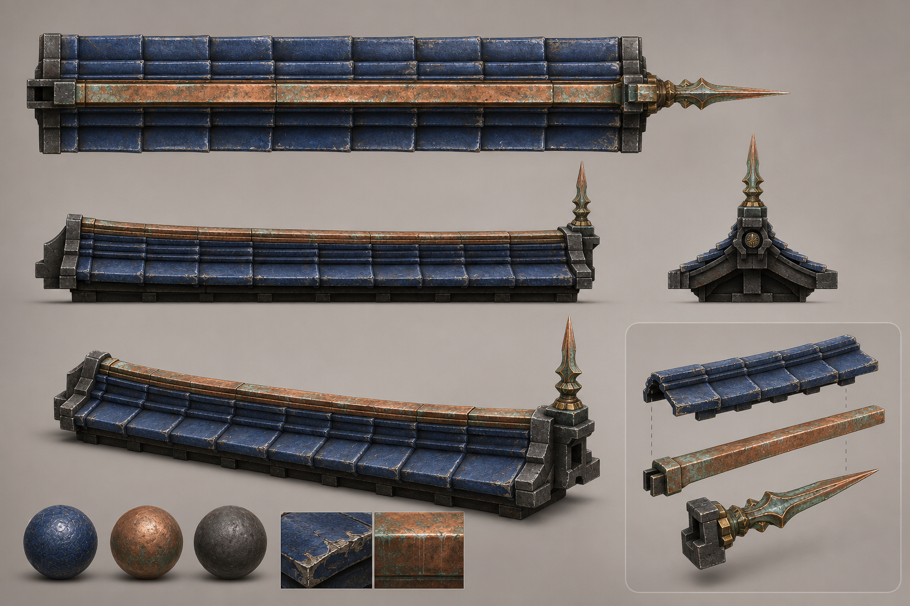
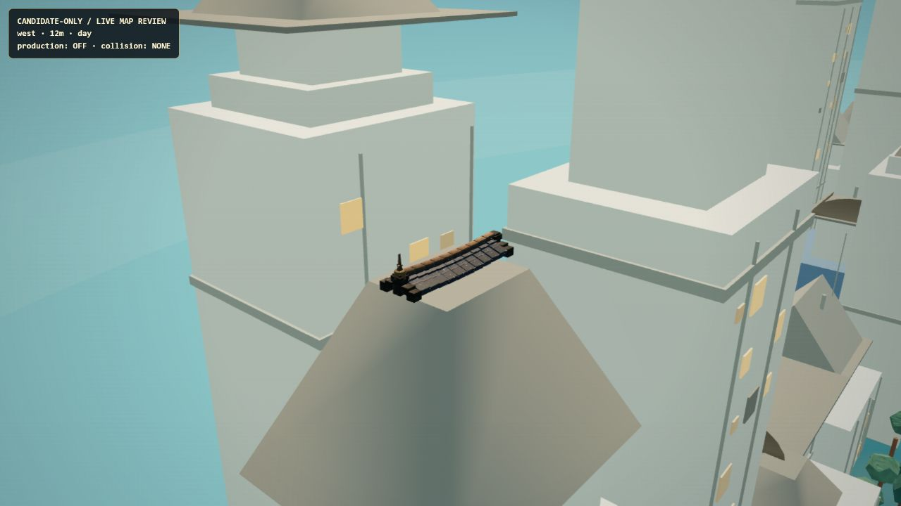
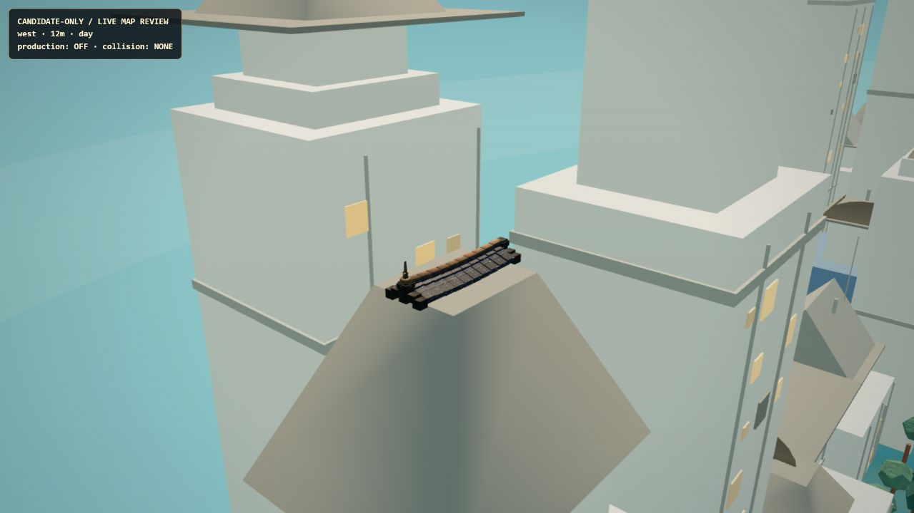
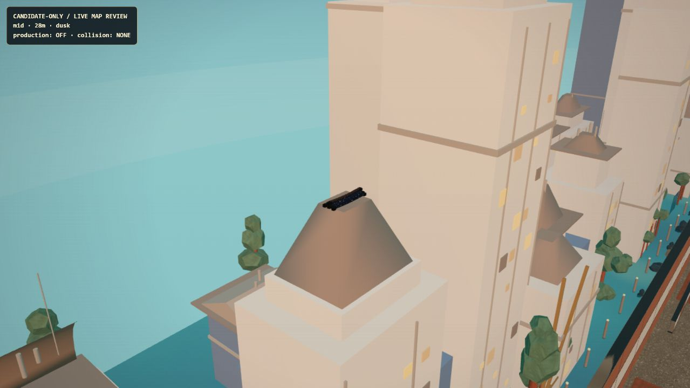
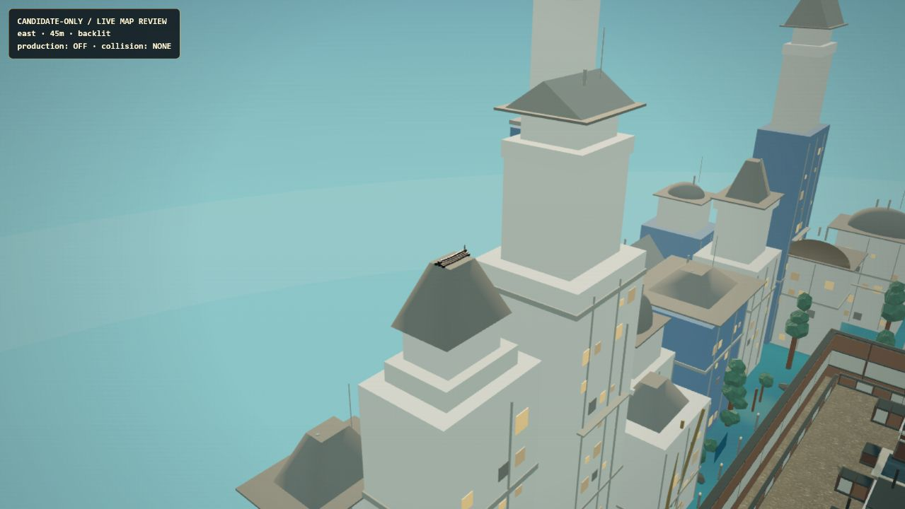

# Kagariai Roof Rib — Human Review Packet

対象: `prop-kagariai-roof-rib-01`  
状態: **candidate-only / production OFF / collision none**  
技術ゲート: renderer PASS、894/894 tests、30/30 routes、fake-cover PASS  
未完ゲート: Human art review、Human competitive readability

## 先に見るもの

1. `assets/01-reference.png` — Image 2由来の設計参照。隠れた背面や製造寸法の保証ではない。
2. `assets/02-before-contact-west-12m.jpg` — adapter修正前。factory原点のため屋根から7cm浮いていた。
3. `assets/03-after-contact-west-12m.jpg` — 修正後。描画AABB最下端とsupport天面が一致。
4. `assets/04-after-contact-mid-28m.jpg` — finialなし中央変種、薄暮。
5. `assets/05-after-contact-east-45m.jpg` — 右finial変種、逆光・遠景。

画像のSHA-256は `SHA256SUMS.txt`、計測・通常起動非表示・collision digestは
`../../docs/evidence/AAA_ROOF_RIB_LIVE_REVIEW_EVIDENCE_20260803.json` を正典とする。

## Visual review board

### Reference

### Support contact — before / after

| Before: +0.07m clearance | After: 0m clearance |
|---|---|
|  |  |

### Distance and lighting

## 実測

| View | Triangles | Draw calls | Console |
|---|---:|---:|---|
| west / 12m / day | 507,294 | 90 | error 0 / warning 0 |
| mid / 28m / dusk | 517,992 | 98 | error 0 / warning 0 |
| east / 45m / backlit | 518,032 | 97 | error 0 / warning 0 |

上限は1,200,000 triangles / 250 draw calls。候補3個自体の最悪値は
7,716 triangles / 15 draw calls / 16 shared textures。

## 正直な目視所見

- 12m: 瓦段、銅spine、鉄end hardware、左finialを識別できる。接地修正後は黒い浮き隙間が消えた。
- 28m: 個別の表面傷より「濃い屋根頂部アクセント」として読む。中央変種は意図的にfinialなし。
- 45m: 微細PBRは読めず、明暗輪郭だけが残る。ゲームプレイ信号ではなく遠景装飾としてのみ評価する。
- assetの情報量は周囲の単純な屋根・白い塔より高く、周辺建築のmaterial密度差は残る。
- 参照よりタイル端の反復が規則的で、大きな釉薬割れとfinialの曲線は簡略化されている。

## 判定方法

`REVIEW_SCORECARD.md` を埋め、最終判断を `review-decision.json` に転記する。

- `APPROVE`: critical項目がすべて4以上、blockerなし。
- `REVISE`: 直せるcritical不足が1つ以上。
- `REJECT`: 基本形状・世界観・競技視認性が不適合。

AIの自己評価、テスト成功、予算内という事実だけではAPPROVEにしない。

## 承認後の境界

Human artとHuman competitive readabilityの両方が明示承認された場合だけ、次担当が
`runtimeAdmissionCandidate.js` の残ゲートを更新できる。更新後はadmissionテスト、全suite、
collision manifest、通常起動非表示、localhost reviewを再確認する。production表示は別変更として扱う。
